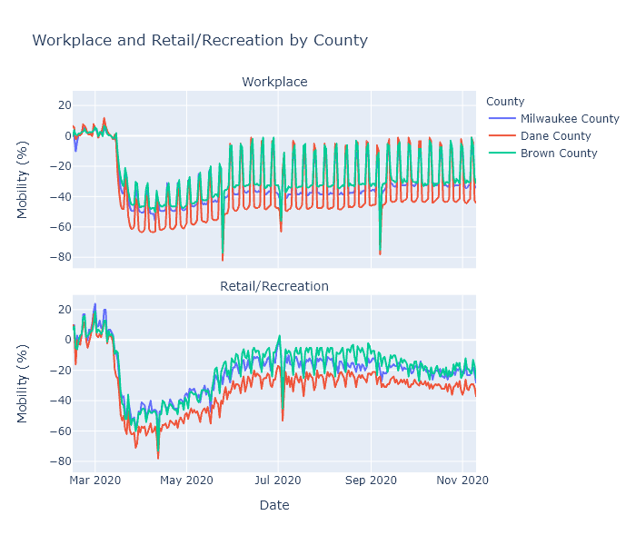

Last Tuesday Governor Evers issued an executive order exhorting, but not requiring, Wisconsin residents to stay home as much as possible. I think there is widespread skepticism that the government can actually do anything to slow the spread of the virus.

Since Covid started, Google and Apple have been publishing data extracted from phones on people's mobility. [Google's data](https://www.google.com/covid19/mobility/) is based on changes in time spent at various categories of place, such as retail/recreation, workplace, and residential. [Apple's data](https://covid19.apple.com/mobility) is based on requests for directions, and turns out to not be as interesting, so for this post I will concentrate on Google.

### Wisconsin's mobility over time
Here is a plot of Google's mobility measure for the state of Wisconsin, with categories for retail/recreation, workplace, parks, residential, and grocery/pharmacy. (They also include transit, but I'm leaving that out to reduce clutter.) [Google explains](https://support.google.com/covid19-mobility/answer/9824897?hl=en&ref_topic=9822927) that each day is compared to a baseline for that day of the week, measured over five weeks in January. This data shows some really interesting patterns. 

1. **The spring lockdown** caused a huge decrease in activity in the workplace, transit, and recreation categories that gradually recovered to a new normal level that was still substantially lower than baseline. I am using "lockdown" as a shorthand, much of this decrease was no doubt due to voluntary individual action rather than directly the result of government restrictions.

1. **Grocery/pharmacy** decreased less - obviously these trips are more essential - and nearly recovered to baseline during the summer. I think you can even see a little bump there before lockdown hit, showing people stocking up. 

1. **Working from home** creates a pronounced weekday-weekend pattern, with the workplace category showing large decreases on weekdays. It shows less of a change on weekends, I assume because people who work on weekends (retail, nurses, factory shift work) are less likely to be able to work from home. Weekend work did decrease substantially during the spring lockdown, but in the summer nearly recovered to the baseline. Weekday work, in contrast, retained most of its decrease. Residential is just the mirror image of the workplace pattern - if you're not at work, you're probably at home.

1. **Holidays** show up as sharp little spikes. You can definitely see Memorial Day, Fourth of July, Labor Day and maybe Easter if you squint.

1. **Parks** in Wisconsin are way more popular in July than in January, what a surprise! They also vary a lot day to day, which I would guess is due to weather. It would be interesting to know if people are using parks less (because of Covid) or more (because it's the only safe-ish thing to do), but I don't think this data can tell us that without a prior year to compare with.

1. **The Safer-at-Home order** was struck down by the Wisconsin Supreme Court on May 13. This data actually does not show a strong change in people's behavior at that date; make of that what you will. I tend to think it means that popular opinion and social behavior are actually more important than the letter of government policies.  But it could also mean that local restrictions picked up the state's slack; or that it just took some time after the decision for people and businesses to ramp back up; or a number of other interpretations I can think of.

### Comparing Milwaukee, Madison, and Green Bay
This data gets specific even to the county level, so I can compare across regions of the state. The plots below compare Milwaukee, Dane (Madison), and Brown (Green Bay) counties, focusing on the workplace and retail/recreation categories.

The data shows that Dane County has been working from home more, and reducing visits to recreational places, more than the other two counties. This makes sense, because Dane County is both more white-collar (so more people able to work from home) and Democrat-leaning (so given the politicization of the virus, more likely to be strict with prevention measures) than any other county in the state. Milwaukee County - pretty blue-collar and Democrat - and Brown County - very blue-collar and politically swingy - are closer together, with Brown having the highest mobility levels of the three.

This data may provide part of the answer to why the northeast of the state started its fall surge before the rest of the state. I have no doubt that virus seasonality is the root cause of the fall surge. But why did it happen in the northeast first? It could be because that region of the state had just slightly higher mobility levels, added to just slightly lower temperatures, to kick off exponential growth a few weeks earlier than elsewhere. 

Since September, the recreation mobility score has been decreasing in Brown County, to the point that now it is level with Milwaukee. I presume this is from people hearing the news and voluntarily curtailing their activity, though it could also just be the effect of colder weather. In any case, it may be helping, because [cases in the northeast now look to be plateauing.](2020-11-08-status-update.md) Perhaps that decrease in mobility, along with some buildup of population immunity, is flattening the curve.

Brown County's recreation measure has only now gotten as low as Milwaukee and still not as low as Madison. But Madison in Milwaukee are seeing increasing case numbers right now. So how does that fit together? I suspect population immunity is part of the story. The northeast has been hit hard and maybe has a higher proportion of immune people than Milwaukee or Madison right now. (I have not run these numbers yet, look for that maybe next week.)

But ultimately we still don't have enough information to know. This mobility data is super interesting but has many limitations. First, it is all in terms of percentage change from that county's baseline in January. It does not show some kind of absolute measure of mobility. So Milwaukee's -30% and Brown County's -30% may in fact be different levels of activity. Second, it does not capture other important prevention measures such as mask usage, or other sources of exposure such as the frequency of gatherings in homes. Third, it is from Google so is obviously biased towards people who use Google's mobile services. And there's probably a few more.

----
### Apple Addendum
Apple's data was overall less interesting, because it was only for requests for driving, walking, or transit directions. The only interesting thing I saw was in Madison and was unrelated to Covid.

Walking and transit directions totally spike in early September. Freshmen didn't know their way around yet!

