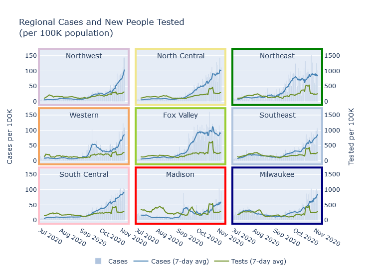
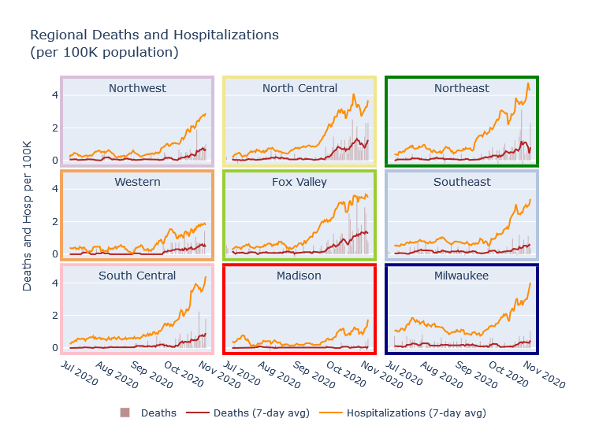

### All together now

All the regions of Wisconsin are now in a pretty similar place for new cases per day. The Northeast, North Central, and Fox Valley regions have actually plateaued for several weeks, and all other regions except Madison have risen to meet them at about the same level. Every day, 0.1% of the population of the state becomes a confirmed case; the true number of new infections is probably [1.5 to 2 times that](2020-10-19-true-infections.md).

### 
In another previous post I [estimated future deaths from current hospitalizations](2020-10-04-what-expect-for-deaths.md), observing that historically, daily deaths tended to run at 15-20% of the number of daily hospitalizations from 2 weeks prior. Since then, the rate of deaths first met and then exceeded my prediction. The current 7-day average death rate in Wisconsin is 40 per day, while 2 weeks ago the rate of new hospitalizations was about 160 per day, for a 25% ratio. Is hospital care and death rate actually getting worse?

I do not think so; instead I think part of the explanation is regional variation. Prior to this fall surge, Milwaukee was the largest contributor to statewide hospitalizations and deaths, so my previous estimate was biased towards Milwaukee's statistics. The current surge has revealed, however, that there is very large regional variation in this ratio of deaths and hospitalizations. In the Fox Valley and North Central regions, the death rate is almost 50% of the hospitalizations rate! Milwaukee, Madison, and the Southeast are still in the 15-20% range, and the other regions are in between.

I can think of several possible explanations for this phenomenon. Certainly areas outside of Milwaukee and Madison skew older, and so have higher mortality risk. Another possibility could be that the more populous Madison, Milwaukee, and Southeast regions have more hospital capacity, so that they end up admitting a greater proportion of moderate-severity patients less likely to die.

This pattern highlights the importance of looking at more than just the case numbers to understand what's happening. Milwaukee and the Fox Valley currently have pretty similar per-capita rates of new cases and new hospitalizations, but the Fox Valley's death rate is 3-4 times higher. (This discrepancy is also because the Fox Valley's surge started earlier; Milwaukee's death rate will certainly rise in the coming weeks.)

### The college spike aftermath
*Repeat my twitter comments...*

### Links
- UW schools testing sites
...

