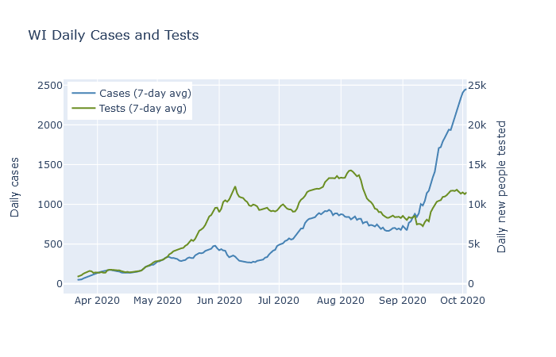
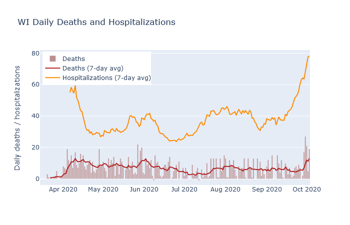

After two weeks of steeply rising hospitalization numbers in Wisconsin, the past several days have now seen deaths begin to rise. This should not be a surprise, unfortunately. While the number of cases does not always correspond to future deaths, the number of hospitalizations has been a fairly reliable predictor.

There are two well-known reasons that higher numbers of cases may not necessarily lead to higher numbers of deaths. The first is that only a fraction of the true infections in the population end up being confirmed as a case by a positive test. Therefore the availability and use of testing strongly affects the case numbers, often independently of the true infective course of the disease.

The plot below shows 7-day averages of daily cases and daily first-time tests, on separate y-axis scales. The test axis is 10 times the scale of the case axis; if the lines are level with each other, then the test positivity rate is 10%. The case rate was higher in May and June than it was in April, but the testing rate was far higher yet. The higher case rate in May and June reflected a higher *detection* rate, but possibly not a higher *infection* rate.

The second instance when cases may not always lead to deaths is when those cases are concentrated in younger people who are at lower risk. There was a modest surge in cases in Wisconsin in July and August that was led by people in their twenties. As shown in the next plot, deaths did rise as a result, peaking at a rate of about 8 per day in early August. But this was lower than the previous peak of 12 deaths a day in late May, even though the July-August case rate was twice as high!

Hospitalizations, in contrast, have had a much more stable relationship to deaths. In addition to deaths, the plot above also shows 7-day averages of daily deaths and daily hospitalizations. 

First, the detection rate of Covid in hospitalized patients, I would guess, has always been much better than in the population at large. At the beginning of the pandemic, tests were being prioritized for hospital patients

Both these plots are available in the new [Dashboard](../dashboard.md) section of this site, where I will try to update them every day. On the dashboard page the plots are interactive, so you can inspect the data by hovering over the elements of the chart.
