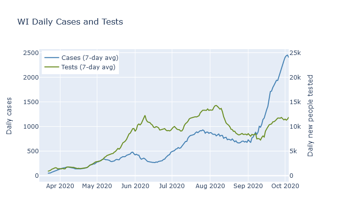
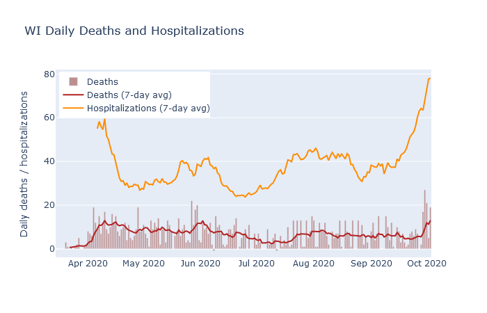

After two weeks of steeply rising hospitalization numbers in Wisconsin, the past several days have now seen deaths begin to rise. This should not be a surprise, unfortunately. While the number of cases does not always correspond to future deaths, the number of hospitalizations has been a fairly reliable predictor.

There are two well-known reasons that higher numbers of cases may not necessarily lead to higher numbers of deaths. The first is that only a fraction of the true infections in the population end up being confirmed as a case by a positive test. Therefore the availability and use of testing strongly affects the case numbers, sometimes independently of the true trends in infections.

The plot below shows 7-day averages of daily cases and daily first-time tests, on separate y-axis scales. The test axis is 10 times the scale of the case axis; if the lines are level with each other, then the test positivity rate is 10%. The case rate was higher in May and June than it was in April, but the testing rate was far higher yet. The higher case rate in May and June reflected a higher *detection* rate, but possibly not a higher *infection* rate.

The second example where cases may not always lead to deaths is when those cases are concentrated in lower-risk young people. There was a modest surge in cases in Wisconsin in July and August that was led by people in their twenties. As shown in the next plot, deaths did rise as a result, peaking at a rate of about 8 per day in early August. But this was lower than the previous peak of 12 deaths a day in late May, even though the July-August case rate was twice as high!

Hospitalizations, in contrast, have had a much more stable relationship to deaths. In addition to deaths, the plot above also shows 7-day averages of daily deaths and daily hospitalizations. Note that these are daily new hospitalizations, which are easier to relate directly to daily deaths, not current patients. The rate of deaths has followed the rate of hospitalizations with more or less a two week lag, and also a pretty constant ratio.

Hospitalizations are a better predictor of deaths because they are less affected by the two reasons that cases are a poor predictor. Tests have always been prioritized towards hospital patients, so their test usage has been more consistent than the rest of the population. And hospitalized cases are naturally skewed toward the older demographics that are more likely to die. Outbreaks that are largely contained to young people, like the ones on college campuses, [have not caused very many hospitalizations](2020-09-26-two-outbreaks.md), and therefore have not caused many deaths either.

So what should we expect for deaths in the next week? At this date, DHS reports a total of 1377 deaths and 7646 hospitalizations, for a death-to-hospitalization ratio of 18%. Purely by eyeballing the graph, it seems that ratio may be decreasing slightly over time, so let's estimate right now the ratio is 1 in 6. As of this writing, new hospitalizations are averaging 75-80 per day. At that hospitalization rate, we can expect the death rate to continue at 10-15 deaths per day, equal or higher to the death rate back in April. If the hospitalization rate has not yet peaked, then I expect deaths to go higher as well.

-------

To me, the plots in this post are helpful in comparing the various headline numbers, and for assessing the state of the pandemic in a broader context. I am now posting interactive versions of them in the new [Dashboard](../dashboard.md) section of this site, where I will try to update them every day. The data, as for most of my analysis, is [downloaded from the Wisconsin DHS](https://data.dhsgis.wi.gov/datasets/covid-19-historical-data-table/data?where=GEO%20%3D%20%27State%27).
