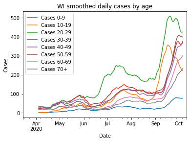
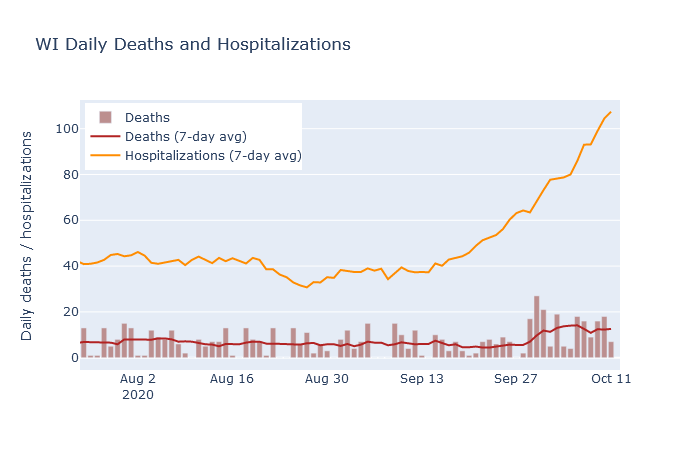
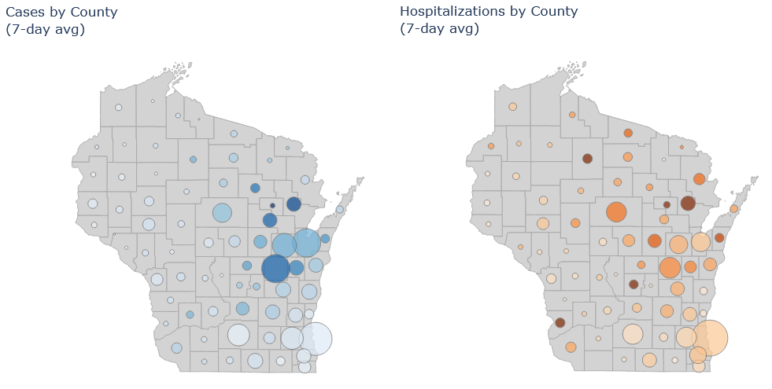
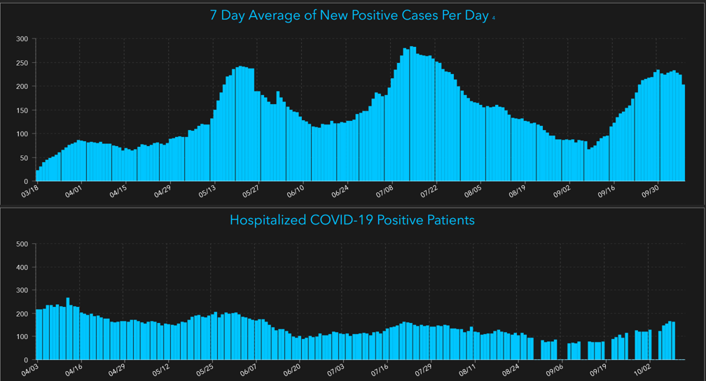
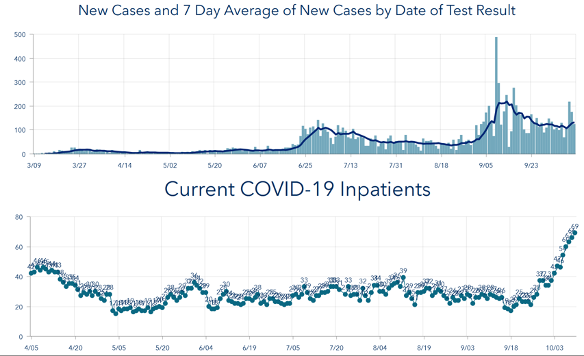

What is happening right now with Covid in the state? It can be hard to piece together an overall picture from hearing the daily headline numbers, or reading news stories with different national or local framings. So in this post I will try to give a status update for the state, as I see it.

### Cases have plateaued overall - but are still rising for older people
The number of new daily cases has possibly peaked or plateaued, which is obviously good news. That news is tempered, however, when you look at the age distribution. Only the age brackets 10-19 and 20-29 age brackets are strongly decreasing, while higher-risk ages 30+ have either only flattened or are still going up.

### Deaths and hospitalizations are still up
Deaths have averaged between 10 and 15 per day, matching my [prediction from last week](2020-10-04-what-expect-for-deaths.md). Unfortunately, hospitalizations have continued increasing rapidly, so I would expect the death rate to increase further in the next week or two.

### The Northeast
The northeast is still the state's hotspot. Brown (Green Bay), Outagamie (Appleton) and Winnebago (Oshkosh) counties all have high numbers of cases and hospitalizations. Some smaller counties in the vicinity, such as Shawano, Oconto, and Menominee, have even worse numbers on a per-population basis.

The two maps below are new on my [Dashboard](../dashboard.md) page. The size of the circle is the average number of cases/hospitalizations in that county, and the color is cases/hospitalizations per population.  So at one glance you can get an idea of both the absolute numbers and the intensity of the pandemic across the state.

### Milwaukee
As for the other two major population centers, I think Milwaukee and Madison are both of moderate concern. Milwaukee cases and hospitalizations have been rising, but at a moderate pace comparable to the upswing in late summer. Clearly we don't want it to get worse, but the situation is not as bad as in the northeast. The plots below are from Milwaukee County's dashboard (because DHS changed its data download format on me and I haven't fully updated my code yet, grumble grumble...).

### Madison
Madison appears to have its campus outbreak under control, but cases have plateaued at a higher level than they were before the outbreak, and now hospitalizations are rising fairly quickly. Two weeks ago I was impressed that the campus outbreak seemed to have been contained to young people, but now it appears it may have spread more widely. (**Update**: [Dane County Public Health has a blog post](https://www.publichealthmdc.com/blog/these-next-few-weeks-are-a-pivotal-moment-for-our-county-and-our-state) with more details. It is also possible that the college cases weeks ago and the hospitalizations now are actually unrelated; it is hard to have strong evidence one way or the other.)

So while the spotlight is rightly on the northeast, those of us in Milwaukee and Madison should be watchful as well.

