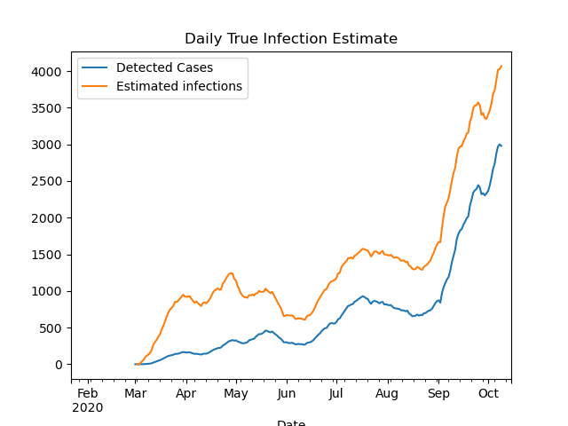

The DHS did not put out any data updates this weekend, [because of computer system maintenance](https://www.jsonline.com/story/news/2020/10/17/heres-why-wisconsin-wont-report-new-coronavirus-numbers-weekend/3697080001/). (Seems like a bad time?) I decided to use this time of mystery and uncertainty to address another unknown number, the true number of infections in the state.

It is well known by now that the number of cases, infections confirmed by a positive Covid test, do not capture all of the infections in the state. Some people may be asymptomatic, some people may be sick but not get a test for various reasons. Early on, one large study estimated that only about [1 in 10](https://www.statnews.com/2020/07/21/cdc-study-actual-covid-19-cases/) infections were actually being detected as confirmed cases. That study did not look at Wisconsin, however. It was also for a period of very limited testing; we are certainly catching more cases now.

So what is the current true number of infections in Wisconsin?

### Let me just tell you the answer
Here's one way to get an estimate of the true number of new infections per day.

1. Take the 7-day average of new cases.
1. Multiply by 1.5 (or 2).

That's it!

I think this is a plausible estimate for case numbers right now, based on a few approaches I will go on to explain. Each approach is a little evidence, a little guesswork.

### Antibody testing
The best evidence would be to test everyone in the state every day. The second best evidence would be to test a representative sample of people. But the test data DHS reports every day is not representative; after all, people go get tested because they think they might be infected! This biases the data towards positive results. The "positivity rate" we see is the percent of people *who get tested* that have the virus, definitely not the percent *of the general population*.

Luckily, more representative evidence has recently come in. Two weeks ago the Journal Sentinel and others [reported the results of a Covid antibody study](https://www.jsonline.com/story/news/2020/10/05/wisconsin-covid-19-less-than-2-of-state-population-have-antibodies/3457334001/) conducted by the [Survey of the Health of Wisconsin](https://show.wisc.edu/), a research effort at UW-Madison. They tested about a thousand people from July to mid-August for coronavirus antibodies, which would show that they had been infected and recovered. These studies, also called serosurveys, have been performed elsewhere but this is the only one I know of in Wisconsin. If they are properly randomized and representative, these studies can give an estimate of the proportion of people in the state that had ever been infected at the time of the study.

This study found that an estimated 1.6% of Wisconsin residents had been infected as of July and August, when they took the blood samples for the study. That would be 93,000 people. The CDC says it takes 1-3 weeks after an infection for antibodies to show up, so to compare to the number of detected cases we want to look at late June. The cumulative number of detected cases then was about 30,000. So up to that point we were detecting 1 in 3 infections. This would actually be pretty good compared to other places. And if we were detecting 1 in 3 infections in the spring and summer, we are very likely detecting a higher proportion now.

There is a lot of room for error here, unfortunately. I have not been able to find a more formal writeup of the study, so I don't know things like how representative their sample was. I also do not think scientists are certain about the false positive or false negative rates of these antibody tests - do all infections produce detectable antibodies, or only a certain percentage? But it is good to have this data in any case, and it is broadly consistent with what I think we know about the virus.

### Cases and tests
This antibody data tells us the true infection rate for a period of time, but only months after the fact. It does not help us react to new data. For example, when I hear that cases are increasing, does that mean the virus is spreading (bad), or that testing is increasing (good)?

This question is why the DHS and everyone else also reports the test positivity rate, which is just the number of positive cases divided by the number of tests. (This sounds simple but of course is actually super complicated, [which I have a previous post on](2020-09-21-tests-positivity-rates.md).) If cases are going up *and* the positivity rate is going up, then it is not just an artifact of increasing tests and the virus is spreading. Conversely, if they are both going down, then the virus level is going down. If one is going up and the other is going down, then it is ambiguous, and virus activity is maybe just roughly the same.

To get any more specific and quantitative, you have to make assumptions and come up with some kind of model. Many people have tried this - [here is Our World in Data comparing a few of them](https://ourworldindata.org/covid-models), and [here is another that has estimates for Wisconsin specifically](https://pandemicnavigator.oliverwyman.com/forecast?mode=states&region=US_US-WI&panel=baseline).

For the rest of this post I am going to share an idea I came up with - because it's my blog - so you should probably go on dilettante alert. I do really think my idea strikes a good balance of simplicity and plausibility that I have not seen elsewhere. But then I also think all my kids are above average and that my college rock band had a shot at the big time.

Anyway, here is my formula.

$$
N_{inf} = k \times \frac{N_{cases}}{\sqrt{N_{tests}}}
$$

where $$k$$ is a constant, $$N_{cases}$$ is the number of daily cases, and $$N_{tests}$$ is the number of daily tests. At some point I will write up my thinking behind this formula, but I do not want to bore anyone with it now. Using the antibody study discussed above to calibrate the constant, I get $$k=240$$, and the resulting estimate over time is plotted below.

With this model, I estimate that the ratio of true infections to detected cases was about 6-to-1 in April; down to 2-1 in June; and only 1.4-to-1 today. That last ratio is a bit low compared to other models, so ultimately I would guess the ratio right now is between 1.5 and 2.

### To be continued...
I will stop the post here, but there is more to say on this topic. In a future post I will try to estimate true infections from deaths, and show how that estimate broadly fits in with the estimate in this post.
