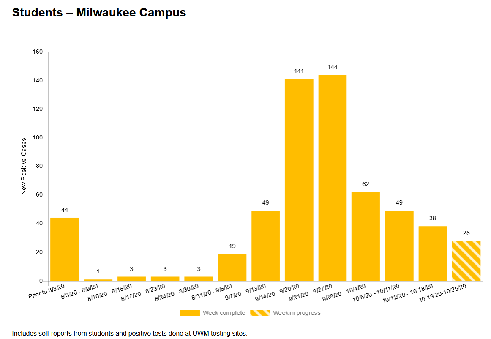

### Everything is going up
Two weeks ago [I sounded a couple optimistic notes](2020-10-11-status-update.md) - new cases had been hinting at flattening, and Milwaukee's wave had not yet gotten as bad as the late summer one - that have now been proven wrong. Wisconsin cases numbers paused, as if on a staircase landing, but then sprinted up the next flight. And Milwaukee's metrics are now [the worst they have been overall since the pandemic first hit in March](https://twitter.com/MattBayer3/status/1316818108322119681?s=20).

That brief flattening of cases reflected numbers in the Green Bay and Fox Valley areas, which have been the worst hit in the state over the last month but plateaued a few weeks ago. They appear to have resumed their rise, unfortunately; and even more unfortunately, the rest of the state is now catching up. 

These are plots of cases, hospitalizations, and deaths grouped by region. I am also adding interactive versions of these plots to a new [Regional Dashboard](../dashboard-regional.md) page. These are the same regions as shown on the [DHS hospital page](https://www.dhs.wisconsin.gov/covid-19/hosp-data.htm), but with Milwaukee County and Dane County (Madison) broken out separately. The Northeast, Fox Valley, and North Central regions are still in the worst shape. But Milwaukee, the rest of the Southeast, and the South Central outside Madison are not far behind. The Madison, Northwest, and Western regions are in better shape, but still getting worse.

This fall Wisconsin started with [one outbreak in colleges](2020-09-14-wisconsin-colleges.md), then a [second in the northeast](2020-09-26-two-outbreaks.md); now it really is everywhere.

### College outbreaks are under control?
There is one bright spot, though, which is that the college outbreaks seem to actually be under control. Here are cases at UW-Madison:

Here are cases at UW-Milwaukee:

And here's Marquette. This one's not really trending down, but it's at least not exploding.

This decrease in college cases could be seen in the data on cases by age, and was another contributor to the brief pause in the state's case numbers I mentioned above. More recently young cases have gone up again, despite colleges remaining relatively calm. I do not think this is a renewal of college cases, but instead the younger age groups being pulled into the general trend.

It seemed for a while that bringing students back was a huge mistake. But I think we have to give college administrators some credit - at least some of them - for attempting to adapt normal life to the pandemic, deploying testing and lockdowns effectively, and beating the virus back. I have to hope that as a state, we can somehow manage to do the same thing.

### Other articles
[American Indians hit particularly hard in latest wave](https://www.jsonline.com/story/news/2020/10/21/covid-19-cases-wisconsins-american-indians-triple-since-sept-1/5985832002/?utm_campaign=snd-autopilot)

[Spring semester plans at UW-Madison](https://madison.com/news/local/education/university/uw-madison-announces-spring-semester-plans-with-expanded-testing/article_763311dd-0ed7-501b-b2ce-86f4b1b073c1.html)

[CBS News story from inside Covid unit at Aurora St. Luke's Milwaukee](https://www.instagram.com/tv/CGpu1yuHDa_/?igshid=1spmwab976kxb)
