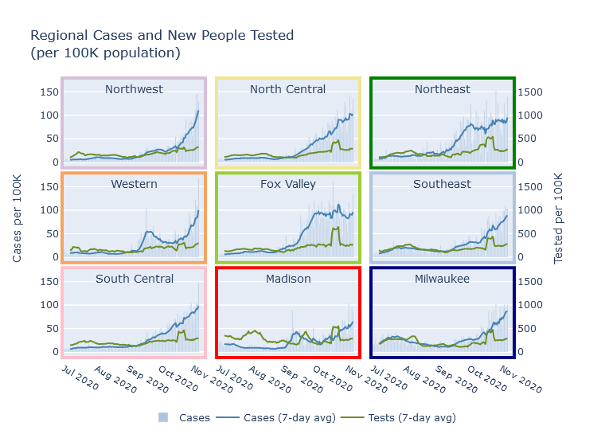
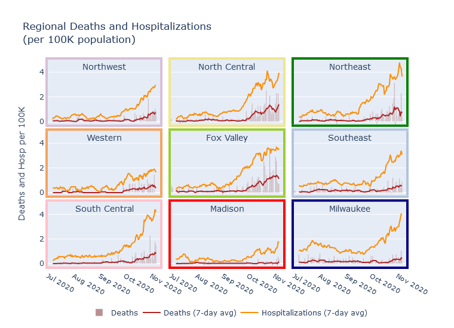

### All together now
All the regions of Wisconsin are now in a pretty similar place for new cases per day as a share of population. The Northeast and Fox Valley regions have actually plateaued for several weeks, and all other regions except Madison have risen to meet them at about the same level. If current trends continue, these other regions of the state will soon exceed the hard-hit Northeast and Fox Valley in new cases per day.

Every day, 0.1% of the population of the state becomes a confirmed case; the true number of new infections is probably [1.5 to 2 times that](2020-10-19-true-infections.md).

### Regions have different death rates
In a previous post I [estimated future deaths from current hospitalizations](2020-10-04-what-expect-for-deaths.md), observing that historically, daily deaths tended to be 15-20% of the number of daily hospitalizations from 2 weeks prior. Since then, the rate of deaths first met and then exceeded my prediction. The current 7-day average death rate in Wisconsin is 40 per day, while 2 weeks ago the rate of new hospitalizations was about 160 per day, for a 25% ratio. Is hospital care and death rate actually getting worse?

I do not think so; instead I think part of the explanation is regional variation. Prior to this fall surge, Milwaukee was the largest contributor to statewide hospitalizations and deaths, so my previous estimate was biased towards Milwaukee's statistics. The current surge has revealed, however, that there is very large regional variation in this ratio of deaths and hospitalizations. In the Fox Valley and North Central regions, the death rate is almost 50% of the hospitalizations rate! Milwaukee, Madison, and the Southeast are still in the 15-20% range, and the other regions are in between.

I can think of several possible explanations for this phenomenon. Certainly areas outside of Milwaukee and Madison skew older, and so have higher mortality risk. Another possibility could be that the more populous Madison, Milwaukee, and Southeast regions have more hospital capacity, so that they end up admitting a greater proportion of moderate-severity patients less likely to die.

This pattern highlights the importance of looking at more than just the case numbers to understand what's happening. Milwaukee and the Fox Valley currently have pretty similar per-capita rates of new cases and new hospitalizations, but the Fox Valley's death rate is 3-4 times higher. Besides the death-to-hospitalization ratio, another cause of this difference is that the Fox Valley's surge started earlier, so that deaths have had more time to catch up to cases and hospitalizations. Unfortunately, I do think Milwaukee's death rate will rise sharply in the coming weeks.

### Other stories
- [UW schools offer free Covid testing](https://www.jsonline.com/story/news/2020/11/04/uw-system-campuses-offer-free-covid-19-tests-communities/6164822002/?utm_campaign=snd-autopilot). These are rapid tests, so somewhat less accurate but you get the results "within 15 minutes." I think this is the first time these rapid tests will be widely available in the state. The program is starting this week. Community members need to register for an appointment at [www.doineedacovid19test.com](https://www.doineedacovid19test.com).

- [Evidence that the college outbreaks led to community spread](https://madison.com/wsj/news/local/education/university/uw-campuses-grapple-with-whether-reopening-led-to-community-spread-of-covid-19/article_d49fa7f0-4e1b-5018-b41c-19da7b8d64ad.html), from analyzing the genetics of particular virus strains. I am still skeptical that the college outbreaks had a strong impact on their surrounding communities. The two counties with colleges mentioned in the story, La Crosse and Dane (Madison), had large student outbreaks but currently have [among the lowest hospitalization rates in the state](https://twitter.com/MattBayer3/status/1323459224412803076?s=20).

- [A sad and poignant story](https://www.jsonline.com/story/news/local/2020/11/06/covid-19-s-legacy-life-and-death-milwaukees-anne-carley-gallun/6096120002/) about a Milwaukee woman with Down syndrome, her full life, and her death from Covid in July.

