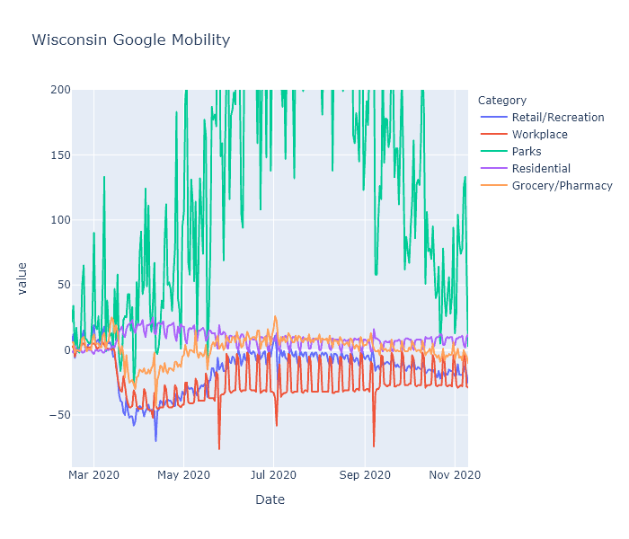

Last Tuesday [Governor Evers issued an executive order](https://www.jsonline.com/story/news/politics/2020/11/10/tony-evers-asks-wisconsin-stay-home-day-record-covid-cases/6241313002/) exhorting, but not requiring, Wisconsin residents to stay home as much as possible. Is there any way to know what effect these kind of orders have? How much are Wisconsin residents staying home, and how does it compare to the lockdown in the spring?

Since Covid started, [Google](https://www.google.com/covid19/mobility/) and [Apple](https://covid19.apple.com/mobility) have been publishing mobility statistics extracted from people's phones. They break it down by state and even by county, so I took a look for Wisconsin.

### Statewide stats
The Google data turns out to be more interesting than Apple's. The following is a plot of Google's mobility measure for the state of Wisconsin, with categories for retail/recreation, workplace, parks, residential, and grocery/pharmacy. (They also include transit, but I'm leaving that out to reduce clutter.) [Google explains](https://support.google.com/covid19-mobility/answer/9824897?hl=en&ref_topic=9822927) that each day is compared to a baseline for that day of the week, measured over five weeks in January. This data shows some really interesting patterns. 

1. **The spring lockdown** caused a huge decrease in activity in the workplace, transit, and recreation categories that gradually recovered to a new normal level that was still substantially lower than baseline. Here I mean "lockdown" as a shorthand for the combination of government restrictions and voluntary actions.

1. **Grocery/pharmacy** decreased less - obviously these trips are more essential - and nearly recovered to baseline during the summer. I think you can even see a little bump there before lockdown hit, showing people stocking up. 

1. **Working from home** creates a pronounced weekday-weekend pattern, with the workplace category showing large decreases on weekdays. It shows less of a change on weekends, I assume because people who work on weekends (retail, nurses, factory shift work) are less likely to be able to work from home. Weekend work did decrease substantially during the spring lockdown, but in the summer nearly recovered to baseline. Weekday work, in contrast, retained most of its decrease. Residential is just the mirror image of the workplace pattern - if you're not at work, you're probably at home.

1. **Holidays** show up as sharp little spikes. You can definitely see Memorial Day, Fourth of July, Labor Day and maybe Easter if you squint.

1. **Parks** in Wisconsin are way more popular in July than in January. (Surprise!) They also vary a lot day to day, which I would guess is due to weather. It would be interesting to know if people are using parks less (because of Covid) or more (because it's the only safe-ish thing to do), but I don't think this data can tell us that without a prior year to compare with.

1. **The Safer-at-Home order** was struck down by the Wisconsin Supreme Court on May 13. This data actually does not show a strong change in people's behavior at that date; make of that what you will. I tend to think it means that popular opinion and social behavior are actually more important than the letter of government policies.  But it could also mean that local restrictions picked up the state's slack; or that it just took some time after the decision for people and businesses to ramp back up; or a number of other interpretations I can think of.

1. **The new normal,** while much more mobile than the spring, is still substantially less mobile than baseline. I believe this *is* having its desired effect - despite rising numbers right now, the virus is spreading more slowly than it did in places like northern Italy and New York with uncontrolled spring outbreaks.

### Comparing counties
Next I wanted to compare different regions of the state, so I plotted Milwaukee, Dane (Madison), and Brown (Green Bay) counties, focusing on the workplace and retail/recreation categories.

Dane County has been working from home, and reducing visits to recreational places, more than the other two counties. This makes sense, because Dane County is both more white-collar (so more people are able to work from home) and Democrat-leaning (so more likely to be strict with prevention measures) than any other county in the state. Milwaukee County (still Democrat but more blue-collar) and Brown County (politically swingy and quite blue-collar) are closer together, with Brown having the highest mobility levels of the three.

This data may help explain some of the virus's regional patterns. I have no doubt that virus seasonality is the root cause of our current fall surge. But why did it happen in the northeast first? Perhaps because that part of the state had just slightly higher mobility levels, added to just slightly lower temperatures, to kick off exponential growth a few weeks earlier than elsewhere. 

Another temptingly explanatory trend is that since September, the recreation measure has been decreasing in Brown County. This could be from people hearing the news and voluntarily going out less, or it could be just a normal seasonal trend. But perhaps that decrease in mobility, along with some buildup of population immunity, is causing the [current virus plateau in the northeast](2020-11-08-status-update.md). 

These explanations are admittedly very speculative. Brown County's mobility numbers are higher than Milwaukee's, but not dramatically. Its recreation has recently decreased, but its score is still not any lower than Milwaukee and Madison, which are currently seeing rising case numbers. Ultimately I don't think the trends are clear enough to draw strong conclusions.

While super interesting, this mobility data also has many limitations. First, it is all in terms of percentage change from that county's baseline in January. It does not show some kind of absolute measure of mobility. So Milwaukee's -20% and Brown County's -20% may in fact be different levels of activity. Second, it does not capture other important prevention measures such as mask usage, or other types of exposure such as gatherings in homes. Third, since it is from Google it can only capture people who use Google's mobile services.

What I think it does confirm, though, is that social behavior does directly impact the spread of the virus. The lockdown in spring prevented the kind of outbreak the state is seeing now. Our post-lockdown behavior was enough to stalemate the virus in the summer, and even now is slowing it down. If we keep that up, and even increase our precautions - in a targeted way, using the knowledge we have gained over the last 8 months - I think it will have an impact.

----

### Apple addendum
Apple's data is less useful, because it only measures requests for driving, walking, or transit directions. The only interesting thing I saw was in Madison and was unrelated to Covid.

Walking and transit directions totally spike in early September. Freshmen trying to find their classes?
