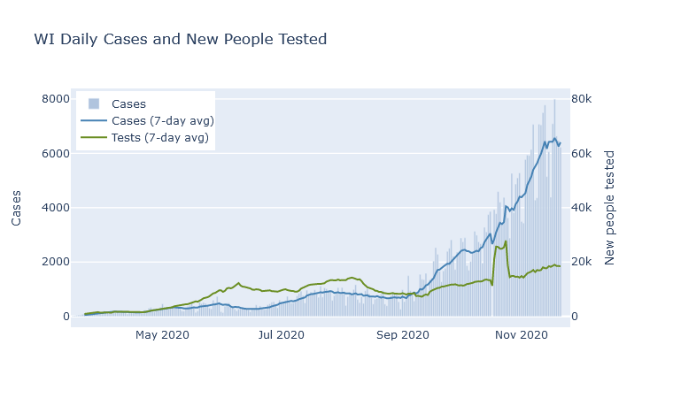
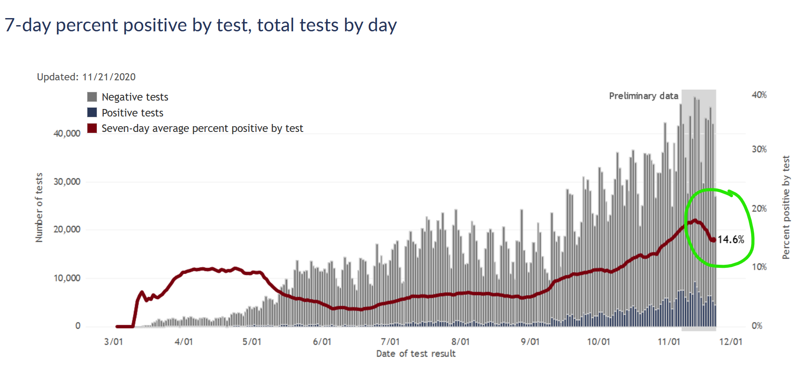
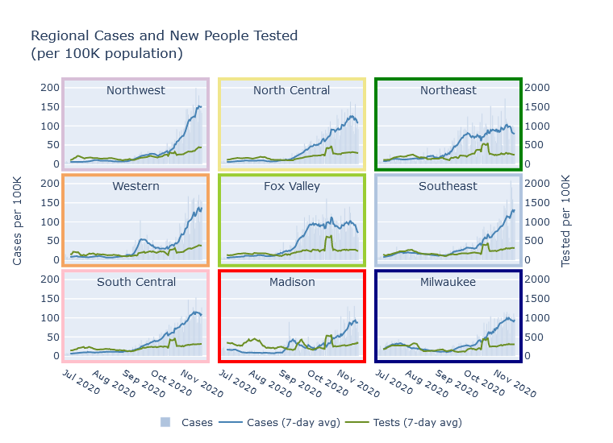

### Hints of a peak
If I write it out loud will I jinx it? There are signs that the case numbers may be peaking. In the past week, the 7-day average for the state has flattened out. 

At the same time, the case positivity rate has also started to decline. This chart from the DHS is tricky because it shows positive/negative by date of test, rather than date reported like the one above, so the last two weeks of data is strictly preliminary. (More tests from those days can get reported later.) But my experience looking at this chart is that while the absolute numbers can change a lot, the positivity rate does not tend to change much as more data fills in. 

If confirmed cases are flat or slightly down, and the test positivity rate is also down, then we can be pretty confident the true number of people infected is also going down.

This would be great news, though the trend is fresh and could easily change quickly. Keep in mind also that even if cases flatten or decline, it would be several more weeks before we would expect to see deaths do the same.

This case trend is also evident at the [regional](../dashboard-regional.md) level. Cases in the North Central, Northeast, and Fox Valley are declining. They are flat or declining just slightly in Milwaukee, Madison, and the South Central. But the trend still seems to be increasing in the Northwest, West, and Southeast.

If this flattening trend continues, I would attribute it to two things. First, Wisconsinites' activity levels [have been going down gradually since September](2020-11-15-mobility.md), according to Google data, possibly in response to the virus's activity going up. Second, enough of us have now been infected that partial population immunity could be helping dampen the spread.

### How many of us have been infected?
The number of confirmed cases is [an underestimate of the true number of infections](2020-10-19-true-infections.md). So to know how many people in Wisconsin have been infected overall, we need to make an estimate.

Virologist Trevor Bedford [made an estimate on Twitter](https://twitter.com/trvrb/status/1327437385395699713) based on using an assumed infection fatality rate (IFR), and reasoning backwards from the number of recorded deaths to the number of infections. The number of deaths is much more reliable than the number of cases (though of course is also subject to errors), and the IFR is known with some precision from a number of scientific studies. He used this reasoning to estimate the number of infections the country has for each confirmed case at 4 to 1, and then applied this multiplier to Wisconsin.

A couple more formal estimation projects are [covid19-projections.com](https://covid19-projections.com/infections/us-wi) from Youyang Gu, a data scientist who became well-known for his Covid model; and [covidestim](https://covidestim.org/us/WI), from an academic group.

Lastly, as to one untimely born, I'll include my own estimate. I am simply adapting Dr. Bedford's reasoning, but adjusting it by estimating Wisconsin's specific infections-to-cases ratio, which turns out to be closer to 3-to-1.[^math]

These estimates are summarized in the table below. The date of the estimate is actually important, because obviously we get more infections every week. Despite the disparity in methods, there's actually decent agreement here - though I have seen other estimates with wider-ranging values. 

Source | Date | % Infected
------ | ---- | ----------
Trevor Bedford | Nov 13 | 21%
covidestim | Nov 19 | 17%
Youyang Gu | Nov 7  | 23%
Matt Bayer | Nov 21 | 18%

In summary, about 20% of the state has had coronavirus. The resulting immunity, combined with our continuing social distancing efforts, has possibly been enough to stall the case curve. I have some cautious optimism; as ever, though, changing data or deepening winter could always prove me wrong. 
 
----
[^math]: Here are the specifics. Cumulative deaths as of 21-Nov are 3005. Divide by the cumulative cases from 3 weeks ago, because that is roughly how long it takes to progress from confirmed case to death. The cumulative cases from 31-Oct was 225,370. Divide the two and the case fatality rate is 1.33%. Divide that by Dr. Bedford's IFR, 0.45%, to get a multiplier of 2.96. Round to 3-to-1, and apply to the total number of cases from 21-Nov (351,169) to get an estimate of 1.05 million infections. Divided into Wisconsin's 5.8 million people, that's 18%.
