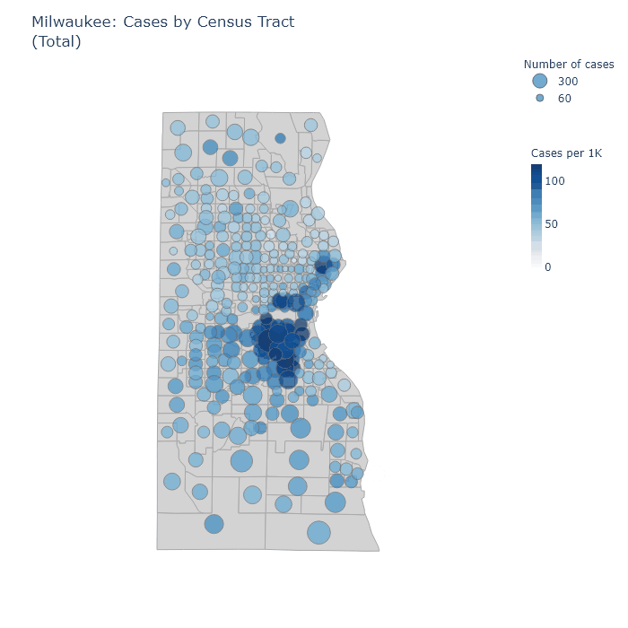
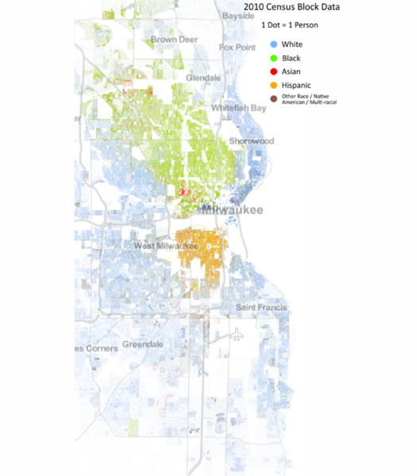
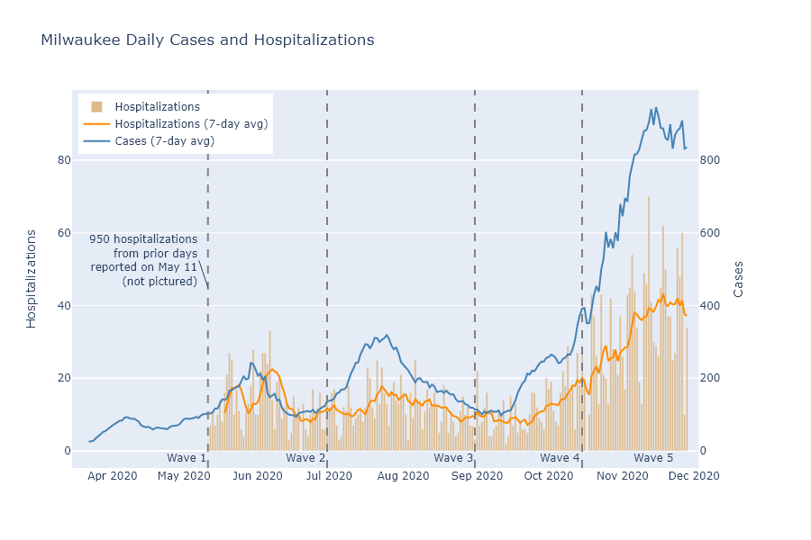
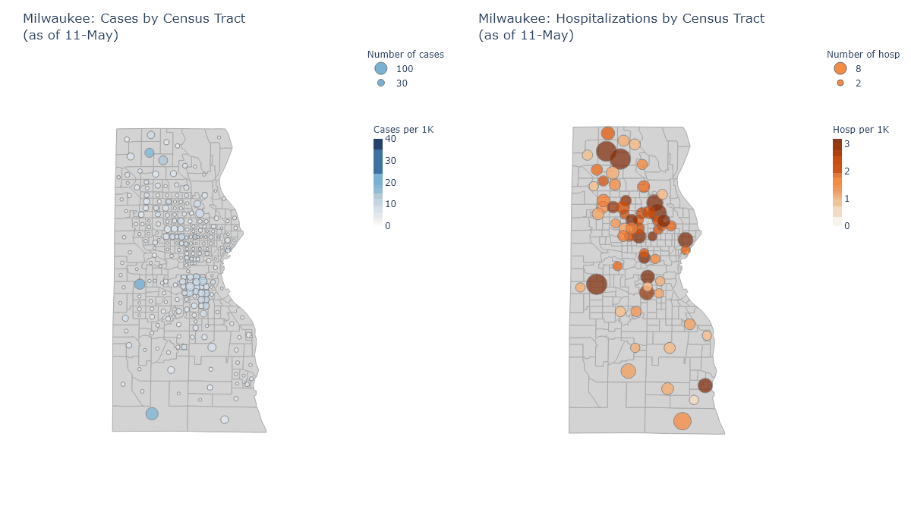

Milwaukee County contains one million people, one-sixth of Wisconsin's total. Even within a single county, there are enough people and enough diversity to give Milwaukee's corner of the pandemic its own geography and its own narrative.

### Pan-geography

The animation below maps out total cases, hospitalizations, and tests for each census tract in Milwaukee County. It has the same format as my [statewide maps](../dashboard-regional.md) - the size of the bubble corresponds to the absolute number inside a tract; while the color of the bubble corresponds to the value per thousand residents. For example, a larger bubble indicates a greater number of cases, while a darker bubble indicates that a larger percentage of the population has had a case.

The patterns in these maps strongly echo the demographic boundary lines of the city. To show this, here is another map: this one plots a dot for each resident, randomly distributed within census tracts, and colored according to race. It comes from a [project at the University of Virginia](https://demographics.coopercenter.org/racial-dot-map/).[^FullMap] The exactness with which the Covid maps follow the boundaries of the racial map is striking.

Returning to the Covid maps, we can see that the highest concentrations of cases have occurred in the predominantly Hispanic near south side, and in an arc from Marquette University through downtown up the East Side to the University of Wisconsin-Milwaukee.

Hospitalizations are also high in the Hispanic south side but relatively low in the downtown-East Side arc, I assume because of younger demographics in that area. In addition, however, hospitalizations are high throughout the majority-Black areas of the city, from the near north side to the far northwest. They are also relatively high in much of the majority-white parts of the south side. 

Some of the tracts with the highest hospitalization numbers, when examined closer, turn out to be the sites of long-term care facilities. The tract in the southeast bordering the lake, third from the bottom, [appears to have several](https://goo.gl/maps/DzxAdPz73xszn3om9), two of which I can find on the DHS's [list of facilities with Covid cases](https://www.dhs.wisconsin.gov/covid-19/investigations.htm).

More affluent predominantly-white areas such as Wauwatosa and the North Shore suburbs, in contrast, are relatively spared from cases and hospitalizations. These same areas, though, along with the Marquette-to-UWM arc, have the highest rates of testing.

### Pan-narrative

By looking at these same maps over time, I think I can identify 5 demographically distinct waves in the pandemic's run through Milwaukee. 

1. Black Milwaukee was struck first and hardest in the spring. Recorded cases are low in this stage because of the lack of testing, but hospitalizations and deaths are high in the Black north side. 
1. Hispanic Milwaukee is hit next. Cases are very concentrated in the Hispanic near south side, although hospitalizations and deaths are more moderate.
1. Students and younger people in the Marquette-downtown-UWM arc contribute to a wave of cases in the late summer, but are not accompanied by many hospitalizations. Cases rise moderately in the rest of the city, along with hospitalizations. 
1. Early fall continues the pattern of the late summer, but with even more cases at Marquette and UWM campuses.
1. Late fall brings a surge across the whole city, with only the north shore and Wauwatosa relatively spared.

Below, a plot shows the time spans of these waves overlaid on daily cases and hospitalizations, and a map animation illustrates their geography for each of these stages. Each frame shows the sum of cases and hospitalizations reported in each wave's time period.

* The virus spreads along social networks. Milwaukee is lamentably segregated by race, and the virus followed that segregation to a large extent.
* This means your experience of the pandemic probably depends on your demographic and your social circle. I am a white professional, and I personally know relatively few people who have had Covid; but a friend with Hispanic family on the south side saw many of them get the virus over the summer.
* The majority-Black north side needs better access to testing. Even now, with testing more plentiful, this region has high hospitalizations but relatively low rates of tests and detected cases.
* The affluent North Shore suburbs have done the best at avoiding Covid so far. I would guess this is primarily because white-collar jobs and sufficient money naturally increase a family's ability to work from home, isolate when necessary, and seek out testing.

----
[^FullMap]: At their website you can browse the [full map for the country](https://demographics.virginia.edu/DotMap/). A certain kind of person (me) could spend hours happily browsing there.
