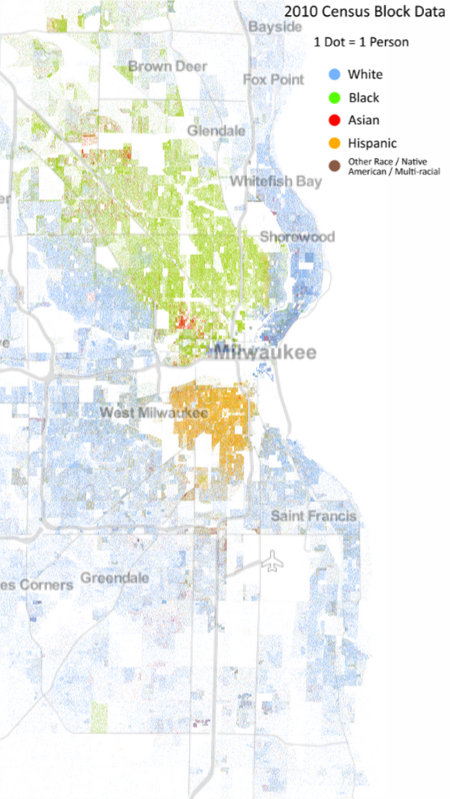

Milwaukee County contains about 1 million people. 

This bubble map has the same format as my [statewide maps](../dashboard-regional.md). The size of the bubble corresponds to the number of cases, hospitalizations, or tests inside a tract; while the color of the bubble corresponds to the value per thousand residents.

For someone who knows the geography of the city, the contours of these maps strongly echo the demographic boundary lines of the city. Below is another map; this one plots a dot for each resident, randomly distributed within census tracts, and colored according to race. It comes from a [project at the University of Virginia].[^FullMap] 

The highest concentrations of cases have occurred in the predominantly Hispanic near south side, and in an arc of young people from Marquette University through downtown up the East Side to University of Wisconsin-Milwaukee.

Hospitalizations are also high in the Hispanic south side but relatively low in the downtown-East Side arc, no doubt because of the younger demographics. In addition, however, hospitalizations are high throughout the majority-Black areas of the city, from the near north side to the far northwest. They are also relatively high in much of the majority-white parts of the south side. 

Some of the tracts with the highest hospitalization numbers, when I look closer, turn out to be the sites of long-term care facilities. The tract in the southeast bordering the lake, third from the bottom, [appears to have several](https://goo.gl/maps/DzxAdPz73xszn3om9), two of which I can find on the DHS's [list of facilities with Covid cases](https://www.dhs.wisconsin.gov/covid-19/investigations.htm).

More affluent predominantly white areas such as Wauwatosa and the North Shore, in contrast, are relatively spared from hospitalizations. These same areas, though, have the highest rates of testing in the county.

----
[FullMap]: At their website you can browse the [full map for the country](https://demographics.virginia.edu/DotMap/). A certain kind of person (me) could spend hours happily browsing there.
