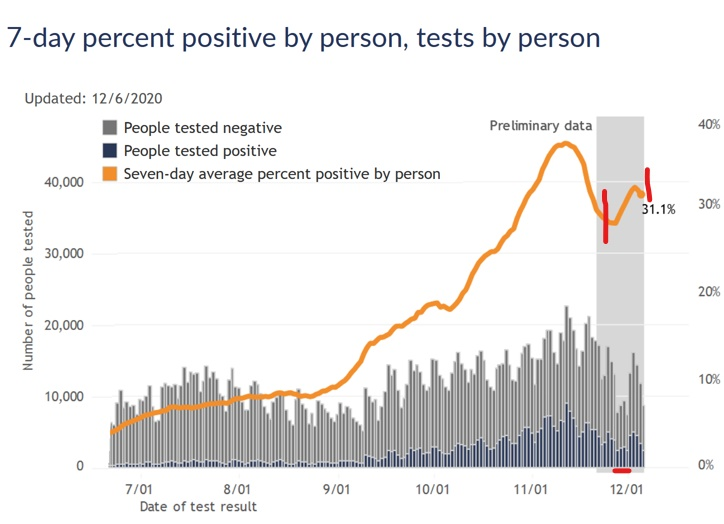
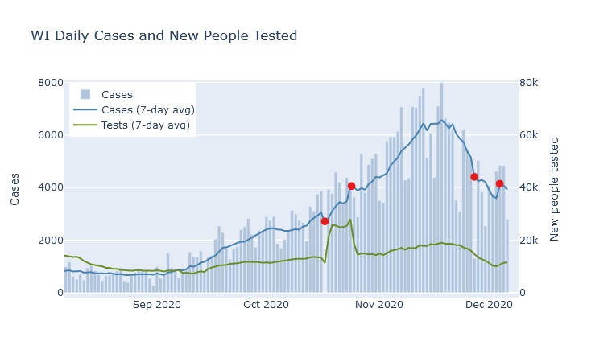

Wisconsin's case load is now declining, and I think deaths have also now peaked. The Thanksgiving weekend is making the data difficult to interpret, but I do not think there is any sign yet of a Thanksgiving surge.

### Past the peak
Two weeks ago I [wrote that Wisconsin's cases had peaked](2020-11-22-status-update.md), and thankfully that has been confirmed by about a 1/3 decline in daily new cases since then. New hospitalizations have also declined. The trend is roughly similar in all regions of the state, although Milwaukee's decline is [slower than the rest](../dashboard-regional.md).

As for reported deaths, I believe they may be at their peak right now. Since it takes a few weeks for a new case to progress to death, we expect the death curve to have a similar shape to the case curve, just delayed. I estimated a delay and a ratio of deaths to cases (the case fatality rate or CFR) to get the best fit between the two curves, and it indicates that deaths should be peaking right now. 

I'm taking the idea for this comparison from [scientist Trevor Bedford](https://twitter.com/trvrb/status/1331780099490807808), who uses a CFR of 1.8% and delay of 22 days to model the United States as a whole. For Wisconsin, I found that a CFR of 1.0% and delay of 12 days seems to match the data better. This would imply that Wisconsin may be detecting a higher proportion of cases than the country as a whole, and that it has a shorter time period between reporting a case and reporting a death.

### Thanksgiving data

You may object, however, that the previous plot showed a huge dip in the deaths average right where I claim that it should be peaking. I think this dip is purely a result of delayed data reporting over Thanksgiving weekend. If not for the holiday, the 7-day average of deaths *would have* peaked this past week; instead, it will peak this coming week as the low-reporting days drop out of the average, after which it will start to decline.

This holiday delay is a problem that appears in all the tracking data right now. As another example, consider the positivity rate for cases vs. new people tested, shown on the [DHS website](https://www.dhs.wisconsin.gov/covid-19/data.htm), which shows a particularly strong discontinuity. The four days following Thanksgiving all have much lower numbers of test results, and much higher positivity, so that the 7-day average takes a strong turn upward starting at Thanksgiving. But on December 3, exactly 7 days after Thanksgiving, the 7-day average turns right back around and starts going down again.

I think this is all an artifact of lower testing availability, and possibly also delayed reporting, on the four days of Thanksgiving weekend. Since many testing locations were closed over the weekend, it's likely that the tests that did occur were more urgent and more likely positive than usual. Once testing returned to its normal availability, the positivity rate begins to return to its previous trend.

An analogous artifact appears in the 7-day average case plots. When a single day is an outlier, with unusually low case numbers, the 7-day average unsurprisingly dives downward on that day. It's easy to forget, however, that the 7-day average will then also shoot upward on the day that outlier is removed from the average, 7 days later. 

To illustrate, I marked two of these instances in the case plot below. The pair on the right is the result of Thanksgiving - the Friday after had very low cases, decreasing the average and creating a mirror-image spike on December 4. That spike was not a sign of a Thanksgiving surge, only a quirk of the averaging method. The very same thing happened in October, when no cases were reported on October 17 due to DHS system maintenance, and the average spiked 7 days later on October 24.

All these irregularities make it very difficult to tell if Thanksgiving itself has caused any kind of surge in the virus. Now that all the Thanksgiving weekend days have passed out of the averages, though, next week's trend should be more reliable.

My intuition is actually that Thanksgiving will not have a large effect on the numbers. I would guess that most families took a level of precaution about Thanksgiving that was similar to what they were taking in the rest of their lives. And can one day, even a celebratory get-together, really count for so much compared to all the work, school, and social contact that happens over weeks of regular life? But that is just a guess; to find out I'll watch the numbers next week.

