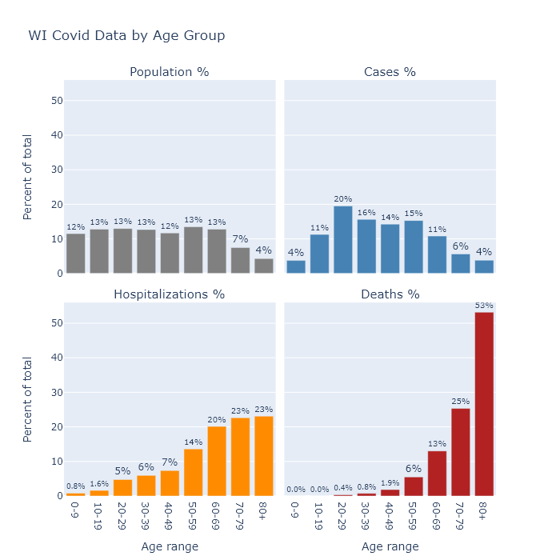
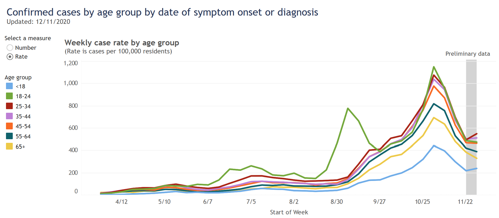

Covid outcomes are very strongly affected by age. What does that age dependence look like in Wisconsin, and how does our mortality rate compare to scientific estimates?

### That is no virus for old men[\*](https://www.poetryfoundation.org/poems/43291/sailing-to-byzantium)
The bar graphs below show the age distribution of Wisconsin's population, Covid cases, Covid hospitalizations, and Covid deaths. The data are cumulative up until the present. These graphs are similar to ones on the DHS's site, except that here I collect them together and compare them with population.[^Sources]

The distribution of population is quite flat, other than starting to taper off at age 70 as people pass away. Relative to shares of the population, Covid cases are a little higher in the middle aged, substantially higher for people in their 20s, and much lower for children under 10. This lower incidence among children could indicate that they are less susceptible to the virus, or it may only reflect the lower likelihood of diagnosing an infection as Covid in that age group.

Hospitalizations show a pronounced swing of the distribution toward the elderly - though still with plenty of middle-aged patients - and deaths shift that way even further. In other words, the older a person is, the more likely their case will require hospitalization, and the more likely their hospitalization will end in death.

To estimate the chance that a Covid case results in death, we can calculate Wisconsin's case fatality rate (CFR) by dividing the number of deaths in each age category by the number of cases as of two weeks ago (since that's about the delay Wisconsin seems to have between its [reported case and death curves](2020-12-07-status-update.md)). This is distinct from the infection fatality rate (IFR), which is deaths divided by infections. Not all infections, perhaps not even most infections, are detected and recorded as cases. Therefore the IFR should be lower than the CFR.

In the table below, I compare Wisconsin's CFR it with an estimate of the IFR from a recent paper.[^Paper] As I would expect from the bar graphs above, the fatality rate increases with age. In fact it increases exponentially (and I mean exponential literally, not figuratively): with each 10 years of age, the fatality rate goes up by about a factor of 3. 

Age group | Wisconsin CFR | Expected IFR
---------- | ----------- | -----------
0-9   | 0%    | 0.001%
10-19 | 0%    | 0.003%
20-29 | 0.02% | 0.01%
30-39 | 0.05% | 0.03%
40-49 | 0.14% | 0.12%
50-59 | 0.38% | 0.39%
60-69 | 1.3%  | 1.3%
70-79 | 4.8%  | 4.3%
80+   | 15%   | 14%
Overall   | 1.1%  | 1.0%

Wisconsin's CFR matches the IFR estimate remarkably well. In fact it is too good a match, because if the observed CFR is this close to the expected IFR, that would imply that Wisconsin is actually detecting all of its Covid infections. If we are actually only recording, say, one-half or one-third of the true infections, then Wisconsin's total IFR would be only one-half to one-third of its CFR (i.e. 0.55% or 0.37%).

I am not sure how to reconcile this comparison. The paper analyzed multiple data sets, some of which did have lower IFRs, so Wisconsin's true IFR probably does fall in its range of uncertainty. Wisconsin's relatively low CFR may also be evidence that we are in fact diagnosing a higher proportion of cases than most models allow. [Youyang Gu's Covid model](https://covid19-projections.com/infections/us-wi), for example, estimates that Wisconsin detects less than 1 in 3; I suspect we're detecting a higher proportion. 

It's also possible that the IFR has changed over time, since most of this paper's data came from earlier stages of the pandemic. Perhaps now treatment has improved; or, more speculatively, tactics for reducing spread have also lowered the average viral dose and decreased the likelihood of death. Or maybe somehow Wisconsin has more favorable demographics for the disease (other than age, which is accounted for), though I have no good guess for which demographic variable that may be. 

### The young in one another's arms
In any case, though the overall IFR is uncertain, the strong dependence on age is well established. Given the low mortality risk to younger age groups, is it ridiculous for them to take measures to prevent catching the disease?

I do not think so, because while the risk associated with *having* the disease may be quite low for younger people, the risk associated with *spreading* it is another matter. I take preventive measures not because I'm afraid of the virus (0.05% CFR for me), but because I don't want to spread it to my parents (1.3%) or my grandparents (15%). 

DHS [publishes a chart](https://www.dhs.wisconsin.gov/covid-19/cases.htm) showing the rate of cases in different age groups over time. With one exception, the dynamics are very similar for all age groups. People over 65 have a little lower prevalence than other groups, but it rises and falls with everyone else.

The 18-24 category is the one exception, but I believe it proves the rule. Their surge at the end of August was a result of [returning to college](2020-09-14-wisconsin-colleges.md), but this surge came under control and the cases in this age group then fell in line with other ages. 

These events [might](https://twitter.com/danielle_ivory/status/1337814187175784450) show that it is possible to successfully segregate younger people from older ones. But it happened in this very specific college sub-group, already age-segregated, under the control of administrators who took pretty intrusive containment measures. I doubt that situation could be replicated more broadly.

So while age is clearly a very strong risk factor for dying from Covid, the strongest risk factor for catching Covid is just...how much Covid everyone else has. This risk factor is not strongly segregated by age, so we can all have an impact on it.

---
[^Sources]: To match up the age bins of the population and Covid data, I also had to combine the DHS's 80-89 and 90+ age ranges. Sources: [Census population data](https://data.census.gov/cedsci/table?q=S01&g=0400000US55&d=ACS%201-Year%20Estimates%20Subject%20Tables&tid=ACSST1Y2019.S0101&hidePreview=true), [DHS cases and hospitalizations by age](https://www.dhs.wisconsin.gov/covid-19/cases.htm), [DHS deaths by age](https://www.dhs.wisconsin.gov/covid-19/deaths.htm).

[^Paper]: The paper is a meta-analysis of a number of other studies. Here is a [link to the paper](https://link.springer.com/article/10.1007/s10654-020-00698-1), and an explanatory [Twitter thread](https://twitter.com/GidMK/status/1336423659850801152) from one of the authors. For the numbers in the table I used their best-fit formula for IFR, evaluated at the midpoints of the age ranges and at 84.5 for the 80+ group.
