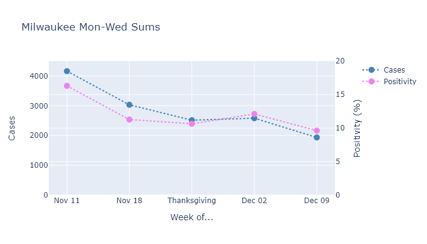

Cases and now deaths are declining in Wisconsin. Thanksgiving was not able to reverse this trajectory, although I think the data shows it did lead to a modest increase in infections.

### Deaths and cases
Two weeks ago I predicted that [deaths had peaked](2020-12-7-status-update.md). The intervening weeks first seemed to confirm this prediction, but in the last few days the average has swung upward again. It looks like this upswing may be driven by some batch reporting from especially Madison and Milwaukee, which you can see in the [regional plots](../dashboard-regional.md). I still think deaths should continue trending downward overall, but they perhaps won't follow the case curve as closely as I thought.

### Thanksgiving surge?
The Thanksgiving weekend caused multiple overlapping discontinuities delays in the tracking data, which makes it difficult to tell if the holiday caused any kind of surge in infections. First there were fewer tests than usual over the holiday; for tests that occurred before Thanksgiving, results probably took a bit longer than usual; and then the reporting of those results through the DHS system was certainly delayed. 

These effects create a small dip and spike in the case curve and the positivity rate that I think are primarly due these changes in reporting and testing, not spread of the virus. And in any case, the overall trend downward has now resumed, so we can conclude at least that Thanksgiving did not reverse the state's trend.

However! This does not preclude the possibility of a small effect for Thanksgiving. Now that some time has passed, we can look at data accurately dated to the time of testing, instead of result or report. First, here is the case data from Wisconsin, mapped to the date of symptom onset or Covid test.

If a person caught the coronavirus on Thanksgiving, it would take a couple days for symptoms to develop and perhaps another day to seek testing. So I would expect any increase in cases from Thanksgiving to start getting appearing on Monday the following week.

In fact, this does seem to be what happens. The Monday/Tuesday/Wednesday following Thanksgiving have slightly higher case numbers than the same days prior to Thanksgiving, bucking the overall downward trend.

We do not know from this data, however, how the level of testing has varied over this time. It is possible that testing overall was lower during Thanksgiving week, which would make the number of detected cases lower. An artificially low number of cases during Thanksgiving week would then make the week after Thanksgiving *look like* a surge.

Unfortunately, DHS only publishes test data by *result* date, not *test* date. (Come on DHS, didn't you know I'd want to look at that?) But [Milwaukee County's dashboard](https://www.arcgis.com/apps/opsdashboard/index.html#/018eedbe075046779b8062b5fe1055bf) does show both cases and tests by test date. I collected this data[^Brag] and plotted it below.

In this data, we can see that testing numbers were significantly different for Thanksgiving day itself, and to a lesser extent the Friday after. For Monday/Tuesday/Wednesday, testing numbers are pretty much on a gentle downward trend from the week before Thanksgiving through two weeks after.

Since testing on these days of the week does not seem greatly affected by the holiday, for each week I summed only those three days of the week and computed the number of cases and the test positivity rate.

This plot shows that the number of cases diagnosed after Thanksgiving went up very slightly, and the positivity rate went up as well. Since both measures increased, this increase in cases is not an artifact of increased testing. 

And since this slight increase occurred in the middle of a longer-term downward trend, 

The case peak, measured by test date, occurred the second week in November. The peak in tests, interestingly, occurred the following week, while cases fell. Possibly this is because all the close contacts of the past week's positives were seeking testing; possibly it indicates that people were trying to get tested as a precaution before Thanksgiving week.

So Thanksgiving week happened in the middle of a downslope. If nothing had changed with testing, we could expect Thanksgiving week to have fewer cases than the week before, and the week after to have fewer cases yet. If a person contracted the virus around Thanksgiving, they would start showing symptoms a few days later and probably seek testing the week after the holiday.

But of course testing did change. Thanksgiving Day itself had very few tests and cases, and the following Friday was also lower than I would normally expect. Fewer tests will tend to make cases go down, and the positivity rate go up.

People took a little more risk over the Thanksgiving holiday, and we got a little more virus. Because the increase in activity was probably temporary, it did not change the overall trend.

I plot this day-by-day because the holiday threw the normal weekly patterns out of whack. Thanksgiving day itself saw a low number of cases, because certainly many fewer tests were performed that day. The week after Thanksgiving, though, does appear to have a slight increase in the number of cases, before they resume declining in the following week.

---
[^Brag]: Milwaukee County doesn't make it available for download, but I was able to write a script to scrape it from the html of the dashboard web site.
