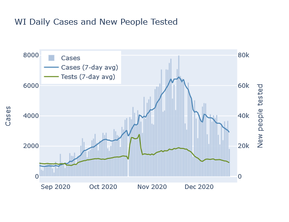

Thanksgiving celebrations did not reverse the virus's downward trend in Wisconsin, but I think the data shows it did lead to a modest increase in infections.

### Thanksgiving surge...
I have been somewhat skeptical of the idea of a Thanksgiving surge, and a first assessment of the data seems to confirm that intuition. Wisconsin's case numbers have continued on their decreasing trend, which shows at least that celebrations did not reverse the virus's trajectory.

And while the days after Thanksgiving did see a dip and spike in the case curve and positivity rate, I thought those were primarily due to [changes in reporting and testing](2020-12-7-status-update.md) over the holiday weekend, rather than spread of the virus.

### Thanksgiving spurt
While these observations argue against the existence of a large surge, however, they do not rule out Thanksgiving spread altogether. And as time passes, the data available becomes more complete and we can get around some of these reporting effects. In particular, we can look at complete data by the date of testing, instead of the date of reporting. 

First, here is the [case data from Wisconsin](https://www.dhs.wisconsin.gov/covid-19/county.htm), plotted by the date of diagnosis or of symptom onset. The lines separate weeks, grouped Monday through Sunday, and Thanksgiving Day is labeled. 
If someone caught the coronavirus on Thanksgiving, it would take a few days for symptoms to develop and perhaps another day to seek testing. So I would expect any increase in cases from Thanksgiving to start appearing on Monday the following week.

Sure enough, the Monday/Tuesday/Wednesday following Thanksgiving do have slightly higher case numbers than the same days prior to Thanksgiving. And this increase happens in spite of the longer-term downward trend.

We do not know from this data, however, how the level of testing has varied over this time. It could be that the number of tests were lower during Thanksgiving week, which would make the number of detected cases lower. An artificially low number of cases during Thanksgiving week could then make the week after Thanksgiving *look like* it was increasing, when perhaps true prevalence was not.

Unfortunately, DHS only publishes test numbers by *result* date, not *test* date, so I can't directly compare. (Come on DHS, read my mind.) But [Milwaukee County's dashboard](https://www.arcgis.com/apps/opsdashboard/index.html#/018eedbe075046779b8062b5fe1055bf) does show both cases and tests by test date[^Brag], so I plotted it below.

In this data, we see that testing numbers were much lower than usual for Thanksgiving day itself, and to a lesser extent the Friday after. For Monday/Tuesday/Wednesday, though, testing numbers are pretty much on a gentle downward trend from the week before Thanksgiving through two weeks after.

Since testing on these days of the week does not seem greatly affected by the holiday, for each week I summed only those three days of the week and computed the number of cases and the test positivity rate (cases divided by number of tests).

This plot shows that the number of cases diagnosed after Thanksgiving went up very slightly, and that the positivity rate went up as well. When both of these measures increase, I think it is a reliable indicator that true prevalence is also increasing. 

Furthermore, this slight increase occurred in the middle of a longer-term decrease, so I think it is even clearer that it represents some amount of "excess" spread. If the holiday had not occurred, I would have expected that week to have fewer cases and lower positivity than the week before it; instead both metrics were higher.

### Thanksgiving speedbump
We can be grateful that the excess Thanksgiving spread was only a speedbump on Wisconsin's downslope, rather than the foothills of a new peak. In retrospect, I think these results make perfect sense. People took a little more risk over the Thanksgiving holiday, and we got a little more virus. But because the increase in activity was only temporary, it did not change the overall trend.

I think Thanksgiving now holds a lesson for Christmas. Taking on a little more risk for the sake of the holiday did increase the spread, but it did not cause a catastrophe. So whatever reasonable precautions we have taken, let's keep them up and make sure the next speedbump is also a little one.

---
[^Brag]: Milwaukee County doesn't make it available for download, but I was able to write a script to scrape it from the html of the dashboard web site.
