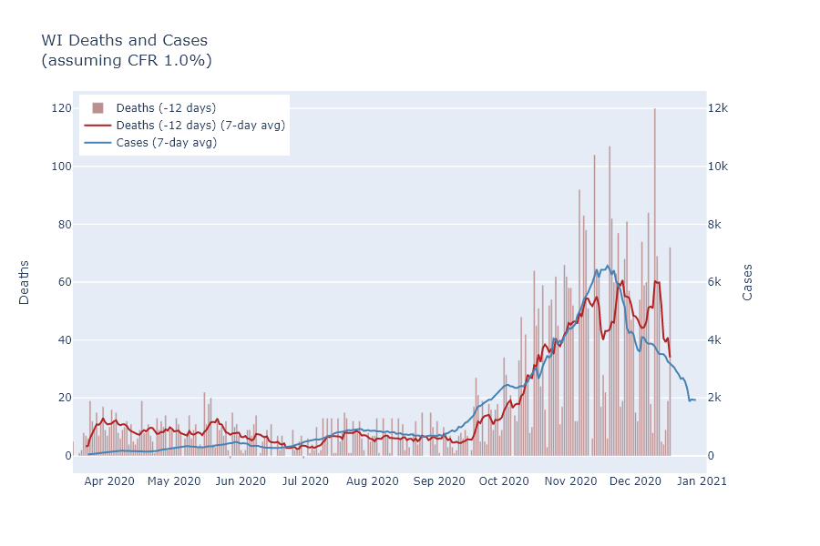
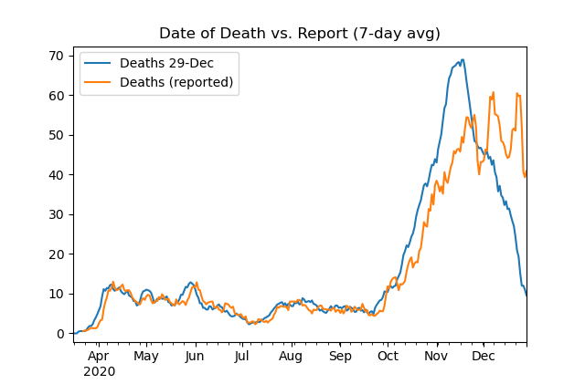
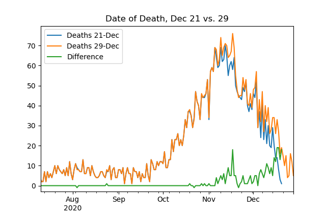

Cases continue declining in Wisconsin. Deaths numbers plateaued for a while and are a bit erratic, but I expect them to decline overall in the future. As happened with Thanksgiving, I predict a relatively small, temporary spurt of new cases from the Christmas and New Year's holidays.

### Cases and deaths
Several weeks ago I predicted that [deaths had peaked](2020-12-07-status-update.md). The intervening weeks have proven this wrong. Here is an update of the graph overlapping Wisconsin's reported case and death curves, with about a two week delay.

Clearly the death curve did not follow the case curve on its downswing, but instead stayed on an erratic plateau for a while. I think this is due not to anything strange with the virus, however, but to increased delays in recording deaths. The [DHS website](https://www.dhs.wisconsin.gov/covid-19/county.htm) does provide data by date of death, in addition to the date of reporting. If I compare these curves, it is evident that the reporting delay increased during the fall surge. This is probably not surprising - health departments have had a lot more deaths to process.

Be wary in interpreting this date-of-death curve, because dates from up to 8 weeks ago are not complete yet. Another way of looking at the reporting delay, actually, is to compare the date-of-death curve today with the curve from a week ago. The difference shows when the deaths reported in the last week actually occurred.

Note that for this plot I've switched from 7-day averages to daily numbers. It shows that many of the last week's reported deaths are from recent days, but that a substantial number are still coming in from mid-November.

I still think reported deaths should start trending downward soon, but for now the timing is going to depend more on reporting than on the previous weeks' cases.

### The lump of covid in our stocking
I believe careful analysis shows that [Thanksgiving did cause a small, temporary spurt of cases](2020-12-21-thanksgiving.md). I would expect the Christmas holidays to have a similar, somewhat larger effect.

The reason I am more concerned now than at Thanksgiving is just that the Christmas season is a longer period of time, with New Year's following closely. It is also preceded by more shopping and activity. Furthermore, since Thanksgiving did not create a large increase in virus, and we are further from Wisconsin's peak, people may have decided to be less cautious for Christmas. The [Google mobility data](2020-11-15-mobility.md), indeed, show a much larger increase in visits to retail and recreation locations prior to Christmas than they did prior to Thanksgiving.

On the other hand, I would not expect people's level of caution to change drastically, and it is true that we are at a lower level of virus activity right now. So my prediction would be that Christmas will cause a larger percentage increase of cases than Thanksgiving, but that the absolute case rate will not exceed the post-Thanksgiving mini-peak and the effect will still be temporary.

Here's wishing for a happier 2021.
