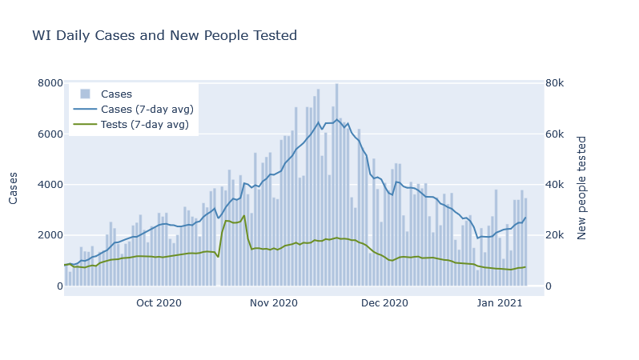
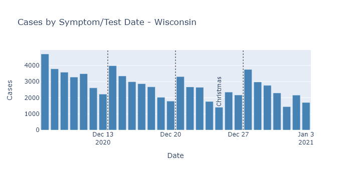

Early returns show that Christmas did indeed lead to an increase in spread. I predict and hope that this spurt of cases will be temporary, as it was for Thanksgiving, but we will need to wait one or two more weeks to know if that happens.

### The moon is right, the virus up[^McCartney]
The daily reported case numbers are increasing in Wisconsin.

But in a similar situation to Thanksgiving, it is hard to know how much of this pattern is due to increased spread during the holiday leading to more cases afterwards, and how much is due to lower testing and delayed reporting leading to fewer *reported* cases during the holiday. To find out, this post will look into the same data by test date that I did in [my Thanksgiving post](2020-12-21-thanksgiving.md).

Here are Wisconsin cases by date of test or symptom onset for four weeks around Christmas, excluding the most recent week because data is not complete yet. Since it is plotted by test or symptom date, it is easier to interpret than the report-date data. There is clearly a modest rise in the number of daily cases in the week after Christmas.

DHS does not publish numbers for tests by test date, so there is no easy way to adjust this for the number of tests being performed. The number of tests in the weeks around Christmas and New Year's was probably lower than the previous weeks. So while this test-date data avoids confusion from delayed reporting, it is still difficult to say whether this trend is a real increase in virus, or an artificial dip due to lower testing around Christmas.

But Milwaukee County, my favorite county, does publish cases and tests by test date, so we can get a better idea for that county in particular.

There is a dropoff in case and tests on the holidays themselves: Christmas and New Years Days, and to a lesser extent their Eves. But the other days of the week are fairly consistent week to week. So I can compare cases and test positivity rate averaged over Mondays through Wednesdays, just as I did for Thanksgiving.

Both cases and positivity rate went up in the week after Christmas, breaking the downward trend from the prior weeks. When both these measures go up at the same time, I think it means that true infections are also going up.

### Simply having a temporary Covid spike?
As long as the Christmas holidays only caused a *temporary* increase in activity, though, I expect the numbers to start going down again in the next week or two, just like they did after Thanksgiving.

Provided they do, I find this pattern of temporary spurts somewhat encouraging, actually. I believe it demonstrates our (admittedly limited) ability to control the virus. For the last several weeks, Wisconsin's current combination of activity level and partial population immunity has been sufficient to put infections on a downward trend. When activity increases, as at Thanksgiving and Christmas, then infections start increasing too. Our population immunity is only partial; it's only enough to prevent spread in the context of our current activity level and preventive measures.

But when the holidays end and we reduce activity again, infections decline again as well. With all that this virus has done to surprise us, I take a little comfort that this pattern seems almost...predictable. Of course, this all assumes that cases *do* go back down again in the next two weeks, and the virus doesn't decide to prove me wrong.

---

[^McCartney]: Sing headings to the tune of [Wonderful Christmastime](https://www.youtube.com/watch?v=-IHP9Acxa54). Fun fact, I actually hate this song and complained about it to my wife on our first date (which was in March). She calls me whenever she hears it so I can...enjoy...it with her.
