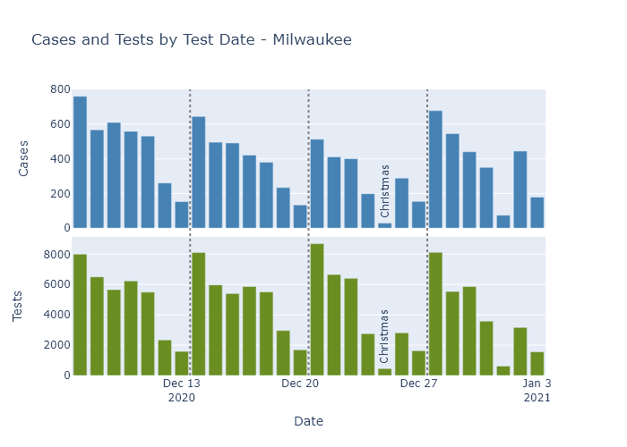
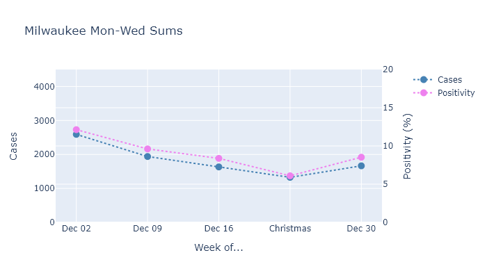

Early returns show that Christmas did indeed lead to an increase in spread, greater in percentage terms than Thanksgiving. I predict and hope that this spurt of cases will be temporary, as it was for Thanksgiving, but we will need to wait one or two more weeks to know if that happens.

### The moon is right, the virus up
Because 
This post will show basically the same data as I did in [my Thanksgiving post](2020-12-21-thanksgiving.md)

Here are Wisconsin cases by date of test of symptom onset for the last four weeks. There is clearly a sustained rise in the number of daily cases in the week after Christmas, continuing into this past week. This past week's data is not even complete yet, so the numbers for this week should rise a bit further yet.

DHS does not publish numbers for tests by test date, so there is no way to adjust this for the number of tests being performed. The number of tests in the weeks around Christmas and New Year's was undoubtedly lower than the previous weeks, so it is still difficult to say whether this trend is a real increase in virus, or an artificial dip due to lower testing around Christmas.

But Milwaukee County publishes both, so we can get a better idea for that county in particular.

Similar to Thanksgiving, there is a dropoff in cases and tests on the holidays themselves, but the other days of the week are fairly consistent week to week. So we can compare cases and test positivity rate averaged over Mondays through Wednesdays.

Both cases and positivity rate went up in the week after Christmas, breaking the downward trend from the prior weeks.

###
As long as the Christmas holidays were only a *temporary* increase in contacts, I expect the numbers to start going down again in the next week or two, just like they did after Thanksgiving.

I find this pattern of temporary spurts encouraging, actually, because it demonstrates the (admittedly limited) ability we have to control the spread. Right now Wisconsin is in an okay position. The combination of preventive measures and partial population immunity we have right now is sufficient to put infections on a downward trend. If we get less cautious and start having more contacts, as we did around Christmas, then we'll go on the increase again. Our population immunity is only partial; it's not enough to prevent spread if our behavior went totally back to normal. 

The biggest danger, though, is not a temporary increase in activity like these holidays, but a long-term change that increases the spread. So it's important to just keep up whatever preventive measures we're all doing. The long-term change we're counting on, of course, is the vaccine, and we get progressively safer as more people get vaccinated. , for the near future

And the other sustained changed to worry about is the new strain, which scientists think may be substantially more transmissible.

---
[^McCartney]: Fun fact, I actually hate this song and complained about it to my wife on our first date (in March). She calls me whenever she hears it so I can...enjoy...it with her.

