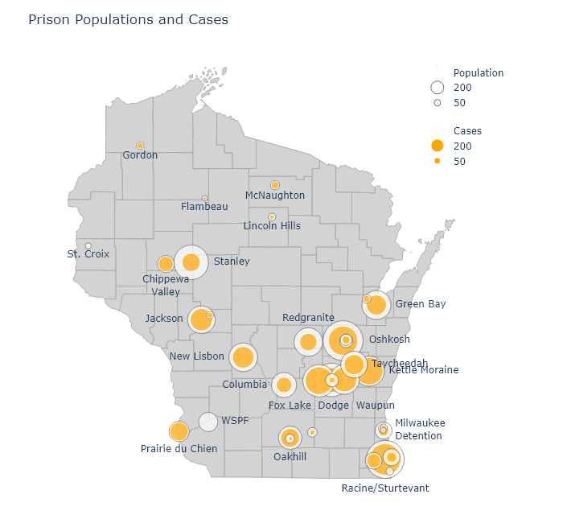
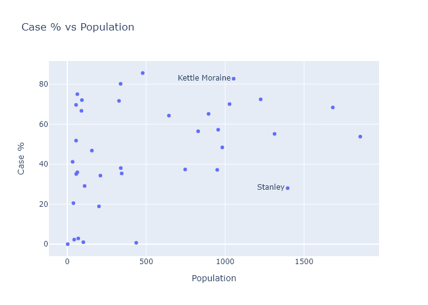

The state Department of Corrections operates 37 prison facilities. It also maintains a small percentage of prisoners at contract facilities, such as county jails. In total, Wisconsin's prisoner population is 20,000 people (according to [this recent population report](https://doc.wi.gov/DataResearch/WeeklyPopulationReports/01082021.pdf)). This only includes prisoners, not people in jail awaiting trial or serving misdemeanor sentences (I think?). From a [2019 demographic report](https://doc.wi.gov/DataResearch/DataAndReports/2019%20PIOC%20Profile.pdf), prisoners are about 95% male, with median age 39.

The DOC provides data for its facilities on a pretty comprehensive [Covid dashboard](https://doc.wi.gov/Pages/COVID19(Coronavirus)/COVID19TestingDashboard.aspx). Total numbers are summed up in the table below. 

Table

If I am interpreting the numbers correctly[^Correctly], more than 50% of all prisoners have been infected. This is about twice an [estimated true infection rate in the general population](https://covid19-projections.com/infections/us-wi). Unlike in the general population, it seems unlikely that there is a large amount of undetected infections, since I think the DOC would usually test everyone in the prison once an outbreak began.

Most of these infections occurred during the same fall wave that hit the state as a whole.

[Plot from dashboard?]

I was curious on the variation between different prisons, so I matched Covid numbers from this dashboard with prison populations to calculate a fraction infected for each facility. In the following map, I show a bubble at each facility's location. The outer bubble size is proportional to the prisoner population, and the inner bubble is proportional to the number of Covid cases. Each bubble's fill percentage, then, shows the infection percentage in that prison. All the prisons are shown here, but I left labels off some smaller ones for the sake of readability.

There have been a number of times over the fall when I've noticed a particular county has had a puzzlingly high case rate. Always, as I dug deeper, I would find out it was because a large prison had tested everybody and added hundreds of cases to the county numbers. Dodge County is a good example - it had high numbers for weeks in ???, but this was mostly because it contains three of the largest prisons in the state.

Few prisons have kept their infection percentage low, but there is some variation. For example, Kettle Moraine has had over 80% infected, while Stanley only has about 25%??. Are there any obvious correlations? I can plot infection fraction vs population:

The predominant relationship here seems to be that there is just more variation in the smaller prisons, which makes some sense. With smaller numbers comes more randomness. The larger prisons seem to converge to an over-50% average.

Another possiblity might be crowding. The population report I mentioned earlier also contained data for each facility's design capacity. So I can plot infection fraction versus "overcrowding", the ratio of a prison's current population to its design capacity. There seems to be a small but noisy correlation here.

---
[^Correctly]: The DOC Covid dashboard lists "Positive Tests", not cases, but specifies that this does not include retests, so I think it must be the same as individual cases. It is probable that not all the cases that occurred in an institution are currently residing there; some have been released (which is listed on the dashboard), and some may have been transferred (which is not listed). The number released is less than 2% of the total cases, however. And if cases have been transferred between facilities, that may affect the individual facilities' tallies but would not affect the total numbers.
