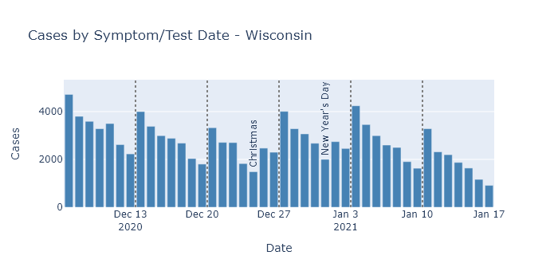
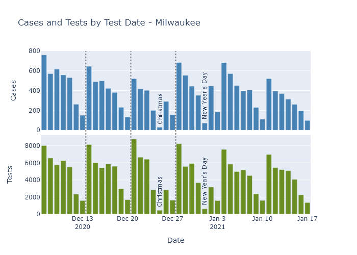
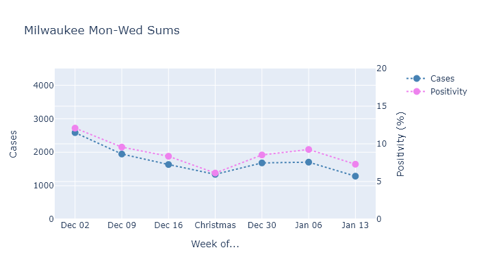

Now that data has fully filled in for the weeks following Christmas, we can confirm that the Christmas case bump was indeed temporary, and Wisconsin has returned to a gradual downslope of infections.

### So this is Christmas (bump is over)
Daily cases by test or symptom date started increasing after Christmas, reached a peak about a week into January, and have been declining since.

As in previous posts, I display the cases by test or symptom date, instead of reporting date, to avoid any issues of confounding because of reporting delays. (Reporting delays are currently making the plot of deaths by report date look nothing like the plot of deaths by death date.)

And again, to check whether this pattern may be due to changes in testing, we can look to Milwaukee County data, which publishes both cases and tests by test date. (The state only publishes cases by test date; it publishes tests by the *result* date.)

The holidays themselves have lower testing, but the other days around them are more consistent. So I'll average only the consistent Monday through Wednesday and plot cases and positivity rate together.

Both measures increased after Christmas, and continued going up a bit in the week after New Year's Day. After that, though, they resumed their decrease on about the same slope as before the holidays.

This data shows that Christmas caused a modest but temporary bump in the number of infections, I believe because the increased activity around the holidays was also only temporary.

### The outlook for Wisconsin
Now that the holidays are over, I expect the gradual downward trend in infections and deaths to continue, possibly until we have mass vaccination and the pandemic is effectively over. Our current combination of partial population immunity, prevention measures, and increasingly vaccination, is strong enough beat the virus back.  There are a few possibilities that could still interrupt this path, however. 
 
The first possibility is that when colleges go back into session this week, it will cause a spike in cases similar to what we saw in the fall. As long as this spike is confined to college campuses, I don't think it's something to greatly worry about. I mean, Tommy Thompson and Becky Blank should worry about it, but I think it's unlikely to kick off any wider increase in spread.
 
The second, more dangerous possibility is the arrival of a more transmissible coronavirus strain to Wisconsin. One strain has become widespread in the U.K., and scientists think that it is responsible for a fast rise in cases even in the face of strong restrictions on activity. These new strains have been detected in the United States, but we don't have any evidence that they're widespread. If a more transmissible strain were to arrive in Wisconsin, its higher transmissibility could return us to increasing infections. 

If this were to happen, my guess is that we would see it in Milwaukee and Madison first, much as those areas saw the first major outbreaks of the original coronavirus. The new strain would have to arrive here from somewhere, and that is more likely to happen in larger cities with more frequent travel out of state.

So far, however, there are no signs of an outbreak of the new strain, so my hope is that more vaccinations, and spring, arrive before it does.

---
