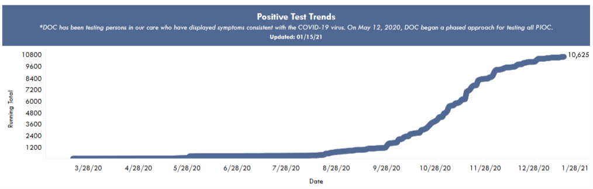
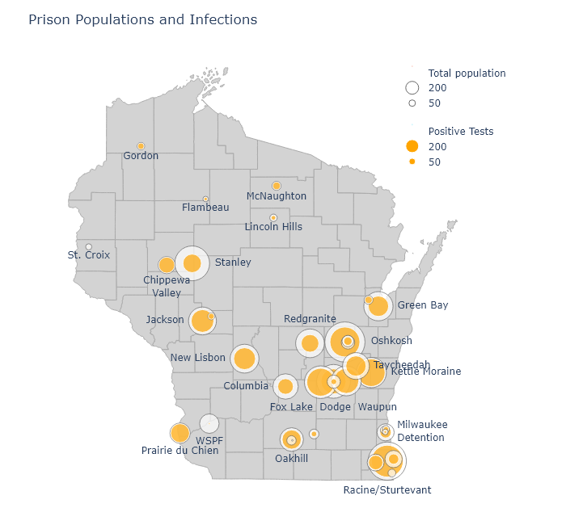
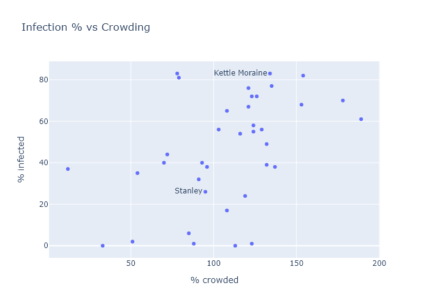

Prisons are not a good place to be in a pandemic. More than 10,000 - over half - of Wisconsin's prisoners have caught coronavirus, in addition to over 2000 staff. Obviously being confined in close quarters is not a good starting point, but there is enough variation between prisons to suggest that Wisconsin prisons could have done a lot better.

### The system as a whole

The Wisconsin Department of Corrections operates 37 prison facilities. It also maintains a small percentage of prisoners at contract facilities, such as county jails. In total, Wisconsin's prisoner population is about 20,000 people (according to [this recent population report](https://doc.wi.gov/DataResearch/WeeklyPopulationReports/01222021.pdf)). This number only includes people under the care of the Department of Corrections, so it does not include federal prisoners or everyone in county jails, such as those awaiting trial. From a [2019 demographic report](https://doc.wi.gov/DataResearch/DataAndReports/2019%20PIOC%20Profile.pdf), prisoners are about 95% male, with median age 39.

The DOC provides data for its facilities on a pretty comprehensive [Covid dashboard](https://doc.wi.gov/Pages/COVID19(Coronavirus)/COVID19TestingDashboard.aspx). Total numbers are summed up in the table below. 

| --------------- | ------------------
| Population (DOC facilities) | 19,271
| Confirmed cases       | 10,557
| Total tests           | 85,970
| Case % of population  | 55%
| Deaths                | 25
| Case fatality rate (CFR)    | 0.24%

If I am interpreting the numbers correctly,[^Correctly] more than 50% of all prisoners have been infected. I'm sure there have been some number of undetected infections as well. But the total number of tests is pretty high, enough for each prisoner to have been tested four times or more. So I would guess that the DOC is detecting most of the infections.

In the general population, in contrast, the cumulative number of tests stands at about [1 per person](https://covidtracking.com/data/state/wisconsin), and the case numbers may understate the true infections by a [factor of 3 or so](https://covid19-projections.com/infections/us-wi). Using that estimate, if about 30% of Wisconsin has had the coronavirus, then prisoners have had about double the risk of catching Covid as the average resident. 

As for risk of death, the prisons' CFR of 0.24% is perhaps a bit higher than what I would expect, based on data from the state as a whole. I only know prisoners' median age of 39, not their distribution, but let's crudely assume they're evenly distributed between ages 20 and 59. Then using the CFR table from [my previous post on age](https://covid-wisconsin.com/2020/12/13/age/), I would predict a CFR of 0.15%. So it would seem that prisoners' risk of death after catching Covid may be somewhat higher than the general population. This could be an illusion due to the crude estimate; because they're mainly men, who have a higher mortality rate; or I imagine because of worse average health and medical care.

In contrast to prisoners' divergent risks of catching and dying from Covid, the timing of prisons' outbreaks was just the same fall wave that hit the state as a whole. The following plot of cumulative cases is from the DOC's dashboard, and shows the most rapid case growth in October and November.

### Comparing individual prisons

To compare the performance of different prisons, I matched Covid numbers from the DOC dashboard with prison populations to calculate a fraction infected for each facility. In the following map, I show a bubble at each facility's location. The outer bubble size is proportional to the prisoner population, and the inner bubble is proportional to the number of Covid cases. Each bubble's fill percentage, then, shows the case percentage in that prison. All the prisons are shown here, but I left labels off some smaller ones for the sake of readability.

An interactive version of this map is available at my new [Prisons dashboard page](https://covid-wisconsin.com/dashboard/prisons/), along with a table of all the DOC's prisons and their Covid numbers. The table is sortable, so you can find out which prisons have the highest cases, deaths, or case percentages.

There have been a number of times over the fall when I've noticed a particular county has had a puzzlingly high case rate. Always, as I dug deeper, I would find out it was because a large prison had tested everybody and added hundreds of cases to the county numbers. Dodge County is a good example - it had higher numbers than its neighboring counties throughout November, but this was partially because it contains three of the largest prisons in the state. Those three prisons alone - Fox Lake, Dodge, and Waupun - account for 22% of all the county's positive cases.

Few prisons have kept their case percentage low, but there is some variation. Perhaps the worst performer has been Kettle Moraine in Sheboygan County, which has had almost 900 cases and a case percentage of 83%. Not surprisingly, there have been [reports of poor pandemic management](https://madison.com/wsj/news/local/crime-and-courts/they-played-with-our-lives-how-one-wisconsin-prison-failed-to-contain-a-covid-19/article_dc703b21-224b-5d0c-bfc5-926820020135.html). In contrast, Stanley in Chippewa County only has 28% cases. 

It would be very interesting to compare infection control practices at Kettle Moraine and Stanley, or at WSPF (Wisconsin Secure Program Facility), which is almost Covid-free. Did the prisons with relatively low case rates do anything different, or did they get lucky?

Or are there any obvious correlations in the data? One possibility could be the size of the prison; so here is case percentage vs population:

The predominant relationship here seems to be that there is just more variation in the smaller prisons, which makes some sense. With smaller numbers comes more randomness. The larger prisons almost all converge to an over-50% average.

Another possiblity might be crowding. More social distancing and better quarantining might be possible in less crowded facilities. The population report I mentioned earlier also contained data for each facility's design capacity. So I can plot infection fraction versus "overcrowding," the ratio of a prison's current population to its design capacity. There seems to be a small but noisy correlation here.

This suggests that some ways of reducing Covid risk could be to expand facilities, or to expand [compassionate release](https://www.postcrescent.com/story/news/2020/10/20/i-feel-completely-helpless-calls-release-certain-state-prisoners-grow-louder-virus-spreads-behind-ba/5935506002/) of certain prisoners, such as the elderly or those with little time left in their sentences.

My wife is a public defender. Back in the fall she won a case for compassionate release of someone in federal prison, due to his health and elevated risk from Covid. (I created a graph for her brief; she tells me lawyers are dazzled by Excel plots.) Unfortunately, compassionate release is [harder for state prisoners](https://www.wisbar.org/NewsPublications/InsideTrack/Pages/Article.aspx?Volume=12&Issue=20&ArticleID=28061), and from what I can glean it doesn't seem like it has happened very frequently. [This article from August](https://www.jsonline.com/story/news/2020/08/11/wisconsin-rejecting-release-requests-prisoner-health-concerns-rise/3311115001/) cites 131 applications and only 2 releases - out of twenty thousand prisoners.

I think the advocates of compassionate release have been vindicated. Every person released before the fall wave would have been spared a very high chance of catching Covid. And by reducing crowding, they probably also would have reduced the risk for the remaining prisoners (and guards!). The DOC clearly didn't have any better plan in place.

---
[^Correctly]: The DOC Covid dashboard lists "Positive Tests", not cases, but specifies that this does not include retests, so I think it must be the same as individual cases. Some cases that have occurred in an institution are no longer residing there; some have been released (which is listed on the dashboard), and some may have been transferred (which is not listed). In the table I list the total positive tests minus the number released, which is only about 200 people and less than 2% of the total cases. If cases have been transferred between facilities, that may affect the individual facilities' tallies but would not affect the total numbers. 
