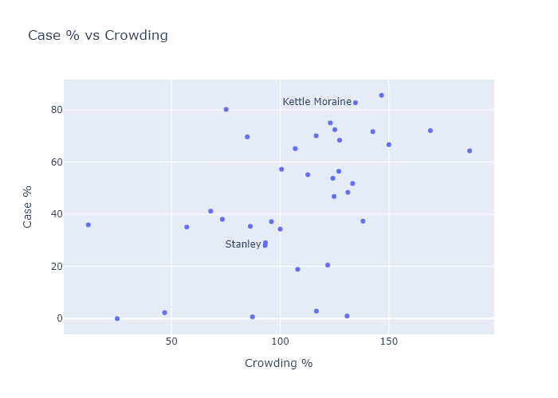

Prisons are not a good place to be in a pandemic. More than 10,000 - over half - of Wisconsin's prisoners have caught coronavirus, in addition to over 2000 staff. Obviously being confined in close quarters is not a good starting point, but there is enough variation between prisons and enough [reports of poor management](https://madison.com/wsj/news/local/crime-and-courts/they-played-with-our-lives-how-one-wisconsin-prison-failed-to-contain-a-covid-19/article_dc703b21-224b-5d0c-bfc5-926820020135.html) to suggest that Wisconsin prisons could have done a lot better.

The Wisconsin Department of Corrections operates 37 prison facilities. It also maintains a small percentage of prisoners at contract facilities, such as county jails. In total, Wisconsin's prisoner population is about 20,000 people (according to [this recent population report](https://doc.wi.gov/DataResearch/WeeklyPopulationReports/01082021.pdf)). This number only includes people under the care of the Department of Corrections, so it does not include federal prisoners or everyone in county jails, such as those awaiting trial. From a [2019 demographic report](https://doc.wi.gov/DataResearch/DataAndReports/2019%20PIOC%20Profile.pdf), prisoners are about 95% male, with median age 39.

The DOC provides data for its facilities on a pretty comprehensive [Covid dashboard](https://doc.wi.gov/Pages/COVID19(Coronavirus)/COVID19TestingDashboard.aspx). Total numbers are summed up in the table below. 

| --------------- | ------------------
| Population (DOC facilities) | 19,271
| Covid Cases           | 10,557
| Total Tests           | 85,970
| Case %                | 55%
| Deaths                | 25
| Case Fatality Rate    | 0.24%

As long as I am interpreting the numbers correctly,[^Correctly] more than 50% of all prisoners have been infected. It's probable there have been some number of undetected infections as well. The underestimate has to be less severe than in the general population, though, where the case numbers probably understate the true infections by a [factor of 3](https://covid19-projections.com/infections/us-wi). First because it would be impossible - a factor of 3 would make the estimated number of infections exceed the number of prisoners. But the total number of tests is also quite high, enough for each prisoner to have been tested four times or more. So I would guess that the DOC is detecting most of the infections.

So if the infection rate in the general population is about 30% at this point, then prisoners have had about double the risk of catching Covid. 

Most of the prison infections occurred during the same fall wave that hit the state as a whole.

To compare the performance of different prisons, I matched Covid numbers from the DOC dashboard with prison populations to calculate a fraction infected for each facility. In the following map, I show a bubble at each facility's location. The outer bubble size is proportional to the prisoner population, and the inner bubble is proportional to the number of Covid cases. Each bubble's fill percentage, then, shows the infection percentage in that prison. All the prisons are shown here, but I left labels off some smaller ones for the sake of readability.

There have been a number of times over the fall when I've noticed a particular county has had a puzzlingly high case rate. Always, as I dug deeper, I would find out it was because a large prison had tested everybody and added hundreds of cases to the county numbers. Dodge County is a good example - it had higher numbers than its neighboring counties throughout November, but this was partially because it contains three of the largest prisons in the state. Those three prisons alone - Fox Lake, Dodge, and Waupun - account for 22% of all the county's positive cases.

Few prisons have kept their infection percentage low, but there is some variation. For example, Kettle Moraine has had over 80% infected, while Stanley only has about 25%. Are there any obvious correlations? One possibility would just be size of the prison; so here is infection fraction vs population:

The predominant relationship here seems to be that there is just more variation in the smaller prisons, which makes some sense. With smaller numbers comes more randomness. The larger prisons seem to converge to an over-50% average.

Another possiblity might be crowding. The population report I mentioned earlier also contained data for each facility's design capacity. So I can plot infection fraction versus "overcrowding", the ratio of a prison's current population to its design capacity. There seems to be a small but noisy correlation here.

My wife is a public defender. She has helped 

It would be interesting to compare practices at Kettle Moraine - which apparently was isolating Covid-positive prisoners but allowing their exposed cellmates to continue circulating - and Stanley. 

Conditions might be even worse, and even less justified, at county jails, where people who haven't yet been convicted of anything are still awaiting trials that are extremely delayed (because of Covid) in conditions that put them at great risk (because of Covid).

---
[^Correctly]: The DOC Covid dashboard lists "Positive Tests", not cases, but specifies that this does not include retests, so I think it must be the same as individual cases. Some cases that have occurred in an institution are no longer residing there; some have been released (which is listed on the dashboard), and some may have been transferred (which is not listed). In the table I list the total positive tests minus the number released, which is only about 200 people and less than 2% of the total cases. If cases have been transferred between facilities, that may affect the individual facilities' tallies but would not affect the total numbers. 
