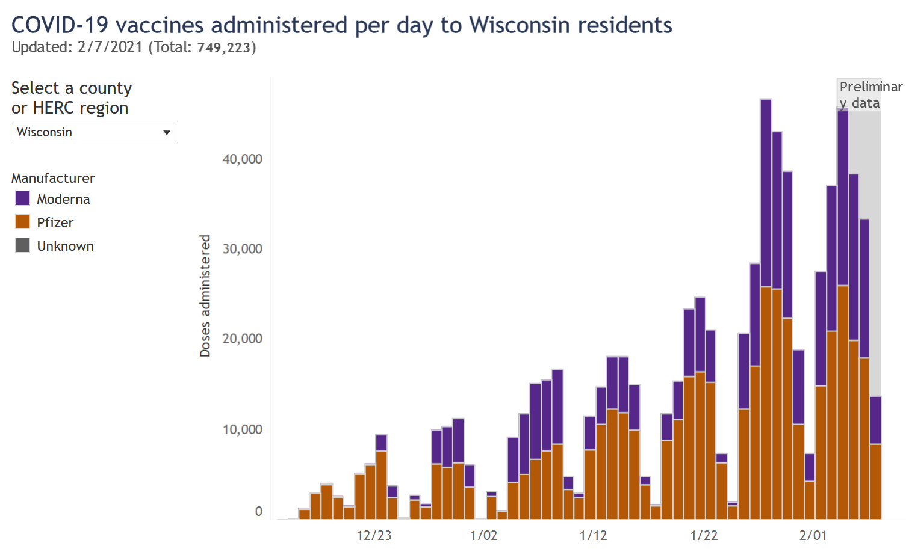
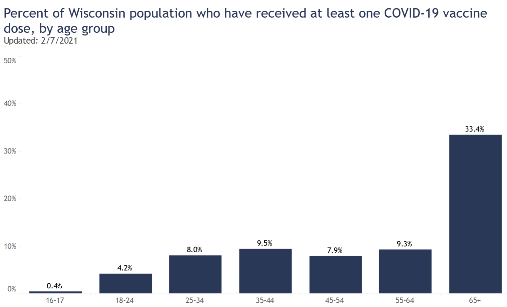
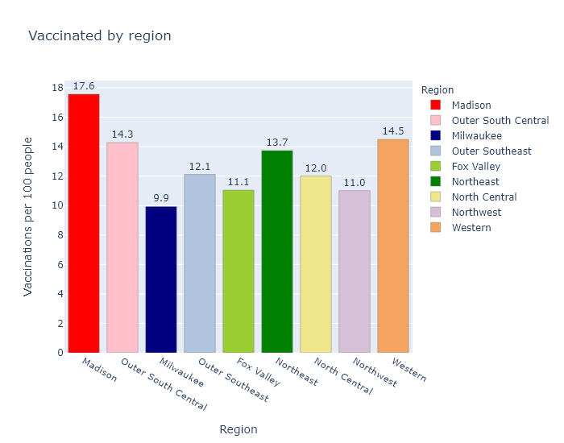
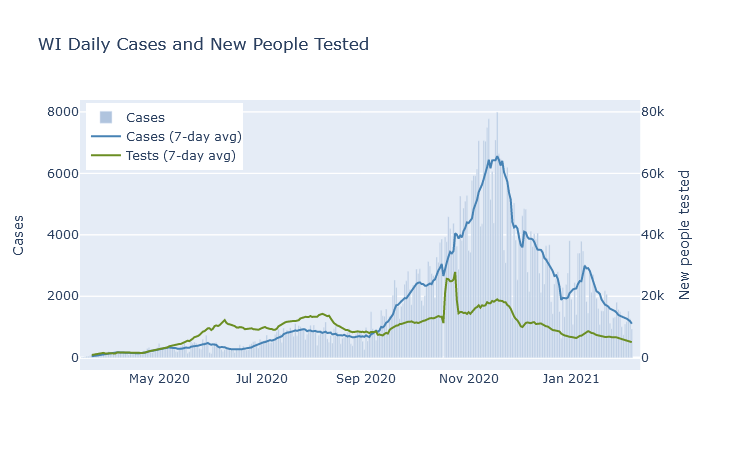
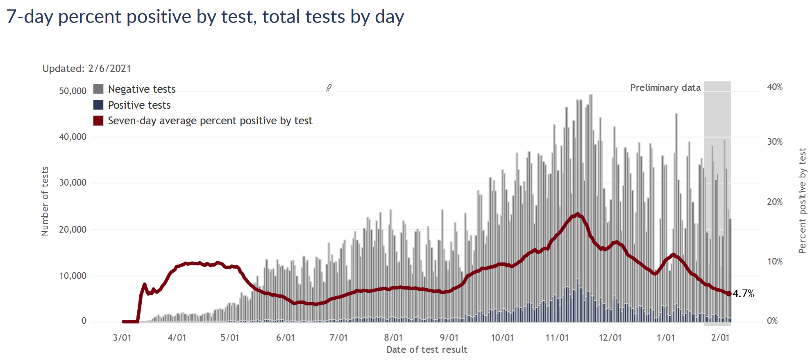

 
Indicators are pretty good! Vaccine administration has started picking up, reaching a substantial fraction of people over 65. I am concerned about uneven distribution between regions of the state, though. Cases and positivity rate continue steadily decreasing, making me optimistic despite the Covid variants abroad.

### Vaccines
I wish vaccine distribution was going faster, but I have been encouraged that in the last two weeks (since the 65+ group was given the green light), rates of vaccination have gone way up.

This data comes from the [DHS vaccination page](https://www.dhs.wisconsin.gov/covid-19/vaccine-data.htm). The proportion of people 65 and over who have received at least one dose has now reached 33%. Really that's decent progress. If this rate continued we would see 75% vaccination for the 65+ group by the end of the month.

I am concerned, however, that Milwaukee County has administered fewer doses than Dane County despite having almost twice as many people. Here is a bar graph of all the regions in Wisconsin and their number of vaccinations per 100 people. (For definitions of these regions see the bottom of the [regional dashboard](../dashboard/regional.md).) This is not the same as percentage of people vaccinated, since some of these vaccinations are second doses.

Madison (Dane County) is the best and Milwaukee County is the worst; other regions are in between. The fact that Dane County ranks first makes me wonder if Madison vaccinators may be getting more favorable vaccine allocations due to better knowledge and communication with the state bureaucracy. But the fact that Milwaukee ranks last makes me wonder if Milwaukee is doing a bad job on distribution. The DHS does not publish data on the allocation per county, unfortunately, so I can't do more than speculate.

A more benign possibility is that the discrepancy relates to the demographics of the regions; I would expect the vaccine numbers to be higher in regions with more health care workers and people over 65. But I don't think that solves the Madison-Milwaukee dichotomy, because I would think that both counties have more health care workers but fewer older people, per capita, than the rest of the state. 

Part of the explanation could be that more of the Milwaukee metro area's health care workers and older people live in suburbs in the surrounding counties. If I include the suburban WOW counties (Waukesha, Ozaukee, Washington) with Milwaukee, the metro area as a whole comes up to 11.4 vaccinations per 100 people, more in line with other areas of the state. But this still does not explain Dane County's over-performance.

I hope to figure out a more complete explanation, or better yet, that the discrepancy eventually evens out.

### Infections
Cases and positivity rate continue their steady downslope, looking the very picture of exponential decrease. (Meaning that if infections decrease, say, 15% every week, the curve will start out steep and flatten over time as it approaches 0; the opposite of exponential growth that starts out flat but quickly accelerates.)

Some authorities warn that we're not testing enough, but I think that's unfounded. Testing numbers are going down, but I think at this point that's a natural part of the surge cycle. Once infections are decreasing, there are fewer people with symptoms and contacts who need to get tested, so demand for testing goes down as well. As long as the test positivity rate is also going down or at least remaining steady and low, it doesn't seem worrisome to me.

A side benefit of the lower testing demand is that response times have improved. I was tested several weeks ago and got the results by the end of the next day; the [Milwaukee County dashboard](https://mcoem.maps.arcgis.com/apps/opsdashboard/index.html#/018eedbe075046779b8062b5fe1055bf) indicates that [nearly 100% of tests are returned within 48 hours](../assets/MkeCounty-TestReturn_2021-02-05.png).

Extrapolating the current case and positivity declines forward to the end of the month would bring the state about back to where we were before the fall surge, at the beginning of September.

The coronavirus variants are out there, so I think it behooves us to remain cautious and vigilant. But indicators are pretty good right now, and I am still optimistic about beating the virus by the summer. 
