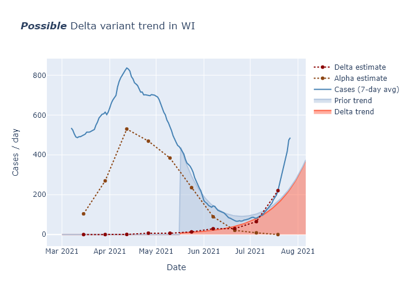

This week there were three additional cases of the B.1.1.7 variant detected in Wisconsin.

*And hast thou slain the Jabberwock?
      Come to my arms, my beamish boy!
O frabjous day! Callooh! Callay!
      He chortled in his joy.*[*](https://www.poetryfoundation.org/poems/42916/jabberwocky)

This was my mood when the results of the Pfizer virus trial were announced. (The Jabberwock = Covid, obviously.) With two doses of vaccine, the monster is slain.

*Beware the Jabberwock, my son!
      The jaws that bite, the claws that catch!
Beware the Jubjub bird, and shun
      The frumious Bandersnatch!*

The first important variant is B.1.1.7, which became dominant in the U.K. and is thought to be more transmissible and possibly more deadly than Covid Classic. The second is B.1.351, which emerged in South Africa and is thought to less affected by existing Covid immunity. This means that people who have already had Covid can be more easilty reinfected, and that the existing vaccines appear to be less effective (though still partially effective to a greater or lesser degree).
      
Clearly the Jubjub bird is B.1.1.7, since as a bird it travels more easily, and the Bandersnatch is B.1.351, "frumious" meaning "less affected by existing immunity."
      
*He took his vorpal sword in hand;
      Long time the manxome foe he sought—*

The [CDC has a page](https://www.cdc.gov/coronavirus/2019-ncov/transmission/variant.html) with information about the new variants, which also includes a third one, P.1.  So far B.1.1.7 is the larger concern. Since it is more transmissible, once introduced it should gradually out-spread Covid Classic. If B.1.351, in contrast, is not inherently more transmissible but is somewhat more able to reinfect those with immunity, this is not immediately as great an advantage. Once most people have some natural or vaccinated immunity, this variant will probably become the bigger concern. (But Moderna and other vaccine makers are preparing boosters for it.) 

The CDC also tracks [all known cases](https://www.cdc.gov/coronavirus/2019-ncov/transmission/variant-cases.html) in the United States by state. There are hundreds of known examples of B.1.1.7, but only a few of the others. California and Florida each have a few hundred known cases, and the other states only a smattering. Wisconsin has only had 5 known cases of B.1.1.7, and none of the others.

A [recent preprint]() estimated the prevalence of B.1.1.7 in the United States and how fast it is displacing Covid Classic. They estimated that at the end of January, B.1.1.7 accounted for 2% of cases in United States, and its *share* of cases was growing at 7% per day, which implies that it is about 40% more transmissible than Covid Classic.

A growth rate of 7% per day corresponds to a doubling time of 10 days, which sounds alarming. But it is important to see this is the growth in *share*, the proportion of all Covid cases that are from this variant. The overall numbers of Covid cases will follow the Classic trend, which is decreasing right now, until the variant becomes a substantial fraction of total cases.

*So rested he by the Tumtum tree
      And stood awhile in thought.*

To see how this might play out in Wisconsin, I made a very simple model pictured below. I eyeball-fit a decreasing exponential curve to Wisconsin's case trend since mid-January. (Decreasing 3.8% per day, or a reproduction factor of R=0.81, with a 5-day transmission interval.) I then assumed that prevalence of B.1.1.7 was 2% at the end of January, and that its transmissibility was 40% higher (so R=1.1, or increasing 2.7% per day). The sum of the two models the total Covid cases per day over time. Under these assumptions, the case rate would level off at the beginning of April and then begin to rise again, reaching a level comparable to today by June.

I want to emphasize that this is *not* a prediction, but an illustration, and I perhaps counterintuitively take it as hopeful. 

*One, two! One, two! And through and through
      The vorpal blade went snicker-snack!*

This model assumes that current trends simply continue indefinitely, but they almost certainly will not.

First, every week almost two hundred thousand vaccines are getting administered, *snicker-snack*. Over 10% of Wisconsin residents have had at least one dose so far, and if we maintain this pace another 10% should have one or two doses by the end of March. This will include a majority of people over 65s. There will still be a long ways to go, but this is enough vaccination to further reduce transmission and to prevent a large proportion of the worst outcomes.

Second, I expect the seasonality of the virus to further work in our favor as winter fades into summer. The end of March is fully spring.

Finally, the B.1.1.7 prevalence may not even be as high as 2% in Wisconsin. The paper's prevalence estimate for the United States did not include any samples from Wisconsin, because it was based on a single company's data. But Wisconsin has been doing its own decent amount of coronavirus sequencing. We have found 5 cases of B.1.1.7, but that is out of thousands of samples. [This article](https://www.postcrescent.com/story/news/2021/01/19/wisconsin-covid-19-gene-sequencing-detects-variants-like-b-1-1-7/6641060002/) from mid-January reports 4400 samples; presumably it is higher now. A total of 5 positives out of probably more than 5000 samples would suggest a prevalence more like 0.1% at the moment, not 2%. That buys us even more time.

And, as in uffish thought he stood,
      The Jabberwock, with eyes of flame,
Came whiffling through the tulgey wood,
      And burbled as it came!

’Twas brillig, and the slithy toves
      Did gyre and gimble in the wabe:
All mimsy were the borogoves,
      And the mome raths outgrabe.
