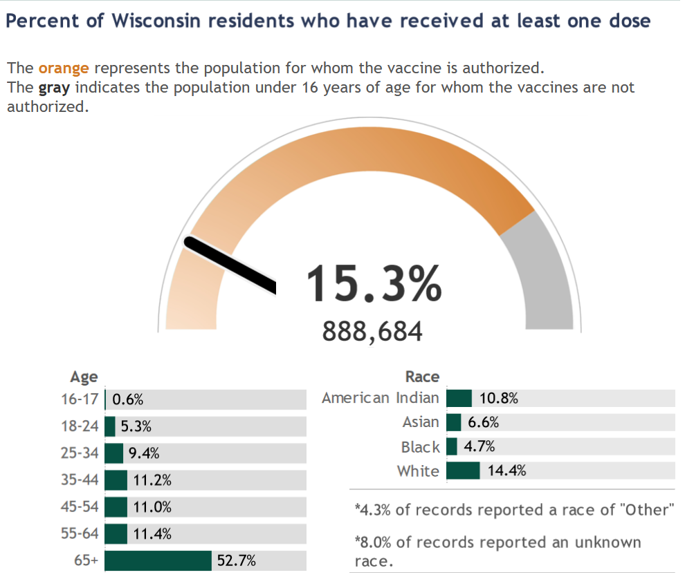
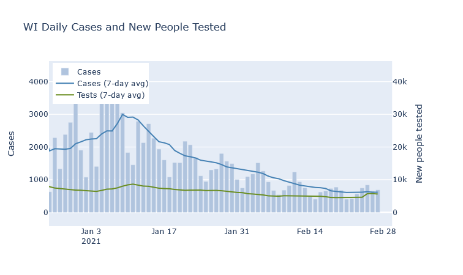
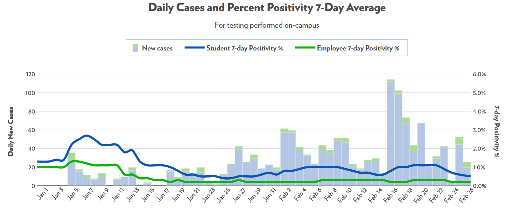
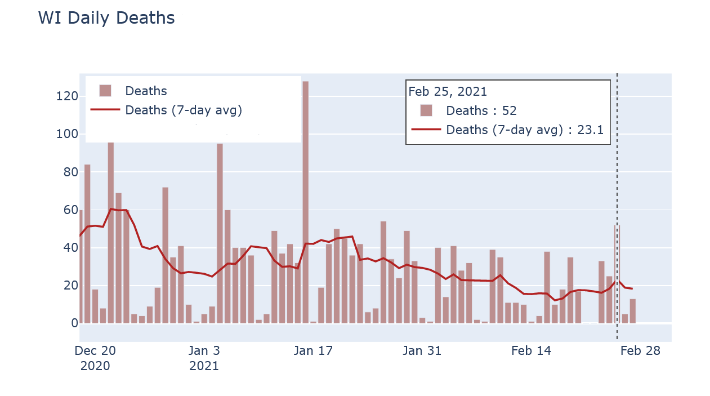
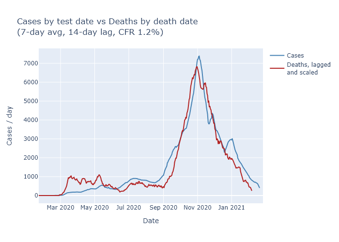

Vaccination is progressing well. Case numbers flattened out this week, but I don't think it's cause for alarm at this point. Finally, while reported death numbers continue to be erratic, when you look at actual dates of death they follow the case trajectory pretty closely. 

### Vaccine progress
The [DHS vaccination dashboard](https://www.dhs.wisconsin.gov/covid-19/vaccine-data.htm) is quite good, so I direct you there for looking at the data by week and by county. Below is a screen grab of the current population who has had at least one dose.

My takeaways are:
- Just over 50% of people over 65 have had at least one dose of the vaccine. This age group accounts for about three-quarters of Covid deaths in the state, so this is hugely important.
- About 200,000 doses have been administered each week for the past five weeks; that is great progress. While the state seemed to get off to a bit of a slow start, that is behind us and the major limitation on vaccinations right now is supply, not distribution.
- That said, supply is increasing. The weekly allocation of vaccines to Wisconsin, as reported on the dashboard, has increased from 140,000 per week earlier in the month to more than 200,000 per week now. Based on the schedule Moderna and Pfizer have committed to, these weekly numbers should continue to go up throughout March.
- Even so, for the time being first doses may be slowing down a bit. Now that we're several weeks into vaccinations, scheduled second doses will be taking up a larger chunk of vaccines, slowing down the first doses for everyone else until supply increases even more.

### A blip in cases?
At the state level, last week the average number of daily cases flattened and even blipped upwards for the first time in a while. I do not think this is cause for alarm, however, at least not at this point. An unusually high number of negative tests was reported at the same time, so there may be some catch-up reporting going on. The statewide test positivity rate has also continued decreasing. If cases are flat but positivity is still going down, I think that is still a positive trend - though of course we'd like to see them both decreasing.

At a local level, the only place that I can tell is having a bit of an outbreak is UW-Madison. I was surprised that it took this long, honestly, since there was such a sizable campus outbreak at the beginning of last semester. For now, though, it seems to have already subsided without much fanfare.

### Deaths are out of order
If you aren't a Covid data junkie and don't, like, run your own hobby blog and stuff, you may see the erratic daily death reports and be concerned. If cases are so low, why did we see 52 deaths reported on a single day last Thursday? 

The reason is that *reported* death numbers are very delayed. Of those 52 reported deaths, nearly half occurred in 2020, and most of the rest occurred in January. Now this day had an unusually high number of old reports, but that's exactly the reason its reported deaths number was so high in the first place. Reported cases, in contrast, do have their own delays but are much more current than deaths.

If instead I compare [DHS's data](https://www.dhs.wisconsin.gov/covid-19/county.htm) on deaths by date of death and on cases by date of test (or symptom onset), the trends look very comparable. The plot below overlaps the two, with deaths moved up by 14 days and the vertical scales matched to imply a 1.2-to-100 ratio of deaths to cases. 

Now the match is not perfect - and note that I'm not even trying to match the spring, when case numbers were much lower due to lower testing. But it's close enough to give me confidence that the downward trend in cases is also leading to a downward trend in deaths, just as we would expect.
