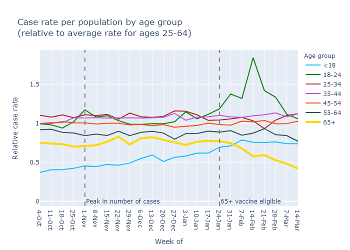

The high vaccination rate of those over 65 is now causing cases to decline faster in that age group. The vaccines are working.

Wisconsin's Covid cases peaked way back in November, due to (I believe) a combination of natural immunity and preventive behavior. Whatever the cause, it was far too early to be due to the Covid vaccines, which only began to be administered in December. I believe that the vaccines work, but is there any way to tell from the state's data? 

One way would be to compare two groups of people with different vaccination rates, and see if their case trajectories were significantly different. People over 65 provide a good test case, luckily for this blog (and for the people over 65).

In Wisconsin, vaccine eligibility was opened to anyone 65 and over starting on January 25. Before that, elibility was limited to healthcare workers and people in long-term care. (Although for Wisconsin, only nursing homes received the vaccine starting in late December, [assisted living only started administrations on January 25 as well](https://www.jsonline.com/story/news/2021/03/09/wisconsin-delayed-starting-assisted-living-covid-19-vaccine-program/4392335001/).) At the time of writing, [over 70% of seniors have received at least one dose](https://www.dhs.wisconsin.gov/covid-19/vaccine-data.htm), compared with 25% for all ages combined. Therefore, between January 25 and today, I would expect to see the Covid rates among seniors decrease faster than the rates among other age groups.

The best data to use for this is DHS's plot of weekly cases, by age group, by date of symptom onset or test result. Here is the full plot copied from the DHS website:

Recently, the over-65 age group has had the lowest case rate, a fact that [the Milwaukee Journal Sentinel has linked to their high vaccination rate](https://www.jsonline.com/story/news/2021/03/19/wisconsin-residents-65-hold-lowest-level-covid-19-cases/4768868001/?utm_campaign=snd-autopilot&cid=twitter_journalsentinel). I don't think that fact alone shows much, however, beca7se this age group already7 had the second-lowest rate throughout most of the pandemic. And because the case rates for all age groups have been going down since November, it's difficult to pick out whether a particular age group has been going down faster than the others.

To be more sensitive to this kind of change, I downloaded DHS's data and made the plot below, which may require some explanation. First I took each age group's rate of cases per 100,000 population, just as shown in the DHS plot. Then I compared those rates against the average case rate for the ages 25-64. I think these age groups represents a sort of baseline for the course of the pandemic, because their case rates tend to move up and down together. In contrast, the 18-24 group has very different pattern due to college outbreaks, and the over-65 group is the one we want to study. The under-18 group is also interesting on its own, so I exclude it from the average as well.

So this plot shows the weekly case rate (per population) for each age group, divided by the average case rate for everyone ages 25-65. It therefore does not show the overall peaks and valleys of the pandemic; it only shows changes in how the different age groups are affected, relative to the baseline 25-64 average. So what does it show? Saving the best for last - 

- Older age groups have generally had lower case rates; 65+ has a lower rate (its line is lower on the plot) than 55-64, which is lower than 45-54, etc.
- The 18-24 group had a mini-surge in mid-February, which I would link to [college campuses](https://covid-wisconsin.com/2021/02/28/status-update/#a-blip-in-cases).
- The under-18 case rate, while low, has gradually increased relative to the other age groups since the fall. I could guess at several possible reasons for this, including school openings; higher availability of tests making it more common to test mild-symptom cases in kids; or buildup of natural immunity in the other age groups leading to a higher 

This plot shows that cases in the over-65 group have in fact decreased faster than other age groups. Moreover, it looks like this divergence started after the week of February 7, two weeks after eligibility. The vaccine clinical trials indicate that their effectiveness begins [two weeks after the first dose].

Another data point to look at would be hospitalizations by age. They are a more important outcome than cases in themselves. And we know that the vaccines are probably even more effective at preventing hospitalization and death than they are at preventing transmission. 

Unfortunately, the only death-by-age data that is publicly available is deaths by date of report, which has recently been particularly unreliable. When you add up the two weeks for the vaccines to begin working, the three or more weeks to proceed from infection to death, and then the unknown number of weeks for a death to be recorded, it seems unlikely that death data will show anything useful yet.

I would guess that their overall lower case rate is because of typically lower numbers of social contacts - likely retired, not going to parties - and perhaps stricter personal precautions due to being at higher personal risk.

In contrast, the under-18 rate, while still decreasing, appears to have decreased less quickly than all other age groups. I would speculate this is due to a lower level of natural immunity - since their case rates have been much lower all through the pandemic - and perhaps because many schools went more virtual during the fall surge but returned to in-person later.

