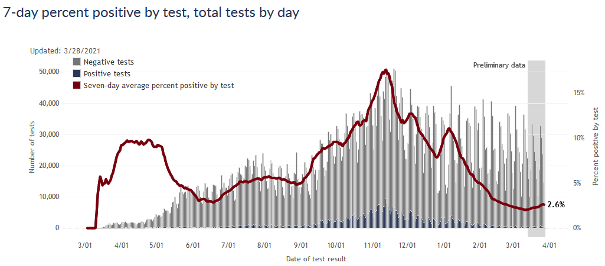
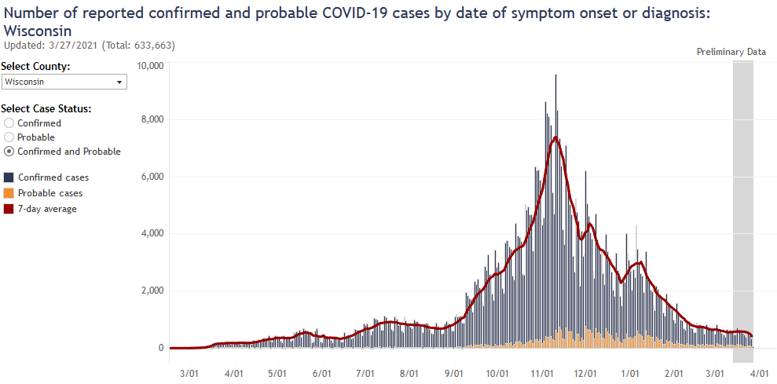
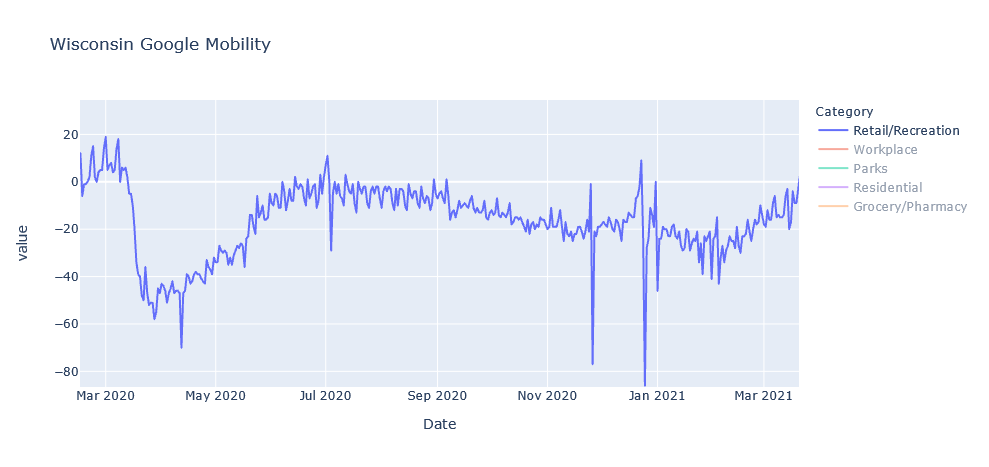
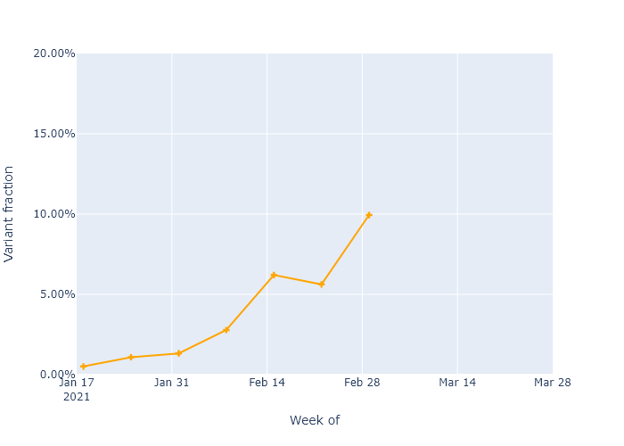

Unfortunately, infections have started trending upwards again, I believe because of a combination of the B.1.1.7 variant and gradually relaxing precautions. But I am still optimistic that vaccinations will keep this last wave small.

### Dangit
Cases are trending upwards again. DHS has been doing some data cleaning in the last several weeks, so there have been a couple bumps in reported cases over the last month that I didn't think had any larger significance. Over the last week, however, more indicators have lined up to show that there is a small increase going on. First, there is the test positivity rate:

Second, the cases by date of test are just perceptibly trending upwards. This plot is always incomplete for the most recent days, so as data fills in it the upward trend will become more clear.

### What's the cause?
My best guess for the cause of the uptick is a combination of people somewhat lowering their personal precautions (laying no blame, I have done it too), and the more transmissible B.1.1.7 variant gaining a foothold.

First, if I pull an update of the Google mobility data, it does show that retail/recreation activity has increased substantially from a low in January. 

I'm focused on retail/recreation not to blame everything on those activities, but more as an index of how cautious people are being in general. Infections are way down, and vaccinations are up, so it's not surprising that people have eased up on precautions. But I'm guessing it is contributing to the uptick.

The second item is the B.1.1.7 variant, which experts expect to gradually spread through the country and increase virus transmission overall, in a race with vaccinations. I have been able to get some idea of where this stands in Wisconsin through something called the [GISAID database](https://www.gisaid.org/), which is a scientific effort that collects genetic sequences for coronavirus and flu submitted by labs and researchers all over the world. Genetic sequencing can differentiate B.1.1.7 samples from other coronavirus strains. In Wisconsin, places like UW-Madison and the state laboratory are submitting their data to GISAID. If I download all the sequences from Wisconsin and chart the percentage that are B.1.1.7 over time, I get the following plot.

The B.1.1.7 variant is increasing in frequency,[^GISAID] as would be expected from having higher transmissibility. The data only goes up to early March, but it's an easy guess that the trend would continue. So the B.1.1.7 variant could make up more than 20% of cases in Wisconsin right now. I think that is enough to start having an effect on our infection numbers, though not enough to be dominant. As it becomes dominant, the overall virus transmissibility will gradually get higher in the state.

### But let's not freak out
I had really hoped we would not see another wave before this was truly over, so this is discouraging. I'm particularly concerned for central Milwaukee, which has already seen a lot of Covid and now is lagging in vaccinations. And our neighboring states [Minnesota](https://twitter.com/dhmontgomery/status/1376206617264316416) and [Michigan](https://www.michigan.gov/coronavirus/0,9753,7-406-98163_98173---,00.html) show that this wave could certainly get worse.

On the other hand, our advantages over the virus have not gone away. We still have vaccination progressing well overall, a mass of people with natural immunity, and the oncoming summer season working in our favor. *And* many of the most vulnerable people have already been vaccinated. So I would still expect this last wave to be small, and to have a lower incidence of death and other bad outcomes.

Think about it this way. If we're the Packers, and Covid is...the Seahawks...we're up five points with two minutes left. We've got this, we've just got to -

{:style="display:block;margin-left:auto;margin-right:auto"}

Sorry, the pain is still raw I know. The point is, let's not do that.

---

[^GISAID]: I am making the pretty large assumption that the sequences in the database are representative of the state. I have not been able to find much information about Wisconsin's sequencing effort and which samples get sequenced and submitted to this database.
