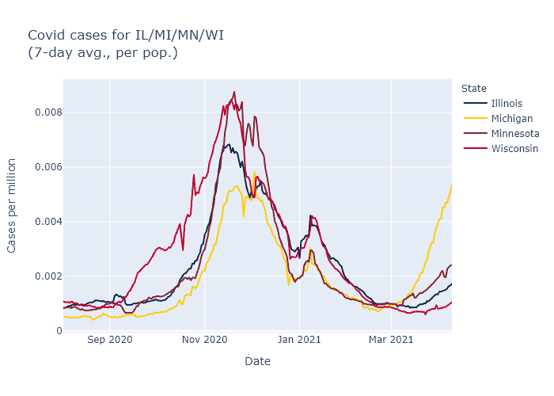

Wisconsin is in the beginnings of a surge in Covid cases. Many of the states in Wisconsin's neighborhood have it worse, especially Michigan but also Minnesota and Illinois. I think the trends in these states can mostly be attributed to the proportion of the B.1.1.7 variant.

### Conference standings
Below is a plot of average cases per day for these four states, using [data from the New York Times](https://github.com/nytimes/covid-19-data). 

For the current wave, it is easy to rank these states in order of severity. Michigan is the worst, followed by Minnesota, Illinois, and last Wisconsin. It is still possible Wisconsin will follow the same trajectory as Michigan, but with ongoing vaccination and possibly more favorable seasonality coming on, I would expect our later start to the wave to lead to a better outcome overall.

But why the different trajectories in the different states? My guess is that the driving force is the prevalence of the B.1.1.7 variant.

Here is [the CDC's estimate](https://covid.cdc.gov/covid-data-tracker/?CDC_AA_refVal=https%3A%2F%2Fwww.cdc.gov%2Fcoronavirus%2F2019-ncov%2Fcases-updates%2Fvariant-proportions.html#variant-proportions) for the prevalence of B.1.1.7 in each state, measured over a four-week period ending March 13. 

State | Proportion of B.1.1.7 
------| ---------- 
Illinois  | 13.1%
Michigan  | 39.0%
Minnesota | 25.5%
Wisconsin | 9.5%

The higher a state's B.1.1.7 prevalence a month ago, the earlier and higher their cases have now spiked. This suggests that the spread of this more transmissible variant may be sufficient on its own to explain these state differences.

A contrary data point is that other states outside the Midwest, Florida in particular, also have high B.1.1.7 prevalence but are not surging like Michigan. For these states, though, I would speculate that the more favorable climate at this time of year is offsetting some of the B.1.1.7 effect.

Returning to the Midwest, another possibility suggested by the plot above is that the states with relatively lighter fall waves are the ones that are now surging higher; Michigan's fall appears to have been the easiest and Wisconsin's the hardest. Perhaps as a result Wisconsin had more built-up natural immunity, or more entrenched cautionary behavior coming out of the fall wave, and therefore was more resistant in the spring.

### Wisconsin's 

I have looked at the state of B.1.1.7 in Wisconsin before

### A note on data sources
I have searched for corroborating evidence for the state prevalence numbers above, but I have not found any source with good data on variant prevalence, over time, by state. 

The Wisconsin DHS has [a page on variants](https://www.dhs.wisconsin.gov/covid-19/variants.htm), but it only shows overall totals. Same with the [CDC's main variant tracker page](https://www.cdc.gov/coronavirus/2019-ncov/transmission/variant-cases.html). I don't find these very helpful; I don't really care about the absolute number of cases or how common B.1.1.7 was over the last nine months (not very), I care about how common it is now.

The testing company Helix has been doing public analyses of its data, including [reporting in the New York Times](https://www.nytimes.com/interactive/2021/04/06/us/variants-cases-spread.html). So far this looks like the best data on the variants in the United States. But while the company has estimates for Michigan, Minnesota, and Illinois that comport with the numbers above, it doesn't do enough testing in Wisconsin to make estimates for our state.

Another source is the GISAID database, which [I have used to plot Wisconsin](https://covid-wisconsin.com/2021/03/28/status-update/#whats-the-cause) and which can visualized by state on the site [outbreak.info](https://outbreak.info/location-reports?loc=USA_US-WI). Its data for [the](https://outbreak.info/location-reports?loc=USA_US-MI) [other](https://outbreak.info/location-reports?loc=USA_US-MN) [states](https://outbreak.info/location-reports?loc=USA_US-IL) are pretty erratic as a function of time, though, although when averaged out they also track with the CDC's estimate pretty well.

