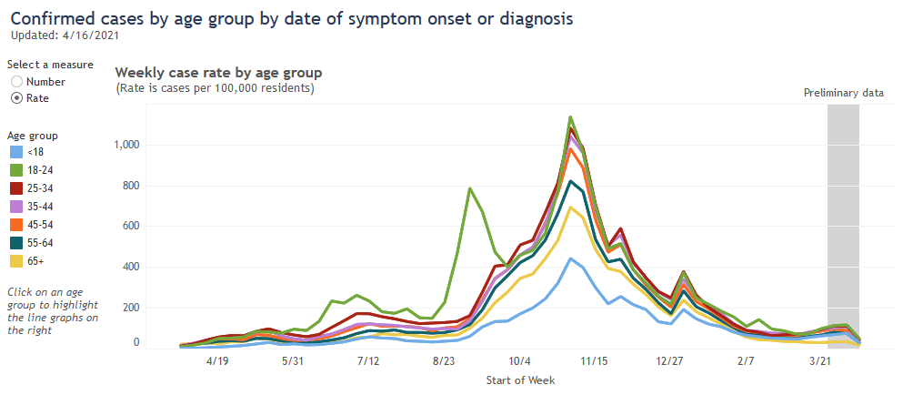
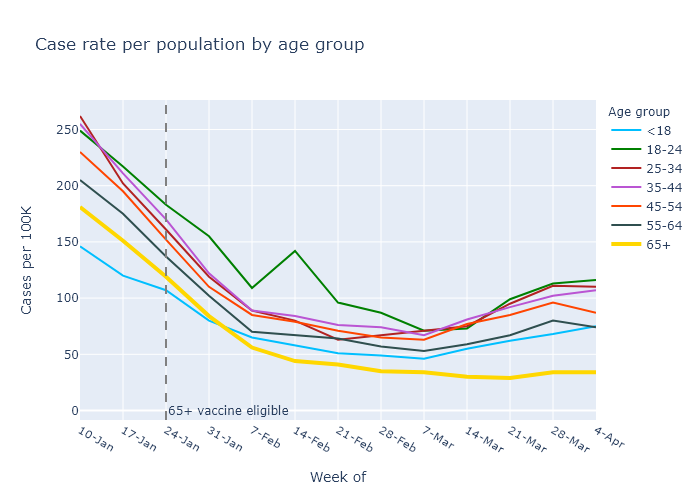
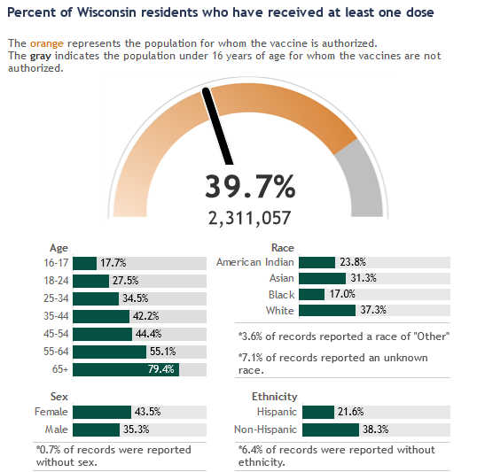
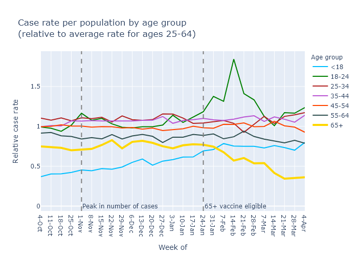

In Wisconsin people over 65 were vaccinated before other age groups, and they now clearly have much lower Covid rates than other age groups.

### Over 65

[A month ago](2021-03-21-vaccines-work.md), the overall case rate was decreasing, but I argued that Covid cases for those over-65 were decreasing faster as a result of vaccinations. It took some analysis, though, because when everything is going down it's hard to see when one line is going down faster than the rest.

Now that we have had a spurt of new cases we don't have that problem. You can just eyeball the graph. From DHS:

The case rate for people over 65 (in yellow) is pulling away from the pack. While everyone else's rates have moderately increased over the last few weeks, the case rate for those over 65 has stayed flat. Let's zoom in.

A closer look shows that the over-65 case rate has gone up a bit in the current spurt, but still by much less than everyone else.

A back-of-the-envelope calculation shows that this is about the reduction in cases I would expect from the level of vaccination for over-65s. To see this, let's compare those over 65 to those under 18. People under 18 have hardly been vaccinated at all, so their case trajectory should show no effect of vaccination. 

In the week of January 10, the start of the plot above, the over-65 and under-18 categories had case rates of 181 and 146, respectively. In the absence of the vaccines, let's assume the ratio of these rates would have remained the same. In that case, by the week of April 4 the under-18 rate was 75 and the case rate for the over-65 should have been (181/146) &times; 75 = 93.

Since the actual rate was only 34, by this reasoning the vaccines prevented 63% (1 - 34/93) of that week's over-65 Covid cases. That's pretty close to the percentage of people over 65 who have already received both doses - 72% as of this writing and a few points lower during the week of April 4. The vaccines are still working.

### Other age groups
Now that eligibility is much wider, other age groups are also catching up. Behind the over-65 age group, the 55-64 group happens to have the second highest [vaccination rate](https://www.dhs.wisconsin.gov/covid-19/vaccine-data.htm) with 55% one dose and 31% two doses. And the next younger age groups aren't far behind.

Using my more sensitive normalized plot for Covid case rates, I think you can maybe see a downward trend in that 55-64 group (in black).

So despite the recent increase in cases, vaccination effectiveness looks strong and vaccination progress is still encouraging. 
