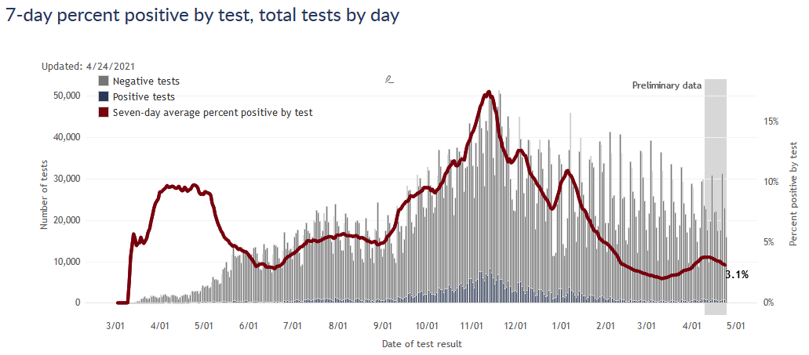

The spring wave has crested for Wisconsin as whole, though not yet in Milwaukee. Vaccination progress has reached 50% of adults but has slowed down.

### Wisconsin spring
The spring wave has clearly peaked, thankfully long before it got bad at all. Both reported cases and test positivity rate are now declining. 

In terms of cases, this spring wave (in Wisconsin) turned out even smaller than the late summer wave from last year. It also hardly touched the largely vaccinated over-65 age group, so I would expect a relatively small number of deaths as a result - possibly not even detectable as a wave in the death data.

Interestingly, all [four midwestern states](2021-04-11-variants-midwest.md) with spring waves peaked this same week, even though the severity was much different in each state. The synchronicity makes me think there must be common factors at work - I would guess vaccination and seasonality, since both vaccination pace and climate are quite similar among these states.

### Milwaukee
Unfortunately, Milwaukee appears to be an unfortunate exception here. While cases in Wisconsin as a whole have tipped downwards, in Milwaukee they are steady or even slowly rising.

A big part of the reason, I think, is the failure to get more vaccines to the central city.  Below are two maps, the first showing percentage of people vaccinated, and the right showing new Covid cases in the last 30 days. The north side, not coincidentally, has both the lowest vaccination rates and the highest recent Covid rates.

### Vaccination pace
Wisconsin has now vaccinated more than 50% of adults and more than 40% of the entire population. The number of doses being administered per week has started to decline, however. Vaccination rate peaked the week of April 4 - the week that eligibility opened to everybody - and has moderately declined since. Note that in the graphic below the vaccine bar for this week is not fully reported yet, so it will rise further.

The [AP has a good story on the causes for the decline](https://apnews.com/article/health-coronavirus-ee7363d012f472d5e8c703bf230a4356). In short, it's a combination of the pause in administering the Johnson & Johnson vaccine (which has now been lifted), and slackening of demand now that everyone is eligible and the people most eager to get vaccinated have had their chance.

I am dismayed that the vaccinating pace has slowed down. On the other hand, we *are* past half-way mark for adults and it seems only natural that demand would decrease as fewer people remain to be vaccinated. I do encourage anyone to get vaccinated if you have not yet - and lower demand means it's easier to do! Here are links for [Milwaukee walk-in sites](https://city.milwaukee.gov/CovidVax) and [Walgreens appointments](https://www.walgreens.com/findcare/vaccination/covid-19/location-screening).
