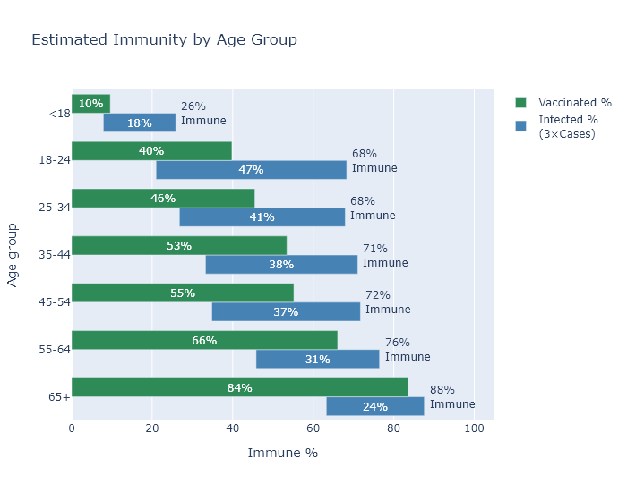

Wisconsin is about half vaccinated, but when you take into account previous infections, the fraction of people with some immunity is more like two-thirds. 

My read on expert opinion is that both types of immunity - from vaccination and from prior infection - confer good protection going forward. There may be hairs to split between them, and in fact [a combination of the two may be the most protective](https://twitter.com/EricTopol/status/1396538615266627585), so it is likely still helpful to get vaccinated even if you have been infected before. But here I'll treat them as equivalent.

To get an estimate of total immunity in the state, I'll start with the number of people vaccinated, which we know pretty well, and then incorporate the number of people with prior infections, which requires some estimation.

### How many are vaccinated?
The state DHS reports that 47.5% have received at least one dose of the vaccine. Oddly, the CDC reports a higher number of 51%. I don't know what to make of this discrepancy, which amounts to 200 thousand people and more than two weeks' worth of first doses. My best guess is that the CDC numbers are including some federal programs that aren't included in the state's data for some reason. I'll use the state's data because it is more detailed, but it may be that we have few more percentage points of vaccinations than it shows.

### How many were infected?
The number of confirmed cases in Wisconsin is about 610,000, or 10.5% of the population. But we know this underestimates the true number of infections, so we need more information.

The CDC now has a [national seroprevalence survey](https://covid.cdc.gov/covid-data-tracker/#national-lab), which samples blood taken from people for non-Covid reasons and tests it for Covid antibodies. The most recent survey puts Wisconsin at 30% infected, which seems pretty reasonable to me. 

Another way to get an estimate is to take the number of deaths and divide by an assumed infection fatality rate. Assuming a 0.45% IFR as in a [previous post](https://covid-wisconsin.com/2020/11/22/status-update/#how-many-of-us-have-been-infected), following virologist Trevor Bedford, that would imply 27% infected, very close to the CDC number. (About 7000 deaths, divided by 0.0045, divided by 5.8 million people in Wisconsin.) 

Based on these estimates, the true number of infections is larger than recorded cases by about a factor of 3. For convenience I'll use this nice round number for the rest of the analysis. 

### How many are immune?
So we have our two numbers. 48% of the state is vaccinated, and 31% have been infected, and of course there must be some overlap between the two. To figure the overlap I'll assume that the two things are independent; in other words, being previously infected does not affect someone's likelihood of being vaccinated.[^Probability] 

The figure below illustrates the estimate. The green bar shows the percentage of vaccinated people, the blue the percentage of previously infected, and their overlap represents people with both a previous infection and a vaccination. The combined spread of the bars shows the total immunity.

Now in reality I would guess that someone who has a previous infection is somewhat less likely to be vaccinated, whether because they have been less concerned about Covid all along, or because they recognize they already have some immunity. If this is the case the vaccinated and infected bars would move apart, the overlap would decrease, and the total immunity estimate would go up. So 66% may be a lower bound.

### By age
Another consideration that reduces the overlap between vaccinations and infections is age, at least among adults. In general, older people have been less likely to get Covid, and more likely to get vaccinated (very sensibly, since the risk of Covid increases rapidly with age). But this entails that the age groups that have the least vaccinations have also had the most infections, which in a way make up for low levels of vaccination. So although the vaccination rate varies pretty broadly between (adult) age groups, my estimated immunity rate is much less variable.

The big exception to this pattern are those under 18. They have had both few infections and very few vaccinations, since most of them are not even eligible for the vaccine yet. The good news is that driving down the virus numbers overall is having the desired spillover effect for cases in children.

### The implications
I find the 65% number encouraging on the one hand, because it will certainly be enough to prevent large surges like last winter, and because the number is even higher for the higher-risk age groups. But I'm discouraged on the other hand, because I would love to just grind coronavirus's knobby little spike proteins into the dirt, and I don't think 65% is going to quite get us there. Without more vaccinations I think we'll continue to see cases at a low level over the summer and a smallish wave in the fall. No reason to panic, but plenty of reason to hope for some more vaccination progress over the summer.

--

[^Probability]: Or in probability terms, P(vaccinated and infected) = P(vaccinated) &times; P(infected). The total fraction immune is then P(vax) + P(inf) - P(vax)&timesP(inf) = 0.48 + 0.31 - 0.48&times;0.31 = 
