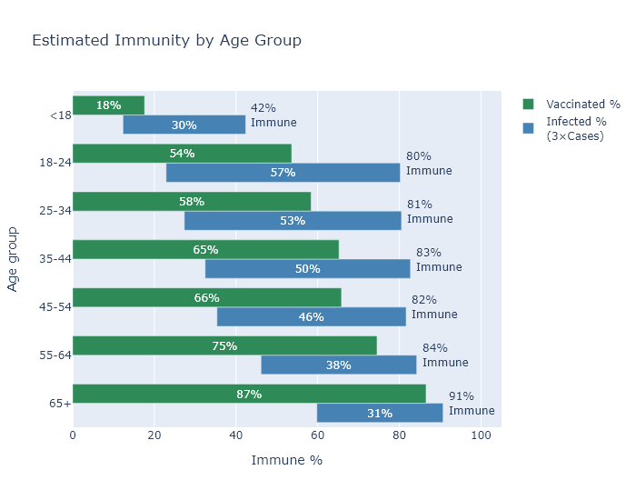

Wisconsin is about half vaccinated, but when you take into account previous infections, the percentage of people with some immunity is probably more like two-thirds. 

New infections have been declining for several weeks now. Are we done? 50% vaccinated would seem to be too low for the fabled "herd immunity", which is a hazy concept in the first place but 

I find the 50% number encouraging on the one hand, because it will certainly be enough to prevent large surges like last winter, and because the number for the elderly is about 80%, which will prevent most Covid deaths in the future. But I'm discouraged on the other hand, because I would love to just grind coronavirus into the dirt so it can never rise up again, and I don't think 50% is going to get us there.

On the other, other hand, there is a large percentage of people who gained immunity to Covid the old-fashioned way, and it's only fair to include them in the numbers. So in this post I will try to estimate the total number of people with some kind of immunity, whether from vaccination or infection.

My understanding is that it is not certain whether vaccinated or infected immunity is better than the other; the vaccinated seem to have more antibodies, but previously infected people may have better response in other pieces of the immune system. There are indications that natural immunity plus one vaccine dose may be the ideal combination.

But here I'll just treat them as equivalent. I think it's fair to say that whatever hairs you might split between them, both types of immunity confer good protection against reinfection, at least in the short and medium term.

### How many were infected?
First we need to know how many people were infected and therefore have natural immunity. [I addressed this once during the fall surge](2020-10-19-true-infections.md) and [here](https://covid-wisconsin.com/2020/11/22/status-update/#how-many-of-us-have-been-infected)

The CDC now has a [national seroprevalence survey](https://covid.cdc.gov/covid-data-tracker/#national-lab), which samples blood taken from people for non-Covid reasons and tests it for Covid antibodies. This survey puts Wisconsin at 30% infected, which seems reasonable to me. Another way to get an estimate is to take the number of deaths and divide by an assumed infection fatality rate. In previous posts I have used a 0.45% IFR, following the example of virologist Trevor Bedford. This method would estimate 27% infected (about 7000 deaths, divided by 0.0045, divided by 5.8 million people in Wisconsin), very close to the CDC number.

The total number of confirmed cases in Wisconsin, by contrast, is only about 610,000, or 10.5% of the population. So the true number of infections is larger than recorded cases by about a factor of 3. I'll use this nice round number for the rest of my estimates.

### How many are vaccinated?
The CDC reports that 50.9% of Wisconsinites have received at least one vaccine dose, which  is higher than the WI DHS number at 47.5%. I don't know what explains the discrepancy, which amounts to 200 thousand people and more than two weeks' worth of first doses. My best guess is that the CDC numbers are including some federal programs that aren't included in the state's data for some reason. But I like to be optimistic, so I'll take the higher CDC number.

### How many are immune?
So we have our two numbers. 51% of the state is vaccinated, and 30% have been infected, and of course there must be some overlap between the two. If people who had previously been infected were equally likely to be vaccinated as the uninfected, then the total number of immune would be 0.51 + (1-0.51) * 0.3 = 0.66, 66%. My guess is that this is not quite true, and that vaccination and infection are actually somewhat anti-correlated. I mean that people who have already gotten the vaccine are probably more likely to have been taking stringent precautions all along, and thus less likely to have gotten infected. There are probably also people who know they had Covid and have natural immunity, and choose not to get the vaccine for just that reason. Both these considerations would tend to decrease the the overlap between vaccinated and infected immunity, and raise the overall immunity number.  So 66% may be a lower bound.

### By age
Another consideration that reduces the overlap between vaccinations and infections is age, at least among adults. In general, older people have been less likely to get Covid, and more likely to get vaccinated. This is very sensible, since the risk of Covid increases rapidly with age. It also means that the age groups that have the least vaccinations also have had the most infections, which in way make up for low levels of vaccination. So although the vaccination rate varies pretty broadly between 38% for 18-24 year olds and 83% for over-65, my estimated immunity rate only varies from 67% to 90%.

The big exception to this pattern are those under 18, who have had both few infections and very few vaccinations, partly because of limited eligibility. Estimated immunity is quite low in this group.

Before running the numbers, I had guessed that breaking this down by age group would result in a higher estimated immunity number overall, because of less overlap between vaccinated and infected individuals. But because of the under-18 group, it doesn't turn out that way. 

However, looking at adults alone, my estimated immunity level is 

[Census estimates from 2019](https://data.census.gov/cedsci/table?q=wisconsin%20population%20age&tid=ACSST1Y2019.S0101)

