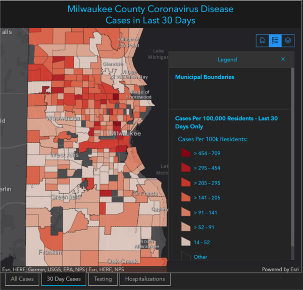

The new Delta variant has taken over and caused a renewed surge in infections in Wisconsin. I think this surge will continue for a while, but thankfully the vaccines will limit the consequences.

### Delta is dominant
The Delta coronavirus variant, also known as B.1.617.2 - I think they're doing an experiment on us to see which naming system is more inscrutable - is now dominant in Wisconsin as well as the rest of the country. Below is a plot over time of the fraction of all virus samples that have been sequenced - that is, have been genetically tested to see which variant strain they belong to. This data is taken from [covariants.org](https://covariants.org/), which in turn draws from the [GISAID database](https://www.gisaid.org/index.php?id=209).

We can see how the two most important variants, Alpha (B.1.1.7) and Delta (B.1.617.2) have taken over in turn. There are many other variants of course, but these have been the important ones because each was a step up in transmissibility compared to previous strains. 

To look at how the change in variant share influenced changes in cases, I multiplied these variant shares by the case numbers for Wisconsin to estimate which cases stemmed from each variant. The plot below shows how the last two case surges have both coincided with a new variant taking over and increasing its numbers, while the other variants continued declining.

Whatever combination of immunity and other factors was leading to the decline of the previous variants were still effective - for those variants. Only the new, more transmissible strains coming in allowed the virus to come back resurgent.

### The Delta delta
As already seen, the Delta variant has caused a... delta in infections, which we can see in both detected cases and the test positivity rate.

There could also certainly be contributions from seasonality (air conditioning weather) and the ongoing return to normal-ish behavior. Seasonality probably explains much of the differences between Wisconsin and the hotter southern states, which have it much worse right now.

If we look around the state, we can see these increases are happening pretty broadly. The map below illustrates change in cases over the last month; the outer circles show the latest 14-day average of cases in each county, while the inner circles show the same average from two weeks past. The larger the donut, the bigger the increase; the darker the inner circle, the higher the per-capita case rate.  

I don't see much of a regional pattern here, certainly not like [last fall in the northeast](https://covid-wisconsin.com/2020/10/11/status-update/#the-northeast). [Milwaukee County](https://www.arcgis.com/apps/opsdashboard/index.html#/018eedbe075046779b8062b5fe1055bf) has the highest case rate, and there the cases are concentrated in the north side of the city, which also has the lowest vaccination rates.

### Downplaying or doomsaying
Four weeks ago, I would have written that everything looked great (which is why it was easy to put off writing). I don't think that anymore, but neither is everything terrible. For one thing, the numbers so far are still low compared to other phases of the pandemic. The rate of cases per day is not yet even as high as our last mini-wave in spring (though positivity rate is higher), and is less than 10% of the peak last fall.

A second reason to be optimistic is that the great majority of the most vulnerable people are vaccinated, including [over 80% of those over 65](https://www.dhs.wisconsin.gov/covid-19/vaccine-data.htm). This will decrease the death rate going forward. Below is a plot comparing cases and deaths in Wisconsin over the course of the pandemic, scaled to roughly match up during the fall peak. The late spring mini-wave already saw a reduction in the ratio of deaths to cases, and I would expect that reduction to hold for this wave as well.

And while we do not have herd immunity (clearly), it is still likely that about two-thirds of the state has [some level of immunity](https://covid-wisconsin.com/2021/06/14/immune/) from vaccination or previous infection, which ultimately limits the amount of damage that Delta can do. 

On the other hand, I don't have much hope that this wave will turn around any time soon. During the spring mini-wave we had the cavalry coming: vaccinations were happening fast and summer was approaching. Now vaccinations are slow - though for the moment there are still more people getting vaccinated every day than getting infected - and fall is coming. If this wave follows the pattern of last year, it will plateau a bit at the end of summer and then take off again in the fall.

The best solution is more vaccinations. They are [picking up slightly](https://twitter.com/MattBayerWI/status/1419775999949131778) already. For anyone who has been waiting, now would be good time. 
