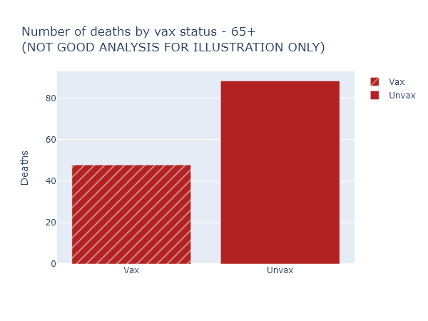
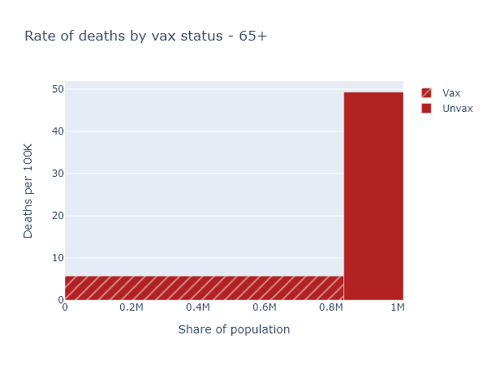
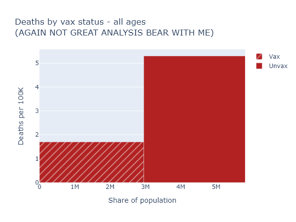
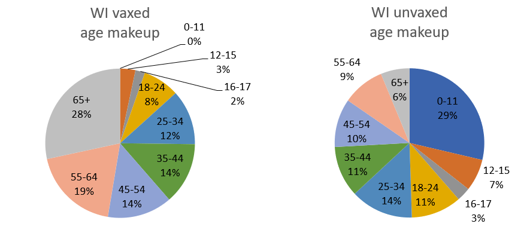
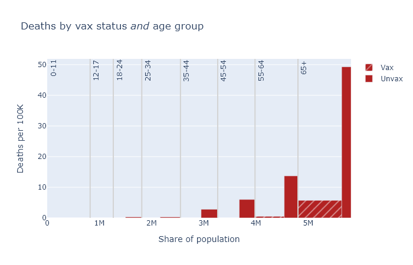
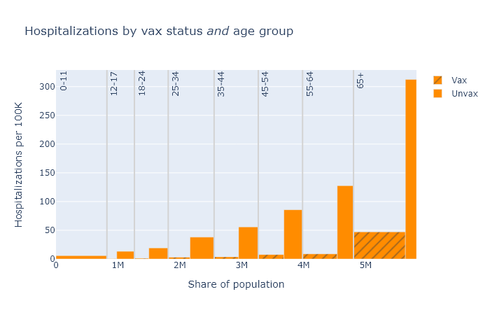
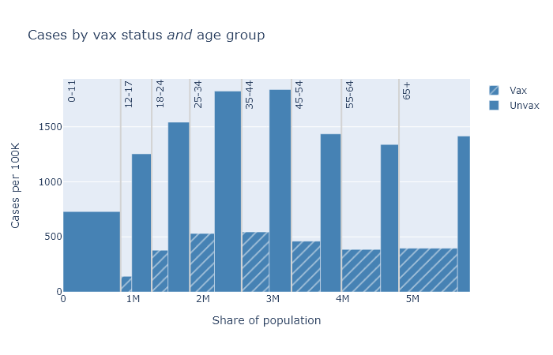

The Wisconsin DHS has begun releasing data on the rates of deaths, hospitalizations, and cases in fully-vaccinated and not-fully-vaccinated people. This gives us the most direct look yet at how the vaccines are working in the real world, and against Delta. The headline numbers are that in the month of August, an unvaccinated person has been 11 times as likely to die, 9 times as likely to be hospitalized, and 4 times as likely to have a confirmed case as a vaccinated person. Where do these numbers come from?

### Accounting for group size
The simplest thing to do would be to just compare the numbers of X deaths among the vaccinated to Y among the unvaccinated. But this is not a good idea for judging the effectiveness of the vaccine. For starters, the size of the vaccinated and unvaccinated groups can be very different. 

Let's take the example of deaths among those over 65. Here is a bar graph of the raw numbers of deaths, in August, in the vaccinated and not-fully-vaccinated groups. (The not-fully-vaccinated group includes people who have only received one dose, and people who have already had Covid. For brevity I am going to label them "Unvax" in these plots, but it is more complicated than that.)

This looks like the vaccine only reduces the risk of death by half, much worse than we've been promised. Luckily, this is not the right way to think about it at all (and for that reason DHS doesn't even display these numbers explicitly). It overlooks that nearly 90% of those over 65 are vaccinated, so these 48 vaccinated deaths are coming from a much larger group than the 88 not-fully-vaccinated deaths.

So here's another plot that visualizes the data better. The height of the bar now indicates the rate of deaths per 100,000 people in each of the vaccinated or not-fully-vaccinated groups. The width of the bar indicates the population of the group. That means the total area of each bar is proportional to the raw number of deaths, but the height more accurately shows the risk reduction from vaccination. For this age group, this per-capita rate of deaths among the unvaccinated was 9 times higher than in the vaccinated.

### Accounting for age
So now we know to always use per-capita numbers. Let's look at deaths again (per-capita, of course) for the whole population.

This is confusing again - the risk reduction here only appears to be a factor of 3. But that's much lower than we just saw for the over-65, which we know is the group most at risk of death. How does this make sense?

We have to realize that when compare all vaccinated against all unvaccinated people, these two groups differ in *two* ways that we know strongly affect the death rate: vaccination status, obviously, but also *age*. In Wisconsin over 80% of people over 65 are fully vaccinated, while zero people under 12 are. The age makeup of each group is very different:

This means you can't make a good comparison across vaccination status without accounting for age. 

To see this more intuitively, let's imagine a simpler, more extreme situation. Imagine that our entire population were half kids under 12, who are entirely unvaccinated but still vanishingly unlikely to die; and half retirees over 65, who are 100% vaccinated but still have some likelihood of dying (albeit much reduced, say by 90%). In this population 100% of Covid deaths would still occur among the vaccinated, and 0% among the unvaccinated. But that would not be because the vaccines were ineffective. It would be because the elderly were *both* more likely to be vaccinated, *and still* more likely to die of Covid.

The real situation in our state, which mirrors the rest of the country, is not so extreme, but it has the same kind of pattern. To get an accurate picture of vaccine effectiveness, we *have to* separate out data by age group, or adjust for age in some way.

### The data itself
Separating and adjusting for age is just what DHS has done in the latest data release, although I think there is some room for better visualization and explanation. (Hence this post.)

Below are three plots that show [DHS's August data](https://www.dhs.wisconsin.gov/covid-19/vaccine-status.htm) for deaths, hospitalizations, and cases, separated out by age group. They are similar to the second plot above in that the height of each bar shows the rate of the outcome per 100k people, showing the risk for that vax and age group, and the width indicates the population of that group. The tall narrow bar for unvaxed deaths over 65 means the group is small and the risk is high; the wide short bar for hospitalizations under 12 means the group is large but the risk is small.

A few points become apparent in these plots.
* Absolute risk (the height of the bars) for deaths and hospitalizations are clearly much higher for older people. 
* The relative risk reduction (the ratio of the height of the vax bar to the height of the unvax bar) is more consistent across age. If you're in your 30s or 40s, the absolute risk of death from Covid is not that high, but the vaccine makes you basically invincible.
* The protection against getting a case is clearly not as good as it is against death and hospitalization. But the vaccine still reduces your chances of getting a case by about three-quarters.

### "Age-adjusted" numbers
Finally, I want to explain the age-adjusted numbers that 

As we have seen, the vaccinated and unvaccinated groups have different age distributions. Age adjustment uses the data we have to estimate what the total per-capita deaths *would be* if both groups had exactly the same age distribution as the population as a whole. Put another way, it's trying to sim

In math, for each age band, (adjusted vaxed deaths) = (observed vaxed deaths) &times; (fraction of total population) / (fraction of vaxed population). Then you add them up and divide by the total population to get their adjusted deaths/100k. Then do the same for the unvaxed group data.

For an individual, it would be more accurate to look at the age-specific numbers. But this age-adjustment procedure gives us the best single number for the risk reduction from vaccination, taking the population as a whole. It is also, I think, the best number to compare with the vaccine efficacy as reported in the original clinical studies, though it is also far from perfect.

Here is a table of these age-adjusted risk factors and vaccine efficacy values for each outcome, again based on this August data. The risk reduction is calculated as the age-adjusted, per-capita rate for the unvaccinated group divided by the rate for the vaccinated group. And the vaccined efficacy is simply 1 - 1 / (risk reduction).

Outcome | Risk Unax/vax (age-adjusted) | Vaccine efficacy (observed)
---------- | ----------- | -----------
Cases | 4x | 75%
Hospitalizations | 9x | 89%
Deaths | 11x | 91%

---

### Acknowledgments
I'm indebted to the blog Covid Data Science for discussion of these issues and modeling how to do this analysis. These are two relevant posts.
* A similar example from Israeli data of how failing to account for age can make vaccine efficacy appear lower than it is: [Israeli data: How can efficacy vs. severe disease be strong when 60% of hospitalized are vaccinated?](https://www.covid-datascience.com/post/israeli-data-how-can-efficacy-vs-severe-disease-be-strong-when-60-of-hospitalized-are-vaccinated).
* A contrary example of how failing to take account of changes with time can make efficacy look higher than it really is: [How time confounding can bias vaccine effectiveness upwards via Simpson's paradox](https://www.covid-datascience.com/post/how-time-confounding-can-bias-vaccine-effectiveness-upwards-via-simpson-s-paradox).
