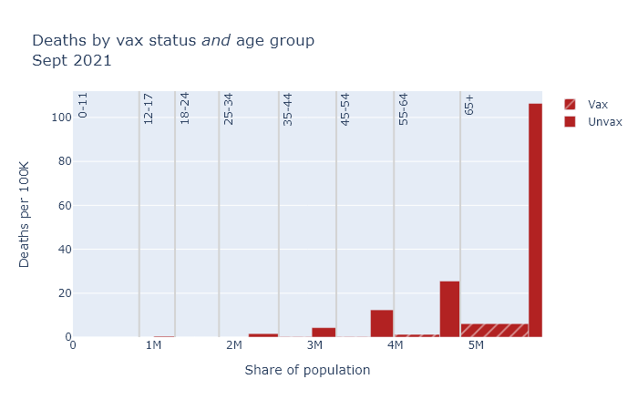
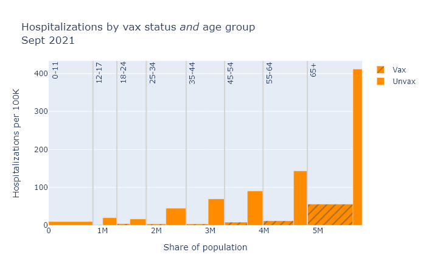
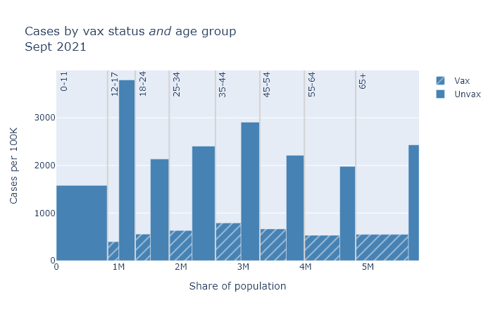

DHS has released their latest update on breakthrough cases, showing data for the month of September. The risk reduction from the vaccine appears to be pretty much the same as last month.

### September data by age group
Last month I wrote in detail on how to interpret these data, so for more background and August's numbers please see [that post](2021-09-23-vaccines-yes-still-work.md). Here I want to share plots of this month's data, and show how the age-adjusted risks are changing with time.

The bar plots below are a little complex, but I think helpful. Each compares vaccinated and unvaccinated groups for a different outcome: deaths, hospitalizations, and cases. The height of the bar indicates the rate of that outcome per 100,000 people. The width of each bar is proportional to the population of the group. 

Finally, the plots are divided up by age group, because the risk of death and hospitalization is so dependent on age. 

In general, the patterns here are very similar to last month. The vaccines continue to provide very strong risk reduction against death and hospitalization, and pretty strong reduction against getting a case. The table below shows the numbers for vaccine efficacy, in other words the percentage risk reduction, based on this data for this month and last month.[^Disclaimer]

#### Estimated vaccine efficacy by month
Outcome | August | September
------- | ------ | ---------
Cases   | 73%    | 78%
Hospitalizations | 88% | 89%
Deaths  | 89%    | 95%

---
[^Disclaimer]: In this table the August numbers are slightly different from [last month's post](https://covid-wisconsin.com/2021/09/23/vaccines-yes-still-work/#age-adjusted-numbers), because DHS updated its August data. But the difference is only 1 or 2 percentage points.
