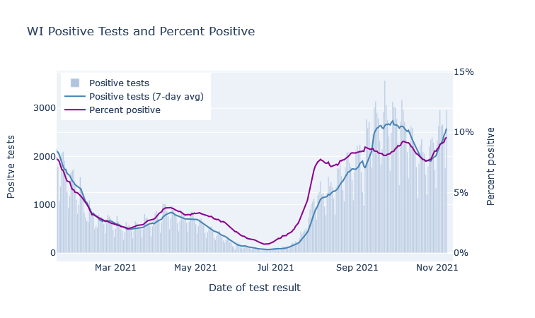
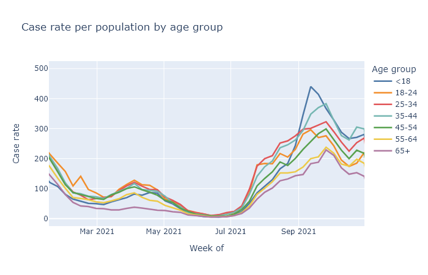
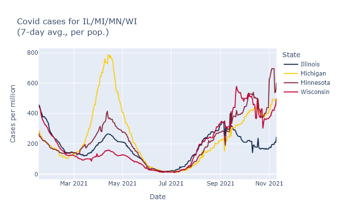
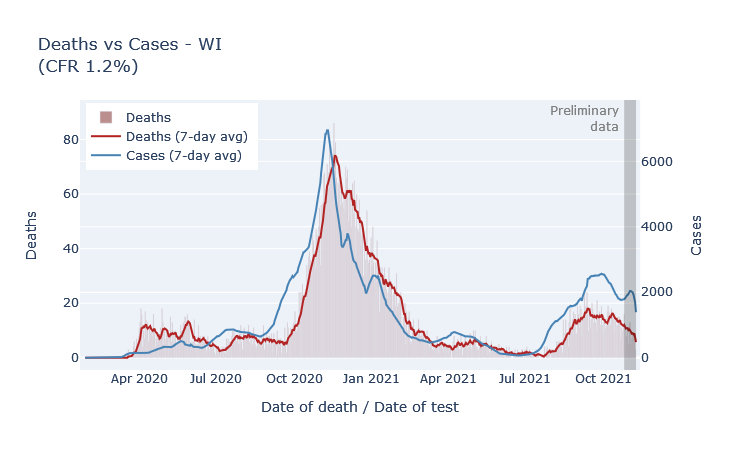
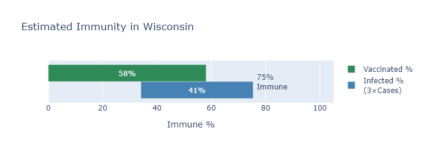

Wisconsin has been on a Covid plateau for a while. Still, I have been waiting for signs of a true winter wave, and I think the data from the last week show that it is starting. If it is, I expect moderately fewer cases than last winter, far fewer deaths, and that this will finally be the last major wave.

### Just when you thought it was safe to go back to choir practice

In the last two months Wisconsin has seen a consistent, moderate level of new cases. [The Delta variant](2021-07-29-delta.md) was responsible for the initial rise in late summer. While the Delta wave crested very high in the South, comparable or worse for them than last winter's wave, here cases plateaued and have just been plugging along. The plot below shows the number of positive tests and the positive test rate (positives / total tests) for Wisconsin over the last several months. 

There was a further boost in September that I think was primarily due to schools, in a combination of increased transmission and increased testing. You can see in the plot above that positive tests bump up in mid-September, but the postivity rate dips, which indicates that a portion of the cases were probably just from increased testing. (Perhaps from contact-tracing school cases?) The positivity rate then goes back up though, so there was increased transmission going on as well.

If you break out cases by age, we see that school-age kids and those 35-45 (their parents) have the highest case rates in this September bump. The other age groups do follow along, but their trajectory is a lot more gentle. This possibly school-driven bump lasted several weeks, and then began to subside. The plot below shows weekly case rates broken out by age, including data from last fall for comparison. 

I wonder if this is a dynamic similar to last fall with college students, where the start of the school year resulted in a large spike of cases, which then settled down and basically followed the trajectory as everyone else. I might speculate that large *changes* in people's contacts and socializing can result in case spikes, which then can subside after an adjustment period.

In any case, the fading of the September bump did not last long. This week I think we are finally seeing the beginning, not of the Jordan Love era, but of a true winter wave. The graph at the top already showed the rise in cases and positivity rate in Wisconsin over the last week. The same thing is happening in all our bordering states, which makes me more confident it's a seasonal effect instead of something more idiosyncratic. Here are reported cases for us and our three nearest neighbors, using data from the [New York Times](https://github.com/nytimes/covid-19-data/blob/master/us-states.csv).

### Better than the original

Fortunately, the fatality rate has been lower for the fall wave so far, which I think is directly due to the vaccine. The most vulnerable ages have high vaccination rates, which means the pool of unprotected people is less at risk of death. The plot below shows deaths by death date and cases by diagnosis date. The scale is set so that the lines overlap when the ratio of deaths to cases (the case fatality rate, CFR) is 1.2%. During last winter's peak the CFR was about 1.2%; so far this fall it's more like 0.7%.

But why are deaths even this high? If the vaccine is supposed to be [90% or more effective at preventing death](2021-10-15-september-breakthrough-data.md), why is the death rate only 40% lower than last winter? Well, the majority of people getting sick are not vaccinated. So the reduction of the death rate is mostly not because the vaccinated people getting sick are not dying, but instead because the unvaccinated people getting sick are less old on average than they were last winter.

### The final chapter

The other bit of good news is that I think this wave will be limited, because we are running out of people without some immunity. A few posts ago I tried to [estimate how many Wisconsinites had some kind of immunity](2021-06-14-immune.md), whether acquired by vaccination or by infection. Since then, of course, more people have gotten both types, I made an updated estimate. The green bar represents the percentage of people who have been vaccinated, the blue bar an estimate of the people who have been infected, with infections estimated at three times the official number of cases.

By this estimate, only about 25% of Wisconsinites still have no immunity to the virus. This sets some boundaries on how big this new winter wave can be. Our first winter wave infected about 30% of the state; even if this winter wave catches everyone left, it would still be smaller.

Now I think this immunity estimate may be a bit low, for reasons I listed in the previous post, and I also don't think literally everyone will end up infected. We'll also pick up some more vaccinations before the wave is over. On the other hand, there will be some reinfections or breakthroughs adding to the total. Overall, my wild guess is to expect somewhat less than the 25% to get infected in this wave, maybe only 10-15%, for 600-900 thousand infections. Divide by 3 for an estimate of another 200-300 thousand official cases; multiply that by the current case fatality rate of 0.7% for 1400-2100 more deaths.

And then I think we really will be done with large waves. Smaller spurts or moderate seasonal waves may still happen, but even if another variant comes along there will be too much built-up immunity for another big one. 

Or that's my best guess. Who the hell knows, of course - they do seem to keep coming out with sequels. 
