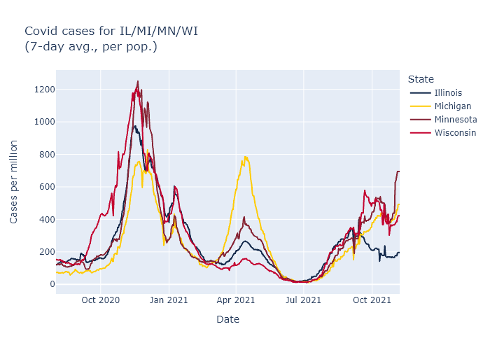
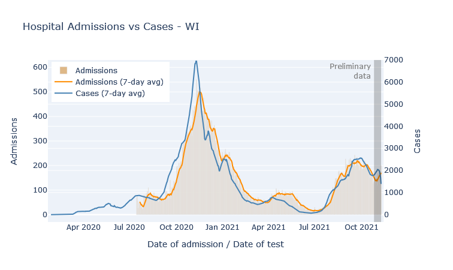
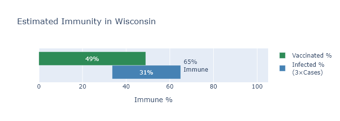

Wisconsin has been ...Still, I have been waiting for signs of a winter surge, and I think the data from the last week show that it might be starting. If we do, I expect fewer cases than last winter, far fewer deaths, and that this will finally be the last major wave.

### Just when you thought it was safe to go back to choir practice

In the last two months Wisconsin has seen a consistent, moderate level of new cases. The rise after summer was instigated by the more transmissible Delta variant becoming dominant. The Delta wave was very high in the South, comparable or worse for them than last winter's wave. But here cases plateaued and have just been plugging along. 

There was a further boost in September that I think was primarily due to schools, both transmission and increased testing. If you break out cases by age, school-age kids and those 35-45 (their parents) account for a lot of the extra bump in September. Then that bump dies away, imitating an overall decrease in cases when in reality, cases in all the other age groups were pretty constant.

[Cases and ages]

This mirrors a pattern from last year, where the start of the college year resulted in a large spike of cases, which then settled down and basically followed the trajectory of the rest of the state. This seems to suggest that large *changes* in people's contacts and socializing can result in case spikes, which then can subside after an adjustment period.

### Sequelitis

But now, this week, I think we are finally seeing the beginning, not of the Jordan Love era, but of a winter wave. The graph in the previous section showed the rise in cases and positivity rate in Wisconsin over the last week. The same thing is happening in all our bordering states.

At the moment things seem worse in the north and west

### Better than the original

The first bit of good news is that the fatality rate has been lower for this wave, which I think is directly due to the vaccine. The most vulnerable ages have high vaccination rates, whcih means the pool of unprotected people is less at risk of death, on average. 

You might question why deaths are even this high - the vaccine is supposed to be 90% or more effective at preventing death, why is the death rate only 50% lower than last winter? Well, the majority of people getting sick are not vaccinated. So the reduction of the death rate is not predominantly from vaccinated people getting sick and not dying, but because the people who do get sick (majority unvaccinated), are less old on average than they were last winter.

### Fuel to burn

The other bit of good news is that I think this wave will be limited, because we are running out of fuel to burn. A few posts ago I tried to [estimate how many Wisconsinites had some kind of immunity](2021-06-14-immune.md), whether acquired by vaccination or by infection. Since then, of course, more people have gotten both types, so below is an updated estimate. The green bar represents the percentage of people who have been vaccinated, the blue bar an estimate of the people who have been infected, with infections estimated at three times the official number of cases.

By this estimate, only about 25% of Wisconsinites still have no immunity to the virus. This sets some boundaries on how big this new winter wave can be. Our first winter wave infected about a third of the state; even if this winter wave catches everyone left, it will still be smaller. Now I doubt literally everyone will end up infected, but we can also expect a substantial number of reinfections or breakthrough infections. My wild guess is to expect somewhat less than the 25% to get infected in this wave, say 15%, for 900,000 infections. Divide by three for an estimate of another 300,000 official cases; multiply that by the current case-fatality rate of 0.8% for 2400 more deaths.

And then I think we really will be done. Even if another variant comes along, there will be too much immunity built up to cause another large wave.

Or that's my best guess. Who the hell knows, of course.

