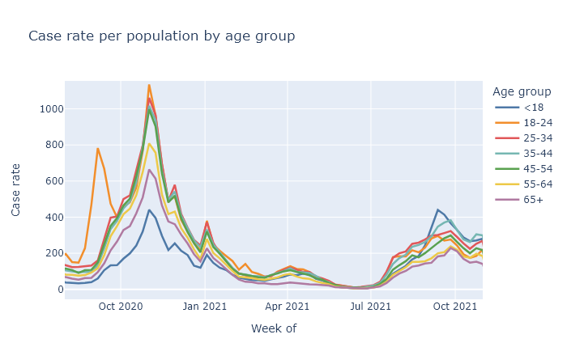

Wisconsin has been on a Covid plateau for a while, not too bad but not great. Still, I have been waiting for signs of a winter surge, and I think the data from the last week show that it might be starting. If we do, I expect moderately fewer cases than last winter, far fewer deaths, and that this will finally be the last major wave.

### Just when you thought it was safe to go back to choir practice

In the last two months Wisconsin has seen a consistent, moderate level of new cases. [The Delta variant](2021-07-29-delta) was responsible for the initial rise in late summer. While the Delta wave crested very high in the South, comparable or worse for them than last winter's wave, here cases plateaued and have just been plugging along. The plot below shows the number of positive tests and the positive test rate (positives / total tests) for Wisconsin over the last several months. 

There was a further boost in September that I think was primarily due to schools, in a combination of increased transmission and increased testing. You can see in the plot above that positive tests bump up in mid-September, but the postivity rate dips, which indicates that a portion of the cases were probably just from increased testing. (Perhaps from contact tracing school cases?) But then the positivity rate goes back up, so there is increased transmission going on as well.

Then if you break out cases by age, we see that school-age kids and those 35-45 (their parents) account for a lot of this September bump. Then that bump dies away, imitating an overall decrease in cases when in reality, cases in all the other age groups were pretty constant.

This mirrors a pattern from last year, where the start of the college year resulted in a large spike of cases, which then settled down and basically followed the trajectory of the rest of the state. This seems to suggest that large *changes* in people's contacts and socializing can result in case spikes, which then can subside after an adjustment period.

But now, this week, I think we are finally seeing the beginning, not of the Jordan Love era, but of a winter wave. The graph in the previous section showed the rise in cases and positivity rate in Wisconsin over the last week. The same thing is happening in all our bordering states.

### Better than the original

The first bit of good news is that the fatality rate has been lower for this wave, which I think is directly due to the vaccine. The most vulnerable ages have high vaccination rates, whcih means the pool of unprotected people is less at risk of death, on average. The plot below shows deaths by death date and cases by diagnosis date. The scale is set so that the lines overlap when the ratio of deaths to cases (the case fatality rate, CFR) is 1.2%. In last winter's peak the CFR was about 1.2%; so far this fall it's more like 0.7%.

You might question why deaths are even this high - the vaccine is supposed to be 90% or more effective at preventing death, why is the death rate only 0% lower than last winter? Well, the majority of people getting sick are not vaccinated. So the reduction of the death rate is not predominantly because the vaccinated people getting sick are not dying, but instead because the unvaccinated people getting sick are less old on average than they were last winter.

### The final chapter

The other bit of good news is that I think this wave will be limited, because we are running out of fuel to burn. A few posts ago I tried to [estimate how many Wisconsinites had some kind of immunity](2021-06-14-immune.md), whether acquired by vaccination or by infection. Since then, of course, more people have gotten both types, so below is an updated estimate. The green bar represents the percentage of people who have been vaccinated, the blue bar an estimate of the people who have been infected, with infections estimated at three times the official number of cases.

By this estimate, only about 25% of Wisconsinites still have no immunity to the virus. This sets some boundaries on how big this new winter wave can be. Our first winter wave infected about a third of the state; even if this winter wave catches everyone left, it will still be smaller. Now I doubt literally everyone will end up infected, but we can also expect a substantial number of reinfections or breakthrough infections. My wild guess is to expect somewhat less than the 25% to get infected in this wave, say 15%, for 900,000 infections. Divide by three for an estimate of another 300,000 official cases; multiply that by the current case-fatality rate of 0.8% for 2400 more deaths.

And then I think we really will be done. Even if another variant comes along, there will be too much immunity built up to cause another large wave.

Or that's my best guess. Who the hell knows, of course.

