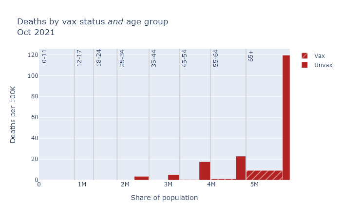
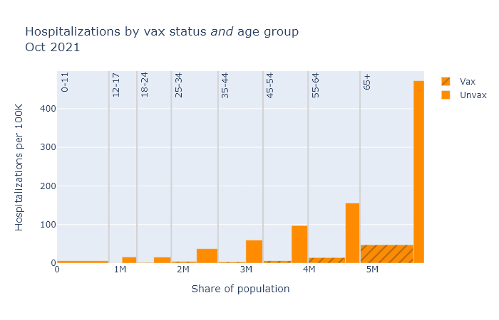
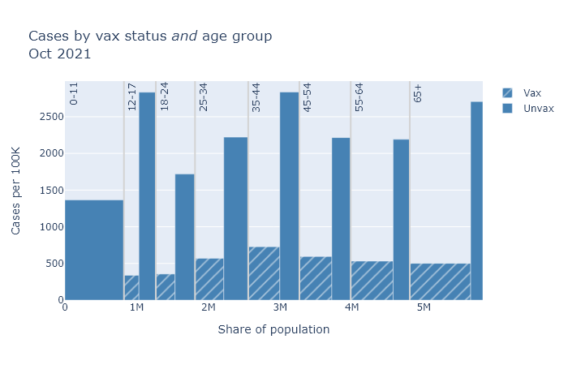

DHS is continuing to release data on breakthrough cases on the 15th of every month, containing data for the previous month. Last week's data was for October.

### September data by age group

If you've seen my [previous](2021-09-23-vaccines-yes-still-work.md) [posts](2021-10-15-september-breakthough-data.md), you know the drill. The plots below compare rates of deaths, hospitalization, and cases between vaccinated and unvaccinated people, separated by age group.

In general, the patterns here are very similar to last month. Some differences are that numbers overall are higher, and that teens make up a larger share of cases. But the vaccines continue to provide very strong risk reduction against death and hospitalization, and pretty strong reduction against getting a case. 

### Estimated age-adjusted vaccine efficacy by month
Boiling this down to a single number, the table below shows estimates of vaccine efficacy based on this data for this month and last month.[^Disclaimer] These numbers are age-adjusted, a process I also tried to explain in [last month's post](https://covid-wisconsin.com/2021/09/23/vaccines-yes-still-work/#age-adjusted-numbers).

Outcome | August | September | October |
------- | ------ | --------- | ------- |
Cases   | 73%    | 78%       | 
Hospitalizations | 88% | 89% |
Deaths  | 89%    | 95%       |

Efficacy appears to have even improved a bit this month, but I would guess that is just some randomness in the data. But it is good news that while efficacy seems to have declined compared to the spring, it looks to be pretty stable right now. 

---
[^Disclaimer]: This table has slightly different August numbers than last month, because DHS updated its August data. But the difference is only 1 or 2 percentage points.
