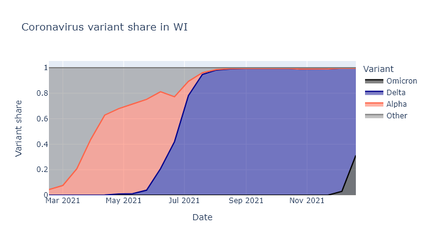
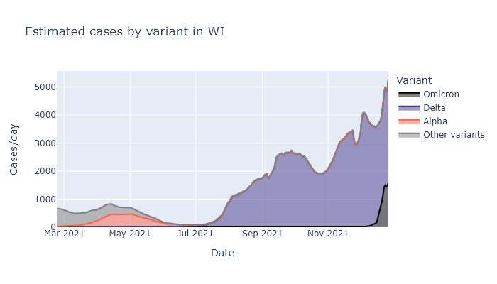
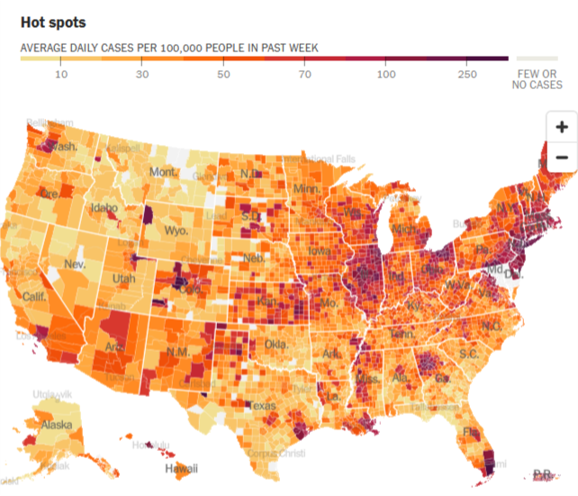
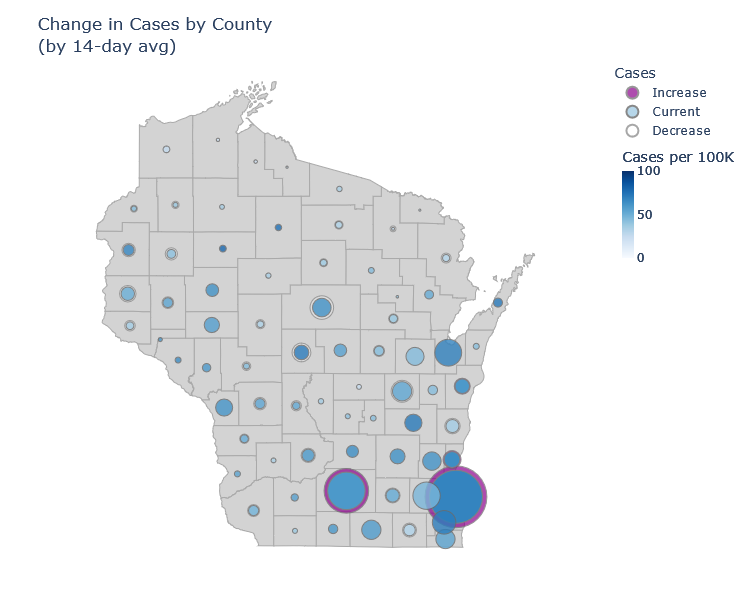

Omicron is here in Wisconsin. It will cause a large spike in cases; outcomes will be less severe than previous waves. I am not going to try to predict how large or how much less.

### O, I am fortune's fool
See, whenever I make a prediction, Covid seems to take that as an invitation to sweep the world with a new variant. [Last June](https://covid-wisconsin.com/2021/06/14/immune/#is-it-enough) I predicted a quiet summer and smallish winter wave; by July Delta had taken over the state, sparked a late-summer wave that only got worse in winter. Then in [early November](2021-11-11-covid-winter-2.md) I predicted that Wisconsin would see a sizable winter wave of Delta, but that this would be the last major Covid wave. Two weeks later Omicron was discovered. 

We're still having a winter wave, of course, but its complexion is going to be different.

### Omicron in Wisconsin
As of this writing, it looks like Omicron already makes up about two-thirds of cases in Wisconsin, and will likely be more than 90% within another week or two. It was less than 5% at the beginning of December. The warnings about how fast it would take over and spread turned out to be true. The plot below shows what fraction of cases is attributable to each variant dating back to March. For a similar but updated dashboard, see the [State Library of Hygiene website](https://dataportal.slh.wisc.edu/sc2dashboard) and click "Variant Report".

I think we are just starting to see this translate into a spike of new cases. Below is a plot of positive tests multiplied by the variant fractions above. The rise in the last week sure looks like the start of our Omicron spike. (The small dip in the last couple days is from lower numbers of tests over Christmas.)

Based on how this is playing out in other states, I expect it to show up first in the cities, where travelers may seed it first. This pattern is easiest to see in states where cases levels were previously pretty low. The map below is from the [New York Times](https://www.nytimes.com/interactive/2021/us/covid-cases.html) - see if you can find Miami, Atlanta, and Houston, not to mention New York City, Washington DC, and Seattle.

In Wisconsin I think we're starting out similarly. Milwaukee and Madison are the only counties currently showing a significant increase in cases averaged over 14 days. I'm guessing that will ramp up and then spread to the rest of the state.

### Onset and outcomes
So what now? Here's what I think we know about Omicron. A good summing-up reference is [the UK's risk assessment](https://assets.publishing.service.gov.uk/government/uploads/system/uploads/attachment_data/file/1043840/22-december-2021-risk-assessment-for-SARS-Omicron_VOC-21NOV-01_B.1.1.529.pdf).

**Transmission.** Omicron is clearly spreading quickly and overtaking Delta. This is because:
1. Omicron reduces protection against new infection from existing immunity, making breakthrough and reinfection more likely.
1. It probably has a [shorter transmission interval](https://mobile.twitter.com/Bob_Wachter/status/1473787896339439616) (the time between infection and onward transmission), which means it both spreads and peaks faster.
1. For those without immunity, it may have [comparable transmissibility to Delta](https://mobile.twitter.com/kakape/status/1476516113664163841). This is less clear, because it is hard to disentangle intrinsic and immunity effects.

**Severity.** Outcomes will most likely be less severe than in previous waves.
1. Existing immunity holds up against severe disease, better than against infection.
1. Omicron looks to be moderately less severe than Delta, even apart from immunity. (Moderate meaning something like 50% lower risk of hospitalization, not like a common cold.)

So we will see a lot of infections, but each infection is less likely to be severe than in previous waves. I don't think we know enough to predict precisely how that will multiply together. We'll find out pretty quickly.
