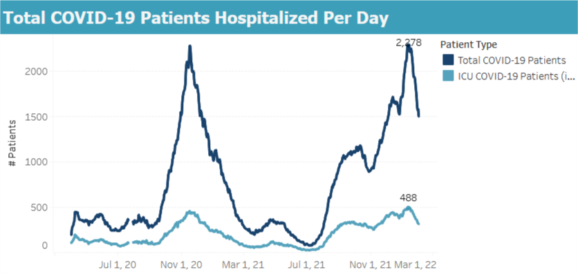

Wisconsin is now a couple weeks past the peak of the Omicron wave. Compared to last winter, the Omicron peak had about double the daily rate of cases; about the same rate of hospitalizations; but less than half the rate of deaths.

The peak rate of new infections happened about one week into January. This was not too clear at the time, because the unprecedented number of cases created a big backlog in state reporting. Then DHS flipped some switch on the 16th and cleared it (was that switch there the whole time?), flooding graphs everywhere with cases. Now that the dust has cleared, though, looking at cases by date of test return makes it clear the peak was at least a week earlier. Here are cases by day of report (including the big backlog dump), and positive tests by day of test result.

](https://www.dhs.wisconsin.gov/covid-19/cases.htm)

By using genetic sequence data to divide up Wisconsin cases by variant, we see that Omicron has entirely taken over from Delta, and that it did so incredibly rapidly. Before Omicron showed up, I thought it was likely that Delta would peter out on its own, but no doubt Omicron's rapid sweep did accelerate that process. Some of the Omicron cases are probably "substitute" cases where people were infected by Omicron instead of Delta. But most of them are "extra" cases, many reinfections or breakthroughs, that would not have happened with Delta alone.

Despite the deluge of cases, the rate of new hospital admissions topped out at a bit below last winter's peak, and is now declining as well. A different measure of hospitalization, the total number of people in the hospital at one time, reached just four patients higher than last winter's peak and is also declining.

The outlook on deaths is also very encouraging. Now, I don't trust that the plot below is really complete yet, because more death reports will filter in over the coming weeks. But it has been a long enough time that I don't think it will change drastically. So, duly caveated, I am happy to report that the peak rate of deaths from Omicron was not even a quarter of the rate from last winter, and in fact may end up lower than the peak of Delta deaths in the previous month.

