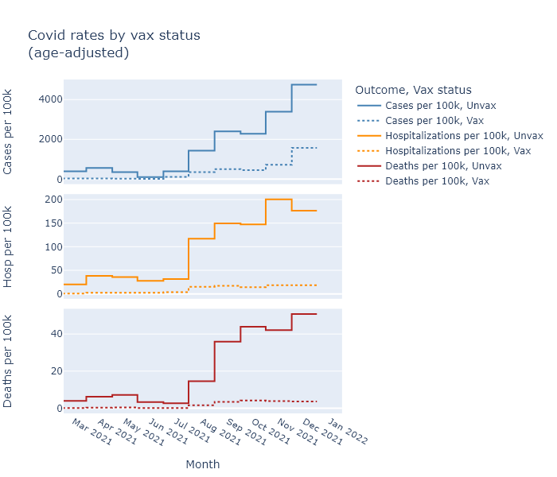

Omicron owed much of its huge transmissibility to its ability to evade immunity.

The DHS has published data on the rates of cases, hospitalizations, and deaths for vaccinated and unvaccinated people, which can give us a real-world estimate of the efficacy or risk reduction from being vaccinated.

I explained [how to interpret this data](2021-09-23-vaccines-yes-still-work.md) when they first started releasing it in September. With Omicron tapering out, now is a good time to look back at the intervening months and see how the different variants have affected the effectiveness of the vaccines.

The primary data that DHS releases are rates of cases, hospitalizations, and deaths calculated for fully vaccinated people (two doses) and not-fully-vaccinated people (mostly zero dose, some single dose). These rates are adjusted for age.

Let's start by comparing rates of cases from November, which was all Delta, and January, when Omicron had finished taking over. (December was a mix.) The plots below compare case rates for different age groups, and within each age group between fully-vaccinated people (at least two doses for the mRNA vaccines) and not-fully-vaccinated people (zero or one dose). The height of the bar indicates the rate of cases per 100,000 people, in that month. The difference between the height of the vaxed bar and the unvaxed bar shows the risk reduction we're seeing for the fully vaccinated.

The width of each bar is proportional to the population of the group. This makes the area of the bar proportional to the total number of cases in that group, not divided by population. Finally, the plots are divided up by age group, because the risk of death and hospitalization is so dependent on age. 

