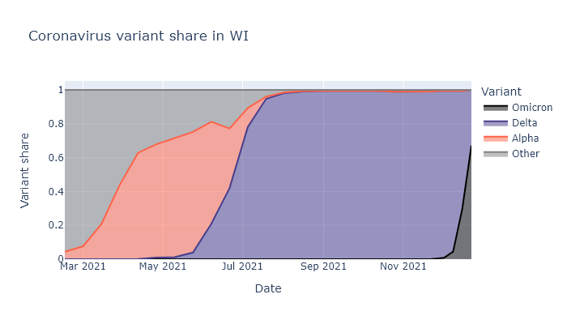

First of all, I need to stop making predictions, because Covid seems to take that as an invitation to sweep the world with a new variant. [Last June](https://covid-wisconsin.com/2021/06/14/immune/#is-it-enough) I predicted a quiet summer and smallish winter wave; by July Delta had taken over the state, sparked a late-summer wave, and worsened the winter prognosis. Then in [early November](2021-11-11-covid-winter-2.md) I predicted that Wisconsin would see a sizable winter wave of Delta, but that this would be the last major Covid wave. Two weeks later Omicron was discovered. 

We're still having a winter wave, of course, but its complexion will be quite a bit different. It might still be "the end", but I'm done with predictions for now.

### Omicron in Wisconsin
As of this writing, it looks like Omicron makes up over 50% of cases in Wisconsin, and will likely be more than 90% within another week or two. It was less than 5% at the beginning of December. The warnings about how fast it would take over and spread turned out to be true. The plot below shows what fraction of cases is attributable to each variant dating back to March. For a similar but updated dashboard, see the [State Library of Hygiene dashboard](https://dataportal.slh.wisc.edu/sc2dashboard), clicking "Variant Report" and then "Proportion of Variants".

I think we are just starting to see this translate into a spike of new cases. Below is a plot of positive tests multiplied by the variant fractions above. The rise in the last week or so sure looks like the start of our Omicron spike. (The small dip in the last couple days is from lower numbers of tests over Christmas.)

Based on how this is playing out in other states, I expect it to show up first in the cities, where travelers seeded it earlier. This pattern is easiest to see in the South, where cases levels were recently very low until Omicron arrived. The map below is from the [New York Times](https://www.nytimes.com/interactive/2021/us/covid-cases.html) - see if you can find Miami, Atlanta, and Houston, not to mention New York City, Washington DC, and Seattle.

In Wisconsin I think it is starting out similarly. Milwaukee and Madison are the only counties currently showing a significant increase in cases averaged over 14 days. I'm guessing that will ramp up and then spread to the rest of the state.

### Omicron in a nutshell

First, Omicron substantially reduces the effectiveness of previous infection and vaccination against new infection. This makes breakthrough and reinfection more likely, increasing the pool of susceptible people and increasing transmission. It also seems likely to have a shorter transmission interval - the time between infection and onward transmission - which means it both spreads and peaks faster. Together, these two traits explain why Omicron is spreading so quickly
1. Omicron may or may not be intrinsically more transmissible than Delta, "intrinsically" meaning in people without some form of immunity. It is hard to disentangle intrinsic and immunity effects.
1. Immunity from previous infection and from vaccination holds up much better against severe disease. If you are vaccinated or previous had Covid, you are more likely to get it or get it again than previously, but your immunity will still help you have a milder case.
1. Omicron seems likely to be intrinsically less severe than Delta. Again it is difficult to disentangle intrinsic and immunity effects
