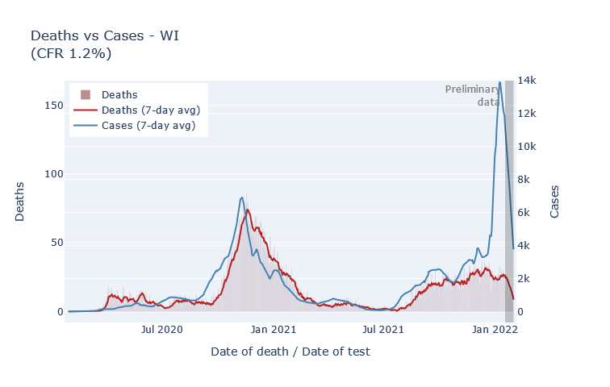

We're now a couple weeks past the peak of the Omicron wave.

Wisconsin reached its peak numbers of new infections about one week into January. This was not too clear at the time, because the unprecedented number of cases created a big backlog in state reporting. Then DHS flipped some switch on the 16th and cleared it (was that switch there the whole time?), flooding graphs everywhere with cases. creating the appearance of a huge surge. Now that the dust has cleared, though, we use DHS's data by test date 

As an example of how the reported data could be misleading, take a look at Milwaukee's cases by report date, and by test date.

[]

By using genetic sequence data to divide up Wisconsin cases by variant, we see that Omicron has entirely taken over from Delta, and that it did so incredibly rapidly. Before Omicron showed up, I thought it was likely that Delta would peter out on its own, but no doubt Omicron's rapid sweep did accelerate that process. Some of the Omicron cases are probably "substitute" cases where people were infected by Omicron instead of Delta. But most of them are "extra" cases, many reinfections or breakthroughs, that would not have happened with Delta alone.

Despite this deluge of cases, the rate of new hospital admissions topped out at a bit below last winter's peak, and is now declining as well. A different measure of hospitalization, the total number of people in the hospital at one time, reached just four patients higher than last winter's peak and is also declining.

It hasn't been long enough to really know how deaths are going to end up. We can see the beginning of an Omicron spike in the death data; more deaths will filter in the next couple weeks. Every day that passes, though, makes it more likely that 

A big reason for the low 
