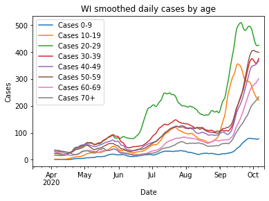

### Cases have possibly peaked - but maybe only among younger people.
The number of new daily cases has possibly peaked or plateaued, which is obviously good news. It is tempered, however, when you look at the age distribution. Only the age brackets 10-19 and 20-29 age brackets are strongly decreasing, while ages 30+ have either only flattened or are still going up.

### Deaths and hospitalizations are still up
Deaths have averaged between 10 and 15 per day, matching my [prediction from last week](2020-10-04-what-expect-for-deaths.md]. Unfortunately, hospitalizations have continued increasing rapidly, so I would expect the death rate to increase further in the next week or two.

### The northeast is still the hotspot

For the other two major population centers, Milwaukee and Madison are should have moderate concern. Milwaukee cases and hospitalizations have been rising, but at a moderate pace comparable to the upswing in late summer. Clearly we don't want it to get worse, but it is not as bad a situation as in the northeast.

Madison appears to have its campus outbreak under control, but cases have plateaued at a higher level than they were before the outbreak, and now hospitalizations are rising.
